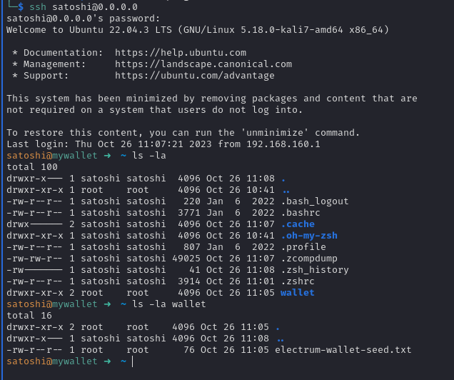
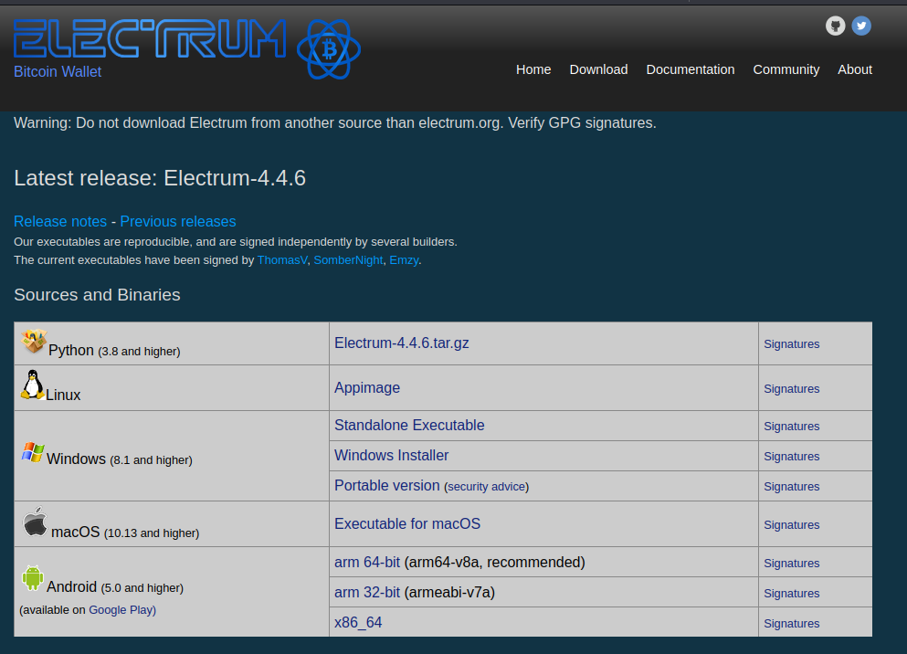
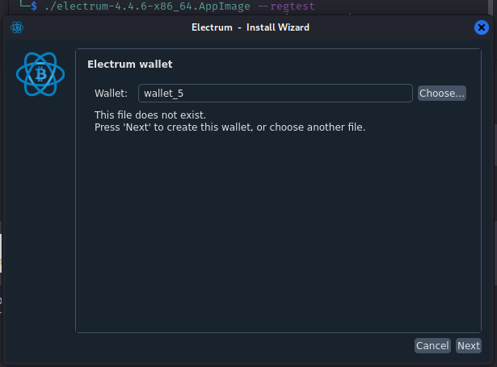
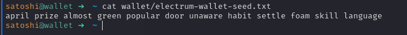
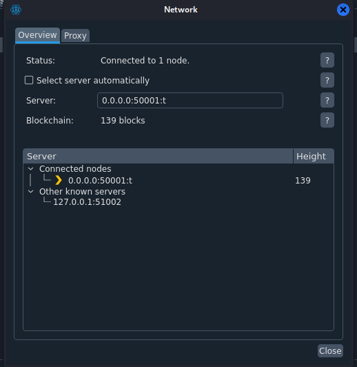
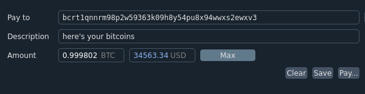
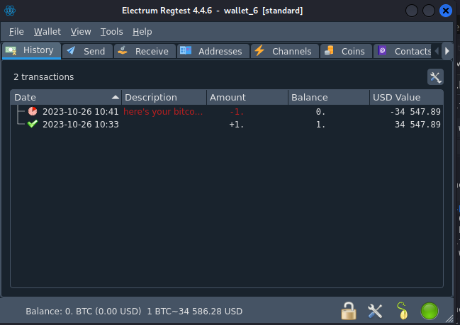
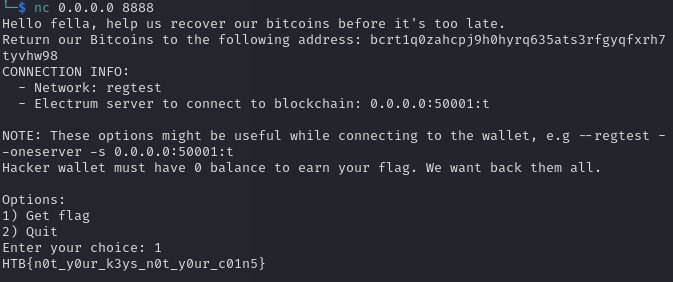

 <font size='10'>Recovery</font>

28<sup>th</sup> 2022 / Document No. D22.102.16

Prepared By: perrythepwner

Challenge Author(s): perrythepwner

Difficulty: <font color=green>Easy</font>

Classification: Official

# Synopsis

- The challenge involves recovering stolen BTC funds given an Electrum seed phrase in a hacked SSH instance.

# Description

- We are The Profits. During a hacking battle our infrastructure was compromised as were the private keys to our Bitcoin wallet that we kept.
We managed to track the hacker and were able to get some SSH credentials into one of his personal cloud instances, can you try to recover my Bitcoins?
- Username: satoshi
- Password: L4mb0Pr0j3ct
- NOTE: Network is regtest, check connection info in the handler first.

# Skills Required

-  Basic research skills.

# Skills Learned

- Bitcoin wallets.
- Bitcoin regtest network.
- Wallet seed phrases.
- Electrum wallet setup & interaction.
- Sending Bitcoins.

# Enumeration

We've been given access to an SSH instance with the credentials `satoshi:L4mb0Pr0j3ct`. Let's establish a connection and investigate the contents of the machine.



Once logged in, we'll notice a file named `electrum-wallet-seed.txt` in the home directory. Players can search for "electrum wallet seed" to find useful information:

- [Electrum Seed Version System](https://electrum.readthedocs.io/en/latest/seedphrase.html)
- [Restoring your standard wallet from seed - Bitcoin Electrum](https://bitcoinelectrum.com/restoring-your-standard-wallet-from-seed/)
- [Creating an electrum wallet](https://bitcoinelectrum.com/creating-an-electrum-wallet/)

These resources provide insights into Bitcoin wallets, how to create or load them, and details about BIP39.

# Solution

## Wallet Recovery

Now that we understand the concept of a seed and how Electrum wallets function, let's proceed with setting up the wallet client.

1. Install the Electrum wallet client.



2. Begin the client in `regtest` mode as suggested in the description.
   

2. Choose the standard wallet option, and then insert the seed found in the SSH instance.
   

3. Switch the network to the Electrum server provided in order to connect to the blockchain.
   

Alternatively, you can start Electrum with the correct server from the command line using the following syntax:
```bash
./electrum-4.4.6-x86_64.AppImage --regtest --oneserver -s 0.0.0.0:50001:t
```

## Sending back the bitcoin

Now it's time to initiate the actual request to retrieve our funds.

1. Connect to the Challenge Handler to obtain the address.
   

2. Return the Bitcoin to the provided address.
   
     

  ## Getting the flag

We can connect to the netcat instance one final time and select the "1) Get flag" option.

  
