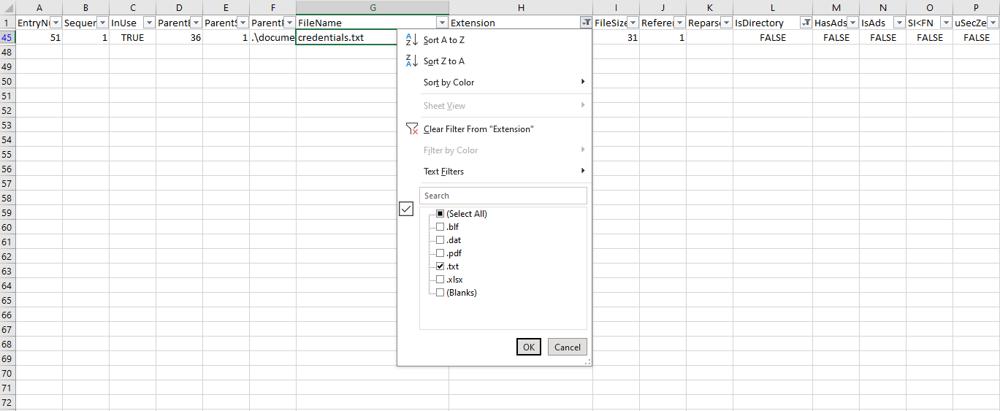

 <font size='10'> Pursue The Tracks</font>

07<sup>th</sup> February 2024 / Document No. D24.102.XX

Prepared By: Nauten, thewildspirit

Challenge Author(s): Nauten

Difficulty: <font color=green>Easy</font>

Classification: Official

# Synopsis

Pursue The Tracks is an easy forensics challenge involving extracting information from MFT records and answering questions to complete the investigation and get the flag.


## Description

* Luxx, leader of The Phreaks, immerses himself in the depths of his computer, tirelessly pursuing the secrets of a file he obtained accessing an opposing faction member's workstation. With unwavering determination, he scours through data, putting together fragments of information trying to take some advantage on other factions. To get the flag, you need to answer the questions from the docker instance.

## Skills Required

* Basic windows knowledge

## Skills Learned

* extracting information from MFT
* Analyzing an incident based on MFT records

# Enumeration

Players are provided with the following file:

- z.mft

The provided file is only the MFT component of a virtual disk.
Because of this, the user can parse it with the appropriate tools.

A well-known tool is [MFTECmd](https://github.com/EricZimmerman/MFTECmd)
```console
MFTECmd.exe -f z.mft --csv c:\temp
```
It will export the entire content to a CSV file. This file can be opened with `TimelineExplorer`, `Excel`, or any other program of your choice. Of course, it would be better if one convert it to `xls` or imports the data to Google Sheets for easier filtering.

A different way to parse the file is to directly open it with [MFTExplorer](https://www.sans.org/tools/mftexplorer/) or [MFT_Browser](https://github.com/kacos2000/MFT_Browser). However, some tools might miss important information such as the timestamp or file size.

For this challenge, the first approach is better because we need to reconstruct the timeline of the events.

# Solution

**Note: do not count system files while replying to questions.**

1. Files are related to two years, which are those? (for example: 1993,1995)

Filtering for "" + "FileName" columns:


Answer: `2023,2024`

2. There are some documents, which is the name of the first file written? (for example: randomname.pdf)

Entries are incremental, so the first file written is the first one with the column "IsDirectory = False".


Answer: `Final_Annual_Report.xlsx`

3. Which file was deleted? (for example: randomname.pdf)

Filtering for "InUse = False":


Answer: `Marketing_Plan.xlsx`

4. How many of them have been set in Hidden mode? (for example: 43)

Filtering for "SiFlags = Hidden":


Answer: `1`

5. Which is the filename of the important TXT file that was created? (for example: randomname.txt)

Filtering for "Extension" column:



Answer: `credentials.txt`


6. A file was also copied, which is the new filename? (for example: randomname.pdf)

Filtering for "Copied = True" column:


Answer: `Financial_Statement_draft.xlsx`

7. Which file was modified after creation? (for example: randomname.pdf)

Checking "Created0x10" and "LastModified0x10" and comparing them. If there is a difference it's the wanted file. By applying the following filter `=IF(TEXT(A2, "mm/dd/yyyy hh:mm:ss AM/PM") <> TEXT(B2, "mm/dd/yyyy hh:mm:ss AM/PM"), C2, "")` on each line we can quickly see which columns have different values.


Answer: `Project_Proposal.pdf`

8. What is the name of the file located at record number 45? (for example: randomname.pdf)

Checking the "EntryNumber" column:


Answer: `Annual_Report.xlsx`

9. What is the size of the file located at record number 40? (for example: 1337)

Checking the "EntryNumber" column:


Answer: `57344`

