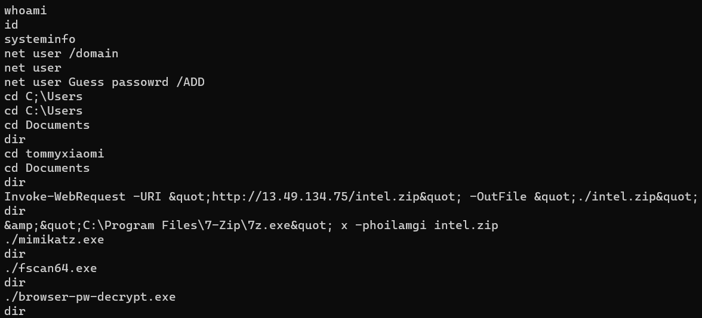
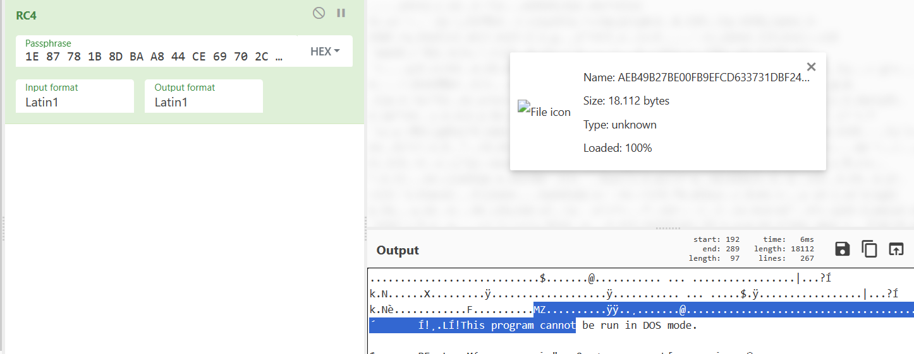
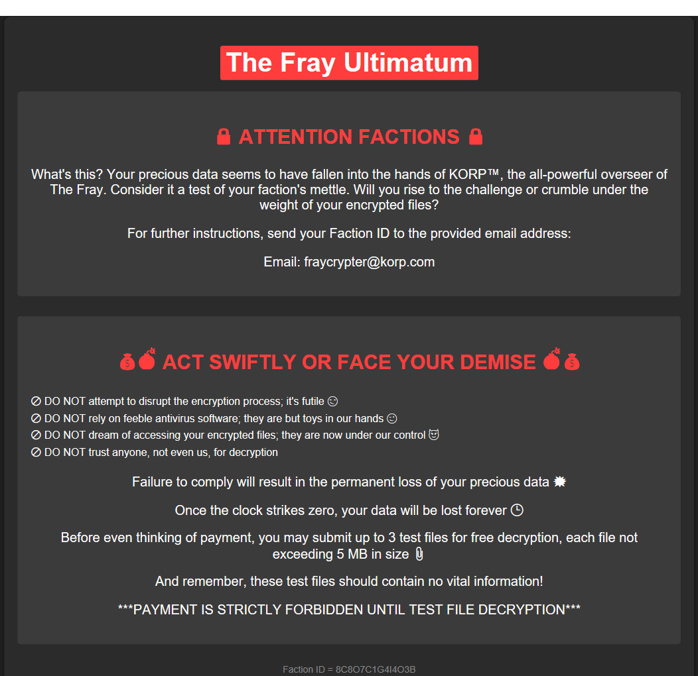

 <font size='10'>Confinement</font>

29<sup>th</sup> February 2024

Prepared By: bquanman & c4n0pus

Challenge Author(s): bquanman

Difficulty: <font color=red>Hard</font>

Classification: Official

# Synopsis

A hard forensics challenge that involves restoring artifacts from the quarantine folder of Windows Defender and then decrypting a C# ransomware for flag

## Description

* Our clan's network has been infected by a cunning ransomware attack, encrypting irreplaceable data essential for our relentless rivalry with other factions. With no backups to fall back on, we find ourselves at the mercy of unseen adversaries, our fate uncertain. Your expertise is the beacon of hope we desperately need to unlock these encrypted files and reclaim our destiny in The Fray. Note: The valuable data is stored under \Documents\Work

## Skills Required

* Familiarity with Windows operating system
* Familiarity with Windows event logs

## Skills Learned

* Analyzing Windows event log
* Attack timeline reconstruction
* Knowledge of where Windows artifacts are stored
* Analyzing C# ransomware

# Enumeration

Players are given the following file:

* **Challenge.ad1**: Logical disk image of a Windows host acquired by FTK Imager.


We can see the encrypted files in the `tommyxiaomi` user folder. The modified time is about `16:05 28/02/2024` so that we can localize the time of the attack to focus on investigating events during this period

Firstly, analyze the event logs to understand what happened.

Using `chainsaw` to hunt critical event


These defender warnings were all created between 15:45 and 15:48 and the threats repeated many times, possibly because the attacker tried to spread malware but was blocked by Windows Defender.

In those threats, `mimikatz.exe` and `fscan64.exe` are very common but how about `intel.exe`?

Find `intel.exe` from Security log. We can see the time the process was created was very close to the time the files were infected so this could be the ransomware!


Furthermore, it was started by Powershell. At this time, the Powershell log should be valuable!


Using [evtx_dump](https://github.com/omerbenamram/evtx/releases/tag/v0.8.1) to parse *Microsoft-Windows-PowerShell%4Operational.evtx* and take all script blocks

In the beginning, the attacker downloaded an archive that appeared to contain attack tools



Next is a series of commands to disable and bypass Windows Defender then extract intel.exe again and execute it the last time before cleaning and exit


Mapping to the timestamp of the defender's log, we can roughly visualize the following:

* the attacker compromised the host at around 17:41
* the attempt to download and execute hacking tools was blocked by Defender until 17:48
* so they had to use some commands to disable and bypass the Defender
* At 18:05:17, they extracted `intel.zip` again and no more defender warnings were generated
* They then executed `intel.exe` to encrypt the files before exiting the system at 18:07:24

At this point, we have a fairly comprehensive view of the attack. However, our goal is to restore our client's files. To do that, the ransomware is needed so that we can understand how files are encrypted.
But we don't have the ransomware sample since it's cleaned up by the attacker!

We need to go back a bit to the defender log


[Details about IDs and information fields in Windows Defender log](https://learn.microsoft.com/en-us/microsoft-365/security/defender-endpoint/troubleshoot-microsoft-defender-antivirus?view=o365-worldwide)

The `Action` here is Quarantine, that means it hasn't actually been removed from the system, but just put into the Windows quarantine folder

Quarantine files are stored at the path **C:\ProgramData\Microsoft\Windows Defender\Quarantine**. In this path, the `ResourceData` folder contains the actual data of those files, while the `Entries` and `Resources` folders contain metadata/information related to them.

Data files are encrypted with a default RC4 key outlined in this [post](https://reversingfun.com/posts/how-to-extract-quarantine-files-from-windows-defender/)



Manual decrypting shows that there is some file information data added to the beginning and end of the file. Removing these data you can get the complete file.
There are also many public scripts to make this task easier.

When we get the complete file, we find that this is a .net executable!

### Ransomware Analysing

List the files in the directory and encode the files with the corresponding extension


Password is generated by combining the userID and the hardcoded salt, generating a sha512 sum and base64 encoding it


Password is then used to generate a `key` and an `iv` to encrypt a file using the Rijndael (AES) algorithm


Ransom note:



# Solution

Take the `userID` from the ransom note. Combined with the hardcoded salt, we can use the same algorithm to decrypt the client's file:

```cs
using System;
using System.IO;
using System.Text;
using System.Security.Cryptography;


string Hasher(string password)
{
    string text;
    using (SHA512CryptoServiceProvider sha512CryptoServiceProvider = new SHA512CryptoServiceProvider())
    {
        byte[] bytes = Encoding.UTF8.GetBytes(password);
        text = Convert.ToBase64String(sha512CryptoServiceProvider.ComputeHash(bytes));
    }
    return text;
}

// Token: 0x0600001C RID: 28 RVA: 0x00002834 File Offset: 0x00000A34
string GetHashCode(string password, string salt)
{
    string text = password + salt;
    return Hasher(text);
}


byte[] array = new byte[65535];
byte[] array2 = new byte[] { 0, 1, 1, 0, 1, 1, 0, 0 };
string uid = "5K7X7E6X7V2D6F";
string salt = "0f5264038205edfb1ac05fbb0e8c5e94";
string password = GetHashCode(uid, salt);
Console.WriteLine("Password: " + password);
Rfc2898DeriveBytes rfc2898DeriveBytes = new Rfc2898DeriveBytes(password, array2, 4953);
RijndaelManaged rijndaelManaged = new RijndaelManaged();
rijndaelManaged.Key = rfc2898DeriveBytes.GetBytes(rijndaelManaged.KeySize / 8);
rijndaelManaged.Mode = CipherMode.CBC;
rijndaelManaged.Padding = PaddingMode.ISO10126;
rijndaelManaged.IV = rfc2898DeriveBytes.GetBytes(rijndaelManaged.BlockSize / 8);
Console.WriteLine("Key: " + Convert.ToBase64String(rijndaelManaged.Key));
Console.WriteLine("IV: " + Convert.ToBase64String(rijndaelManaged.IV));
```

With all that in place, we can export the valuable file and decrypt it!


Turns out it's an Excel workbook and one of the cells is the flag!


