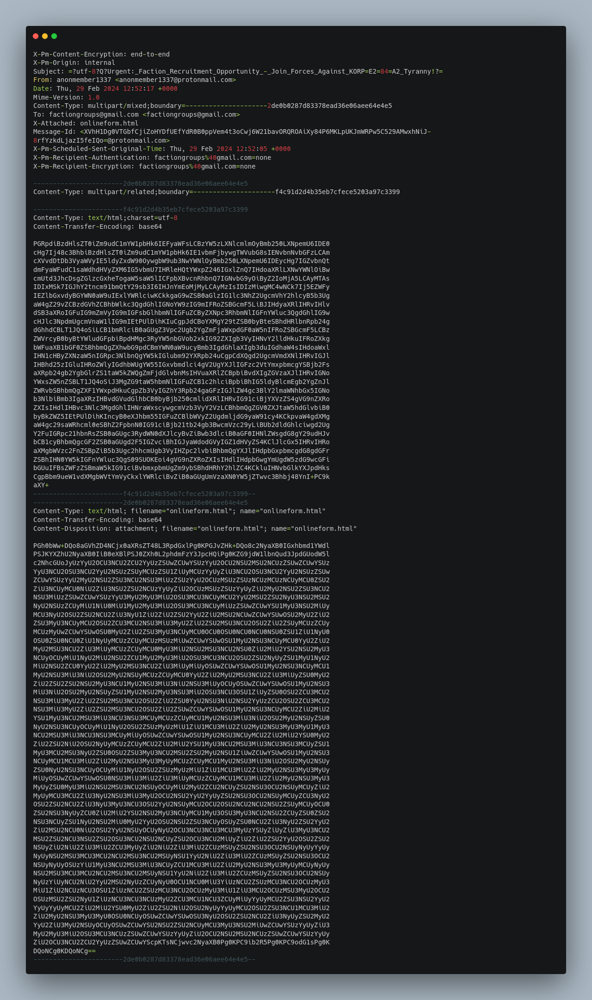
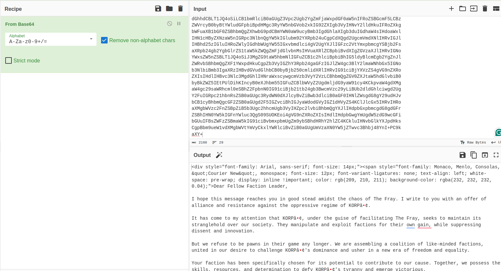
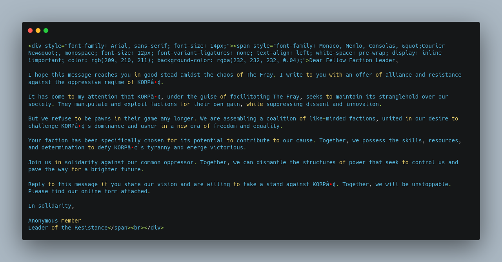
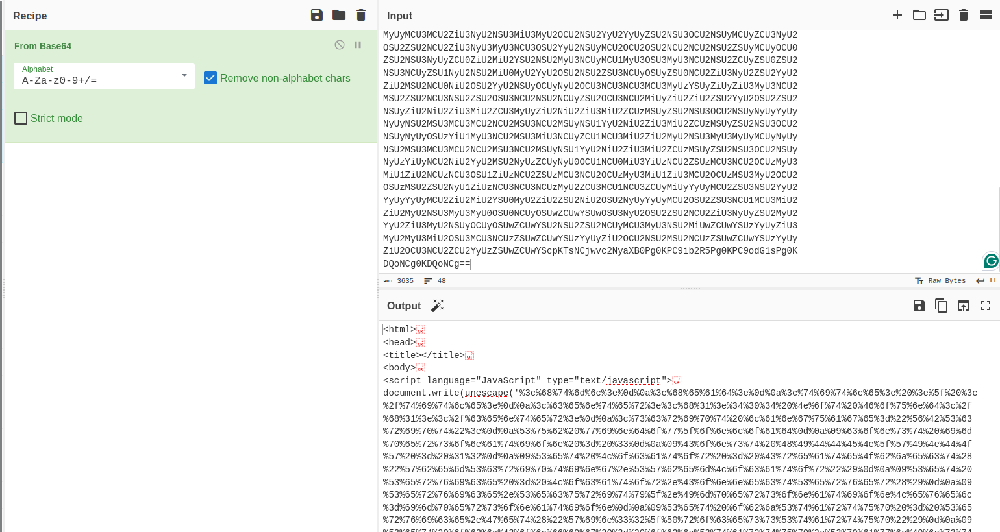
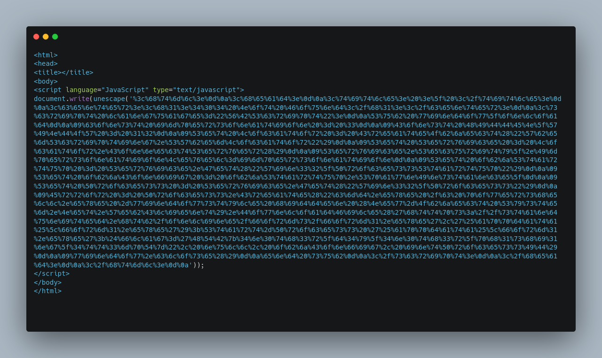
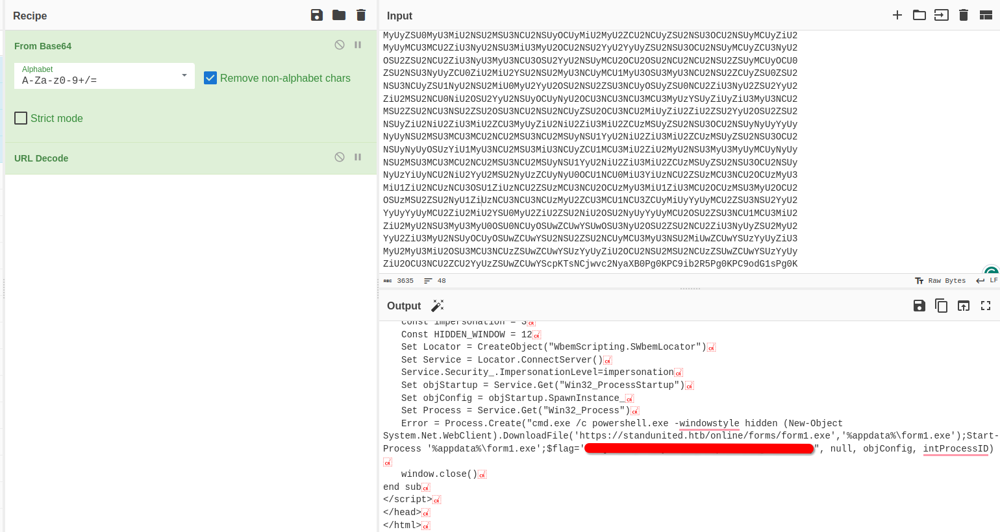

 Urgent

29th February 2024 / Document No. D24.102.XX

Prepared By: thewildspirit

Challenge Author(s): thewildspirit

Difficulty: Very Easy

Classification: Official

# Synopsis

A very easy forensics challenge that involves extracting and base64-decoding an attachment from an email conversation and URL-decoding the final payload. 

## Description

* In the midst of Cybercity's "Fray," a phishing attack targets its factions, sparking chaos. As they decode the email, cyber sleuths race to trace its source, under a tight deadline. Their mission: unmask the attacker and restore order to the city. In the neon-lit streets, the battle for cyber justice unfolds, determining the factions' destiny.

## Skills Required

* Basic decoding knowledge

## Skills Learned

* Basae64 decoding
* URL decoding
* Extracting attachements from eml files

# Enumeration

Players are given a file named `Urgent Faction Recruitment Opportunity - Join Forces Against KORP™ Tyranny.eml` which is an email conversation.

We can use any editor to inspect this file. The content of it is the following.

We can easily find some important information, such as:

* The sender: `anonmember1337@protonmail.com`
* The receiver: `factiongroups@gmail.com`

Let us find the actual content of the mail. There are two blocks. The first block contains the following headers:

* Content-Type: text/html;charset=utf-8
* Content-Transfer-Encoding: base64

So we know that it is probably some kind of text, and since we know the encoding (base64) let us use cyberchef to decode it.

The full conversation can be found here:

For the next block, we have the following headers:

* Content-Type: text/html; filename="onlineform.html"; name="onlineform.html"
* Content-Transfer-Encoding: base64
* Content-Disposition: attachment; filename="onlineform.html"; name="onlineform.html"

So we know that the encoding is base64 and it is an attachment. Again, using cyberchef we will decode the file.

The full html page can be found here:

# Solution

Cyberchef can detect the last encoding which is `URL encoding`.

