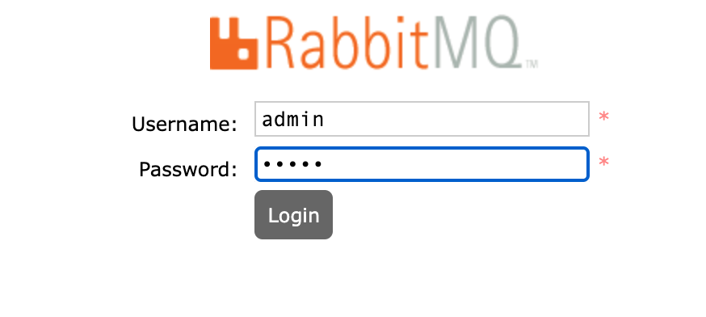
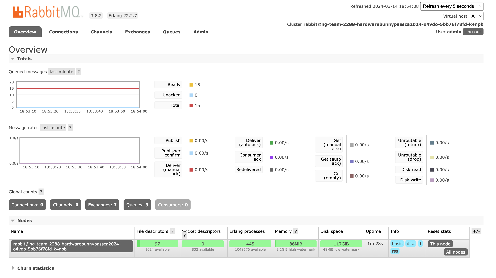
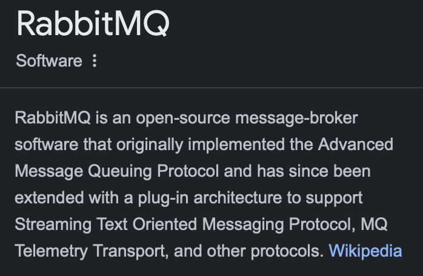
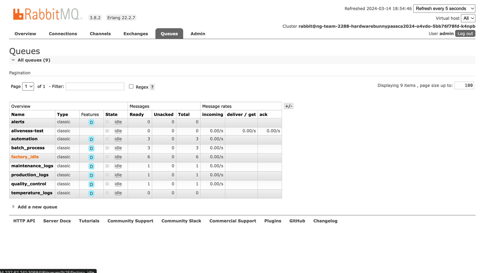
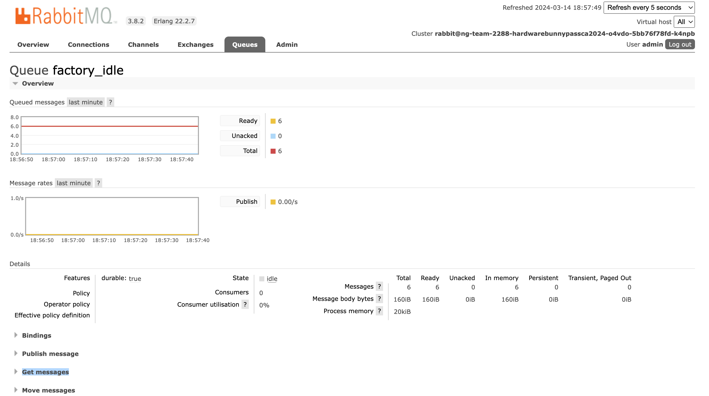
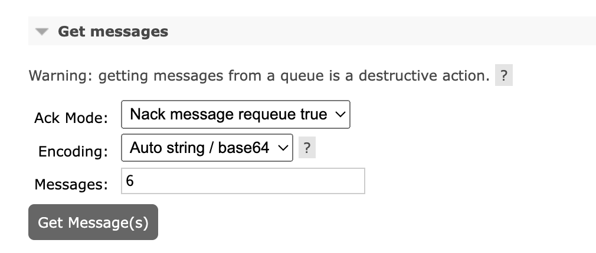
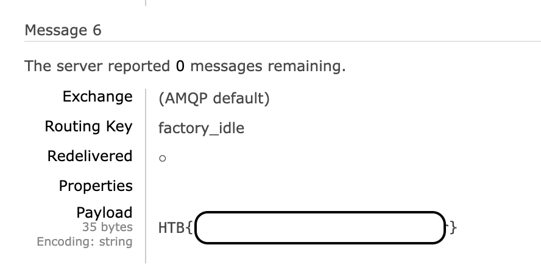

BunnyPass

14$^{st}$ March 2024 / Document No. D24.102.24

Prepared By: `diogt`

Challenge Author(s): `makelaris`

Difficulty: Very Easy

Classification: Official

# Synopsis

- The objective of this challenge is to gain access to a RabbitMQ instance and read the messages sent over it

## Description

- As you discovered in the PDF, the production factory of the game is revealed. This factory manufactures all the hardware devices and custom silicon chips (of common components) that The Fray uses to create sensors, drones, and various other items for the games. Upon arriving at the factory, you scan the networks and come across a RabbitMQ instance. It appears that default credentials will work.

## Skills Required

- Basic understanding of web interfaces

## Skills Learned

- Navigating a RabbitMQ instance and reading messages

# Enumeration

This challenge does not have a downloadable part, we are only given a live instance of  RabbitMQ. As per the description of the challenge, the default credentials should be valid for this instance. Given this hint let us try the common `admin:admin` combination.

After pressing the Login button we successfully connect to the RabbitMQ Instance.

If we search in Google for RabbitMQ we can see that it's a message broker, using the Message Queuing Protocol.

Based on that information we can navigate to the Queues tab and see if we can read any of the messages.

Out of all the Queues, only one appears to have a substantial number of messages, factory_idle with 6 messages ready. Selecting that leads us to another page.

On the bottom of the page, we can see a `Get messages` drop-down menu.

Let's input the number of messages we saw earlier, six, and hit the `Get Message(s` button. Scrolling over the messages we can see that the last message contains the flag.

# Solution

N/A

