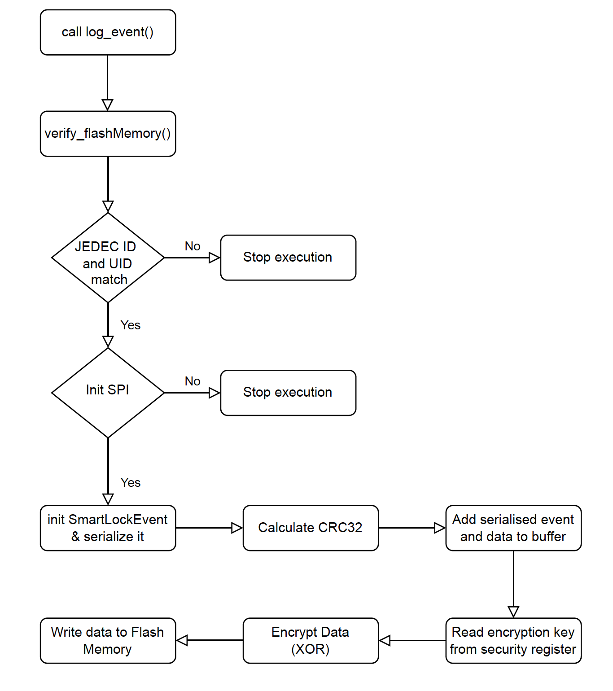
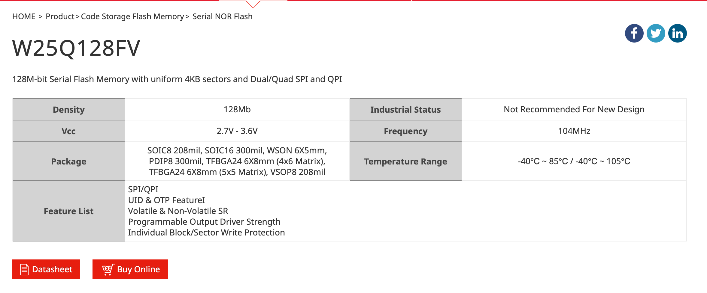
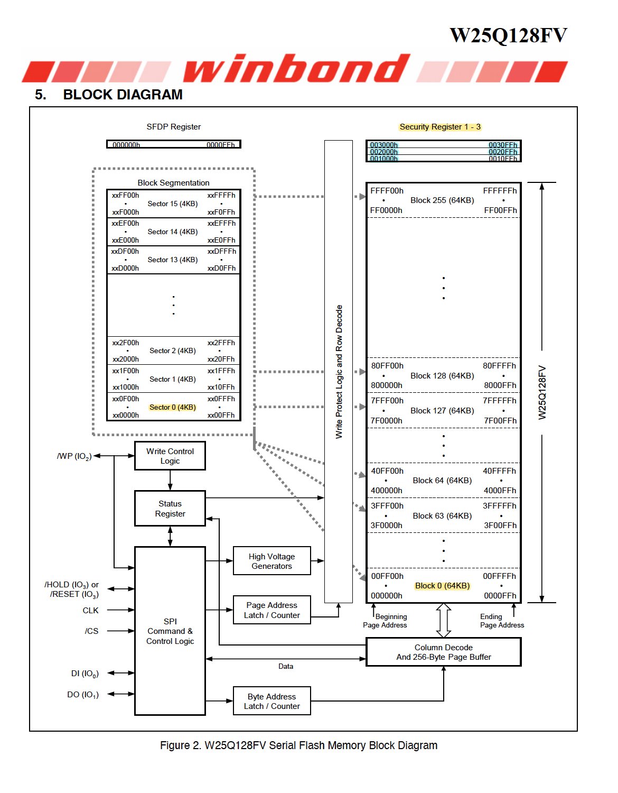
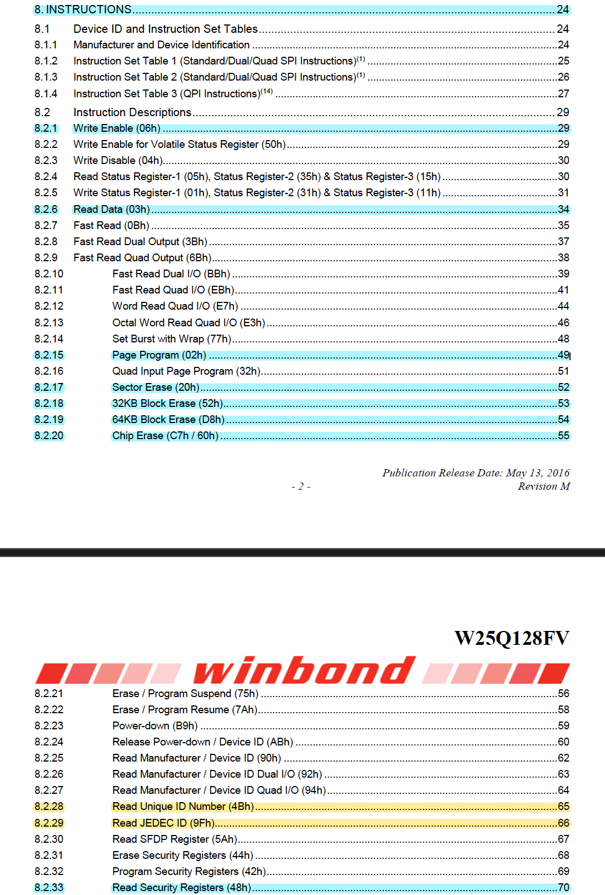
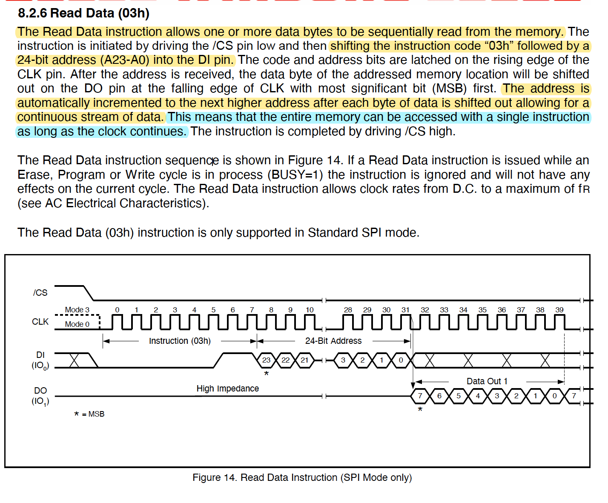
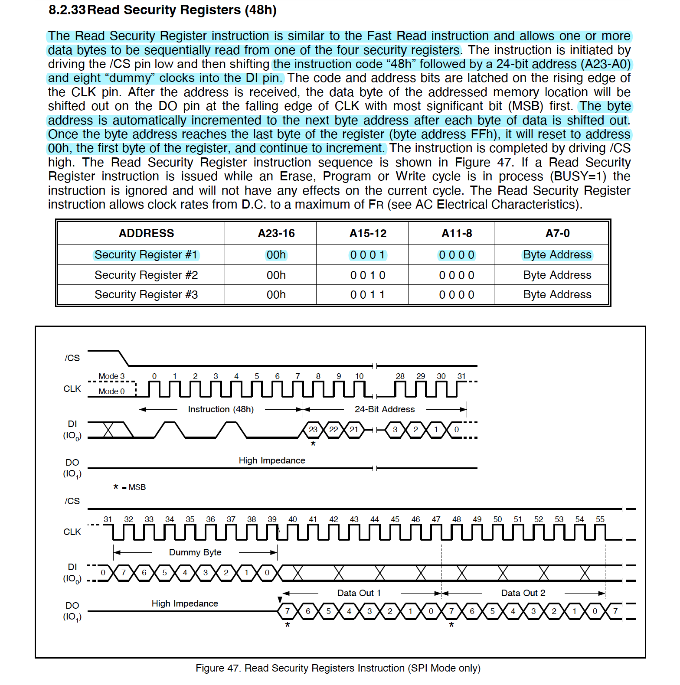
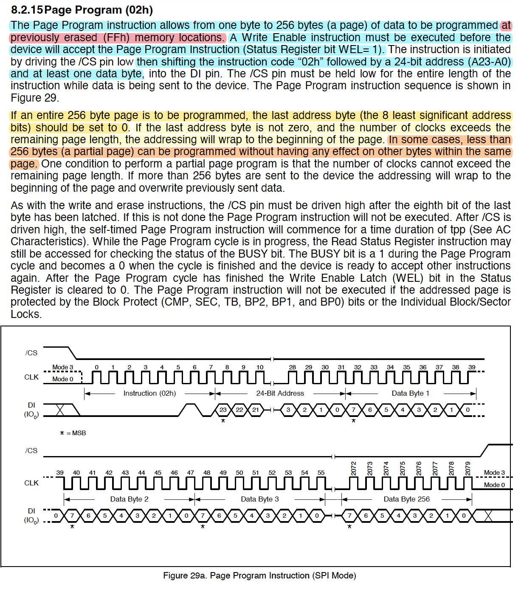
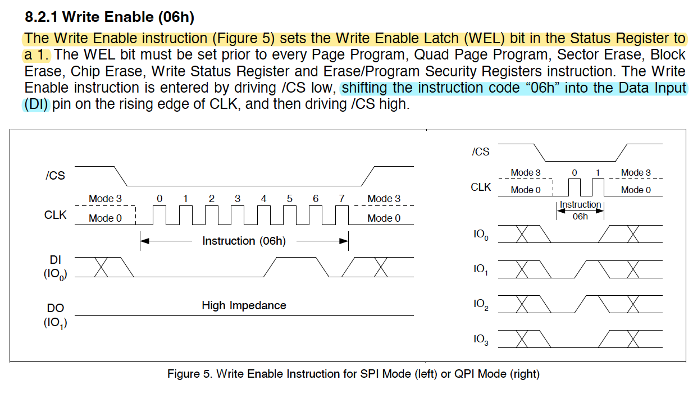
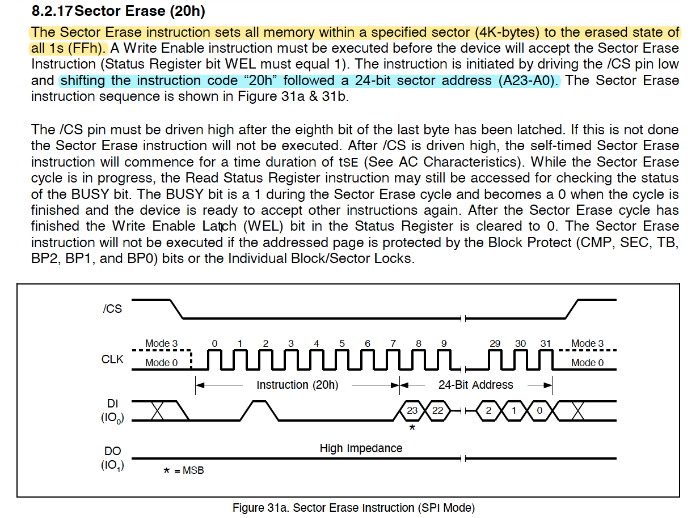

<font 
size='6'>Flash-ing Logs</font>

14$^{st}$ March 2024 / Document No. D24.102.24

Prepared By: `diogt`

Challenge Author(s): `diogt`

Difficulty: <font color=red>Hard</font>

Classification: Official

# Synopsis

- The objective of this challenge is to locate and modify all the logs saved on a smart lock's flash memory that are associated with a specific user ID. The process requires two key steps. First, analyze the C source code responsible for logging events to understand how the log entries are structured and managed. Following this, it is essential to gain a comprehensive understanding of the flash memory's functionality and architecture by reviewing its Datasheet. Then, by identifying the correct instructions and required command sequences we can overwrite existing log entries with new data, effectively pointing the logs to a different user

## Description

- After deactivating the lasers, you approach the door to the server room. It seems there's a secondary flash memory inside, storing the log data of every entry. As the system is air-gapped, you must modify the logs directly on the chip to avoid detection. Be careful to alter only the user_id = 0x5244 so the registered logs point out to a different user. The rest of the logs stored in the memory must remain as is.


## Skills Required

- Basic source code analysis

## Skills Learned

- Analyzing Documentation of hardware components
- Interacting with flash memories using serial interfaces

# Enumeration

In this challenge, we are given two files:

- `client.py` : A client file that allows interaction with the flash memory chip using a socket connection.
- `log_event.c`:  The source code that handles the event logs written on the flash memory

## Analyzing the source code

Let us first analyze the provided source code. The code extends over roughly 240 lines, thus our first step will be to map out its flow to understand how it processes and stores log data in the flash memory. A quick review of all the functions is sufficient to understand that the `log_event` is the main function of this code, as it calls most of the secondary functions in the file. 

```C
// Implementations
int log_event(const SmartLockEvent event, uint32_t sector, uint32_t address) {

    bool memory_verified = false;
    uint8_t i;
    uint16_t n;  
    uint8_t buf[256];   


    memory_verified = verify_flashMemory();
    if (!memory_verified) return 0;

     // Start Flash Memory
    W25Q128_begin(SPI_CHANNEL);
    

    // Erase data by Sector
    if (address == 0){
        printf("ERASE SECTOR!");
        n = W25Q128_eraseSector(0, true);
        printf("Erase Sector(0): n=%d\n",n);
        memset(buf,0,256);
        n =  W25Q128_read (0, buf, 256);
       
    }
    uint8_t buffer[sizeof(SmartLockEvent) + sizeof(uint32_t)]; // Buffer for event and CRC
    uint32_t crc;

    memset(buffer, 0, sizeof(SmartLockEvent) + sizeof(uint32_t));

    // Serialize the event
    memcpy(buffer, &event, sizeof(SmartLockEvent));

    // Calculate CRC for the serialized event
    crc = calculateCRC32(buffer, sizeof(SmartLockEvent));

    // Append CRC to the buffer
    memcpy(buffer + sizeof(SmartLockEvent), &crc, sizeof(crc));


    // Print the SmartLockEvent for debugging
    printf("SmartLockEvent:\n");
    printf("Timestamp: %u\n", event.timestamp);
    printf("EventType: %u\n", event.eventType);
    printf("UserId: %u\n", event.userId);
    printf("Method: %u\n", event.method);
    printf("Status: %u\n", event.status);

    // Print the serialized buffer (including CRC) for debugging
    printf("Serialized Buffer (including CRC):");
    for (size_t i = 0; i < sizeof(buffer); ++i) {
        if (i % 16 == 0) printf("\n"); // New line for readability every 16 bytes
        printf("%02X ", buffer[i]);
    }
    printf("\n");

    // Write the buffer to flash
    write_to_flash(sector, address, buffer, sizeof(buffer));

    // Read 256 byte data from Address=0
    memset(buf,0,256);
    n =  W25Q128_read(0, buf, 256);
    printf("Read Data: n=%d\n",n);
    dump(buf,256);

    return 1;
}

```

The log_event function code is pretty straight forward, as we can see from above the flow of this function is as follows:

* Verify memory using verify_flashMemory()
  * Initialized an SPI channel to the flash memory and verify its JEDECID and UID based on some hardcoded values
* Initialize the flash memory SPI channel
  * Initializes the SPI channel, this time to write the log event
* Initialize a SmartLockEvent struct
* Serialize the SmartLockEvent and add it to the buffer
* Calculate the CRC32 of the serialized event
* Add CRC to the buffer
* Print the SmartLockEvent for debugging
* Write the buffer to flash
* Read the data back to verify the write operation

Let's examine each step in detail now.

### SmartLockEvent

The SmartLockEvent struct defines the format the logs have, consisting of 5 different fields.

```C
// SmartLockEvent structure definition
typedef struct {
    uint32_t timestamp;   // Timestamp of the event
    uint8_t eventType;    // Numeric code for type of event // 0 to 255 (0xFF)
    uint16_t userId;      // Numeric user identifier // 0 t0 65535 (0xFFFF)
    uint8_t method;       // Numeric code for unlock method
    uint8_t status;       // Numeric code for status (success, failure)
} SmartLockEvent;
```

The `log_event` function receives an `SmartLockEvent` as input, which it serializes into a format suitable for byte-wise storage in flash memory. This serialization process converts the event data into a streamlined byte sequence, preparing it for efficient storage and retrieval from the flash memory. 

```C
uint8_t buffer[sizeof(SmartLockEvent) + sizeof(uint32_t)]; // Buffer for event and CRC
memset(buffer, 0, sizeof(SmartLockEvent) + sizeof(uint32_t));
uint32_t crc;
// Serialize the event
memcpy(buffer, &event, sizeof(SmartLockEvent));
```

After serialization, the event's CRC32 checksum is computed and appended to the buffer containing the serialized data, ensuring data integrity and error-checking capabilities.

```C
// Calculate CRC for the serialized event
crc = calculateCRC32(buffer, sizeof(SmartLockEvent));

// Append CRC to the buffer
memcpy(buffer + sizeof(SmartLockEvent), &crc, sizeof(crc));
```

After a few print commands used mostly for debugging purposes, as indicated by the comments, the next command is calling the write_to_flash()

```c
// Write the buffer to flash
write_to_flash(sector, address, buffer, sizeof(buffer));
```

This is the last command of interest to us in the log_event(), but the process continues in the write_to_flash. 

```C
void write_to_flash(uint32_t sector, uint32_t address, uint8_t *data, size_t length) {
    printf("Writing to flash at sector %u, address %u\n", sector, address);
    
    uint8_t i;
    uint16_t n;  

    encrypt_data(data, length, 1, address); 

    n =  W25Q128_pageWrite(sector, address, data, 16);
    printf("page_write(0,10,d,26): n=%d\n",n);

}
```

As we can observe from its code before writing the data to the memory using the `Page Write` command it encrypts the buffer using the encrypt_data().

``` C
// encrypts log events 
void encrypt_data(uint8_t *data, size_t data_length, uint8_t register_number, uint32_t address) {
    uint8_t key[KEY_SIZE];

    read_security_register(register_number, 0x52, key); // register, address
    
    printf("Data before encryption (including CRC):\n");
    for(size_t i = 0; i < data_length; ++i) {
        printf("%02X ", data[i]);
    }
    printf("\n");

    // Print the CRC32 checksum before encryption (assuming the original data includes CRC)
    uint32_t crc_before_encryption = calculateCRC32(data, data_length - CRC_SIZE);
    printf("CRC32 before encryption: 0x%08X\n", crc_before_encryption);

    // Apply encryption to data, excluding CRC, using the key
    for (size_t i = 0; i < data_length - CRC_SIZE; ++i) { // Exclude CRC data from encryption
        data[i] ^= key[i % KEY_SIZE]; // Cycle through  key bytes
    }

    printf("Data after encryption (including CRC):\n");
    for(size_t i = 0; i < data_length; ++i) {
        printf("%02X ", data[i]);
    }
    printf("\n");


}
```

Moving into this function we can observe a few interesting lines. First of all the read_security_register function is called but isn't present in the provided source code. It is used to read the key used for encryption by the flash memory's security register.

```C
read_security_register(register_number, 0x52, key); // register, address
```

Let's break down the arguments of this function:

* register_number: The security register to read from. This is also given as an argument to the encrypt function, which is `1`

  * ```c
    void encrypt_data(uint8_t *data, size_t data_length, uint8_t register_number, uint32_t address) {
    // <SNIP> //
    encrypt_data(data, length, 1, address); 
    ```

* 0x52: As denoted by the comment this is the specific address where the read operation will start inside the selected security register.

* key: This is the buffer where the data will be written `which is initialized inside the function.

  * ```C
    uint8_t key[KEY_SIZE];
    ```

  * The key size is defined at the start of the source code: 

    * ```C
      #define KEY_SIZE 12 // Size of the key
      ```

Once the key, of length 12, is read from the security register 1, starting at address 0x52 the next step is to perform the encryption process.

```C
// Apply encryption to data, excluding CRC, using the key
for (size_t i = 0; i < data_length - CRC_SIZE; ++i) { // Exclude CRC data from encryption
    data[i] ^= key[i % KEY_SIZE]; // Cycle through  key bytes
}
```

The encryption process employs a straightforward XOR operation, applying it between the data bytes and the key bytes, excluding the CRC32 bytes. Now that we have concluded the source code analysis we have a clear picture as to whats the flow of the event logging process.




## Analyzing the flash memory's Datasheet and interacting with it

Next we must gather information on how the flash memory operates. The source code doesn't provide much information as all the functions related to the memory are missing. Luckily some of them contain an interesting key word `W25Q128`. A quick google search will reveal that this is the name of the flash memory in question.


Navigating to the manufacturer (Winbond) [website](https://www.winbond.com/hq/product/code-storage-flash-memory/serial-nor-flash/?__locale=en&partNo=W25Q128FV) will lead us to the component's datasheet.



When approaching the datasheet for analysis it requires a focused strategy, starting with identifying key specifications like memory capacity, the memory structure, and available instructions.

#### **GENERAL DESCRIPTIONS** 

The first section of the datasheet, General Descriptions, contains a brief but very informative overview of the flash memory and its features. We can highlight areas of interest to keep a track of all the useful infromation.


>  When engaging with hardware components it is very important to be aware of their operating voltages and other electrical characteristics, to avoid damaging the component. In our case, this is of scope as the physical connection is already established.

To summarize the information we learned for the memory:

* Memory Structure
  * 64-KB Blocks, that contain:
    * 4-KB Sectors, that contain:
      * 256-Byte pages
* Erase operations are supported for Blocks and Sectors
* Program operations supported for Pages
* The memory has 3x 256-byte long Security Registers
* Memory supports Software and Hardware Write protection.

**BLOCK DIAGRAM**

Next, we can review the block diagram to get a a better understanding of how the Blocks, Sectors, and pages are structured. 



#### Instructions

Now that we have painted a clear picture of the memory layout we can go back to the Table Of Contents and review the available Instructions. With a quick review of each instruction, we can highlight the ones we are interested in, which include instructions to:

* Read the contents of the memory
* Read the security registers of the memory
* Program pages, to write data back to the memory
* Erase instructions 




##### Read Data (03h)

The read data instruction is pretty straight forward. In order to use it we simply have to provide the flash memory with:

* The instruction code 0x03
* A 24-bit (or 3 byte) address
* As long as the clock is active the memory will sift out bytes starting with the address we provided and automatically incriment it.



Lets attempt now to use the `client.py` to read data from the memory. We can adjust the example command in order to read the first sector of the memory, and then display it on chunks of 16bytes (as the total size of each log entry).

```python
# Read Logs
# [0x03, 0x00, 0x00, 0x00]: Data to send to memory
# 4096: Numbe of bytes to read back
logs = exchange([0x03, 0x00, 0x00, 0x00], 4096) 

# Split the list every 16 characters
log_enties = [logs[i:i+16] for i in range(0, len(logs), 16)]

for i in range(0,len(log_enties)):
    print(log_enties[i], i)
```

Uppon executing the client.py with the changes above we can observe some log entries.

```
python3 client.py
0 [135, 116, 216, 252, 35, 93, 193, 139, 109, 7, 72, 83, 152, 212, 93, 23]
1 [36, 160, 217, 252, 223, 93, 145, 138, 110, 7, 72, 83, 219, 205, 238, 195]
2 [55, 178, 222, 252, 74, 93, 226, 137, 111, 7, 72, 83, 235, 76, 228, 185]
3 [249, 168, 222, 252, 35, 93, 70, 138, 110, 7, 72, 83, 119, 46, 29, 254]
4 [175, 61, 222, 252, 74, 93, 226, 137, 110, 7, 72, 83, 53, 30, 146, 143]

<SNIP>

155 [152, 60, 126, 255, 241, 93, 193, 139, 110, 7, 72, 83, 99, 198, 28, 206]
156 [26, 27, 127, 255, 240, 93, 186, 219, 109, 7, 72, 83, 207, 91, 108, 133]
157 [134, 45, 127, 255, 157, 93, 186, 219, 111, 7, 72, 83, 236, 104, 129, 205]
158 [218, 203, 124, 255, 157, 93, 186, 219, 111, 7, 72, 83, 134, 173, 71, 208]
159 [214, 161, 124, 255, 240, 93, 186, 219, 111, 7, 72, 83, 209, 155, 216, 44]
160 [255, 255, 255, 255, 255, 255, 255, 255, 255, 255, 255, 255, 255, 255, 255, 255]
161 [255, 255, 255, 255, 255, 255, 255, 255, 255, 255, 255, 255, 255, 255, 255, 255]
162 [255, 255, 255, 255, 255, 255, 255, 255, 255, 255, 255, 255, 255, 255, 255, 255]

<SNIP>

253 [255, 255, 255, 255, 255, 255, 255, 255, 255, 255, 255, 255, 255, 255, 255, 255]
254 [255, 255, 255, 255, 255, 255, 255, 255, 255, 255, 255, 255, 255, 255, 255, 255]
255 [255, 255, 255, 255, 255, 255, 255, 255, 255, 255, 255, 255, 255, 255, 255, 255]
```

It appears that the memory currently contains 160 logs, as the rest of the sector appears to not be written, as indicated by the 255 (0xFF) bytes.

##### Read Security Registers (48h)

Before we attempt to decrypt the logs we need to also obtain the key located in the security register No.1



The instruction is similar to the read command with two differences:

* Each security register has a unique address
* The instruction required eight dummy clocks prior to start reading.
  * We can achieve that by simply sending an additional random byte (8-bits)

```python
KEY_SIZE = 12
key = exchange([0x48, 0x00, 0x10, 0x52, 0x00], KEY_SIZE)
print('key', key)
# key [57, 222, 106, 153, 38, 93, 254, 137, 108, 6, 72, 83]
```

##### Decrypting the data

Now that we have the data and the key we can proceed with decrypting the data, in order to identify the logs with the specified `user_id = 0x5244`. Let also adjust our print function to print the data in hex so its easier to spot the expected values. 

```python
import copy

def print_logs(logs):
    for i in range(0,len(logs)):
        log = logs[i]
        data = ' '.join(f'{number:02x}' for number in log)
        print(data)
     
def xor_logs(logs):
    for log in logs:
        for i in range(0, len(log)-4):
            key_chr = key[i % KEY_SIZE]
            log[i] = log[i] ^ key_chr

            
print('Decrypt logs..')
log_enties = log_enties[:total_log_entries]
saved_logs = copy.deepcopy(log_enties)


change_logs = log_enties[-log_entries_to_update:] 

sample_entry = copy.deepcopy(log_enties[0])

# decode logs with specified user_id
xor_logs(change_logs)
# decode sample log 
xor_logs([sample_entry])

print_logs(change_logs)
```

Uppon executing the client again with out updates we get the decrypted logs.

```
python3 client.py
key [57, 222, 106, 153, 38, 93, 254, 137, 108, 6, 72, 83]
Decrypt logs..
9e 8e b2 65 05 00 3f 02 01 01 00 00 35 f3 29 39
fd 61 b3 65 f9 00 6f 03 02 01 00 00 3e fe 75 b6
ee 4f b4 65 6c 00 1c 00 03 01 00 00 d5 a6 0f ee

<SNIP>

e1 0d 13 66 ca 00 b0 03 03 01 00 00 a9 f1 ea 25
71 b8 14 66 d7 00 3f 02 02 01 00 00 2f 76 b1 08
f3 9a 15 66 d6 00 44 52 01 01 00 00 c1 47 96 32
8f c9 15 66 bb 00 44 52 03 01 00 00 70 4d 6d 13
b3 eb 15 66 bb 00 44 52 03 01 00 00 e3 00 be dc
bf 55 16 66 d6 00 44 52 03 01 00 00 8e 16 90 74
```

As we see, the last 4 logs contain the user_id given to us by the challenge's description `'0x44', '0x52'`.

> The memory is using little-endian format. In little-endian systems, the least significant byte (LSB) is stored at the lowest memory address, and the most significant byte (MSB) is stored at the highest. Therefore, writing `0x5244` results in `0x44` (LSB) being stored before `0x52` (MSB).

##### Modifying Log Entries

Now that we have successfully decrypted the data and located the required logs we can proceed with creating the CRC32 function and verifying its correct operation using the sample_entry we have copied from the list (which will also be used as a reference for our new user_ids).

```python
import struct

def append_crc(data):
    # Calculate CRC32 of the data and return it as unsigned int
    crc = binascii.crc32(data) & 0xffffffff
    # Append CRC32 to the data
    return data + struct.pack('I', crc)
  
new_sample = list(append_crc(bytes(sample_entry[:-CRC_SIZE])))
if new_sample == sample_entry:
    print('CRC validated!')
```

```
python3 client.py
key [57, 222, 106, 153, 38, 93, 254, 137, 108, 6, 72, 83]
Decrypt logs..
CRC validated!
```

As our code grows, it's wise to structure it with clearly defined functions and to use variables for instruction codes. This strategy not only streamlines code expansion but also makes debugging more straightforward, enhancing both development speed and code maintainability. Now that we validated that we can successfully read, decrypt data, and calculate their CRC32 checksums we can proceed with altering the required logs.

```python
print(f'Change logs with user_id {user_id:#x}..')

for i  in range(0,log_entries_to_update):
    log = change_logs[i]
    
    # replace User ID with a valid id from a sample log
    log[6] = sample_entry[6]
    log[7] = sample_entry[7]
 
    # calculate and append CRC
    new_data = append_crc(bytes(log[:-CRC_SIZE]))
    
    new_log_entry = list(new_data)
    # Encrypt data back
    xor_logs(new_log_entry)

    change_logs[i] = new_log_entry

# Replace with new log entries
saved_logs[-4:] = change_logs

```

##### Writing the modified logs back to memory

The last step is to write the data back to the memory. Let's go back to the datasheet to review how we can achieve that.

###### Page Program (02h)

As we saw earlier in the General Description, we can program up to 256 bytes at a time (one page). To achieve that we can use the Page Program instruction.



This instruction has some dependencies, unlike the read commands we saw so far. 

* A Write Enable instruction must be executed before the device will accept the Page Program Instruction (Status Register bit WEL= 1). 
* Data can be programmed at previously erased (FFh) memory locations. 

As highlighted in <font color=#FFA500)>orange</font>, in some cases page program can work without erasing the page, which is how the log_event() operates, with the assumption that the range to be written is already erased (0xFF). 

###### Write Enable (06h)

The write enable command is pretty straightforward we just need to send the instruction byte.



###### Erase Sector (20h)

Searching for all the available erase commands we can see that the smaller chunk of data we can erase is Sectors. This is also referenced in the General Description of the memory. 




The instruction again is pretty straightforward as we just need to enter the instruction code followed by a 24-bit address. Now that we have all the instruction codes and know how to invoke them we can get back to our script to implement them.

```python
WRITE_ENABLE = 0x06
SECTOR_ERASE = 0x20
PAGE_PROGRAM = 0x02

print(f'Program pages with new logs..')

# Concatenate log entries back into pages
pages = [saved_logs[i:i+16] for i in range(0, len(saved_logs), 16)]
flattened_pages = [sum(segment, []) for segment in pages]


# ERASE SECTOR
exchange([WRITE_ENABLE])
exchange([SECTOR_ERASE, 0x00, 0x00, 0x00])

# Write modified logs
write_pages(flattened_pages)

# Get falg
print('FLAG:', get_flag())

```

> WARNING: Be careful when altering data in a flash memory with either program or erase commands as a wrong command might result in permanent loss of the data! **Always** create a **local copy** of all the **original memory contents**. With a local dump of the memory, you can always revert in the memory's original state. 
>
> In the scope of the challenge u can simply restart the docker instance, but in real life this is not the case!

# Solution

Finally executing the script with all the pieces in place will be successful. But before we do that let's also add another read command at the end starting on the provided FLAG_ADDRESS so we can also read the flag.

```python
import socket
import json
import binascii
import struct
import copy

# INSTRUCTION BYTES
WRITE_ENABLE = 0x06
SECTOR_ERASE = 0x20
READ = 0x03
READ_SECURITY_REGISTER = 0x48
PAGE_PROGRAM = 0x02

# Useful information
KEY_SIZE = 12
CRC_SIZE = 4
user_id = 0x5244
total_log_entries = 160
log_entries_to_update = 4


FLAG_ADDRESS = [0x52, 0x52, 0x52]

def exchange(hex_list, value=0):

    # Configure according to your setup
    host = '127.0.0.01'  # The server's hostname or IP address
    port = 1337        # The port used by the server
    cs=0 # /CS on A*BUS3 (range: A*BUS3 to A*BUS7)
    
    usb_device_url = 'ftdi://ftdi:2232h/1'

    # Convert hex list to strings and prepare the command data
    command_data = {
        "tool": "pyftdi",
        "cs_pin":  cs,
        "url":  usb_device_url,
        "data_out": [hex(x) for x in hex_list],  # Convert hex numbers to hex strings
        "readlen": value
    }
    
    with socket.socket(socket.AF_INET, socket.SOCK_STREAM) as s:
        s.connect((host, port))
        
        # Serialize data to JSON and send
        s.sendall(json.dumps(command_data).encode('utf-8'))
        
        # Receive and process response
        data = b''
        while True:
            data += s.recv(1024)
            if data.endswith(b']'):
                break
                
        response = json.loads(data.decode('utf-8'))
        #print(f"Received: {response}")
    return response

def write_pages(pages):
    for page_no in range(0, len(pages)):
        # Craft packet
        address = [0x00, page_no, 0x00]
        data = pages[page_no]
        packet = [PAGE_PROGRAM] + address + data      
        exchange([WRITE_ENABLE])
        exchange(packet)

def get_flag():
    FLAG = exchange([READ] + FLAG_ADDRESS, 256)
    # Convert the list of characters back to their ASCII values
    FLAG = [chr(char) for char in FLAG if char < 255]
    return ''.join(FLAG)

def print_logs(logs):
    for i in range(0,len(logs)):
        log = logs[i]
        data = ' '.join(f'{number:02x}' for number in log)
        print(data)
     
def xor_logs(logs):
    for log in logs:
        for i in range(0, len(log)-4):
            key_chr = key[i % KEY_SIZE]
            log[i] = log[i] ^ key_chr

def append_crc(data):
    # Calculate CRC32 of the data and return it as unsigned int
    crc = binascii.crc32(data) & 0xffffffff
    # Append CRC32 to the data
    return data + struct.pack('I', crc)

# Read Logs
# [0x03, 0x00, 0x00, 0x00]: Data to send to memory
# 4096: Numbe of bytes to read back
logs = exchange([0x03, 0x00, 0x00, 0x00], 4096)

# Split the list every 16 characters
log_enties = [logs[i:i+16] for i in range(0, len(logs), 16)]

  
key = exchange([0x48, 0x00, 0x10, 0x52, 0x00], KEY_SIZE)
print('key', key)

print('Decrypt logs..')
log_enties = log_enties[:total_log_entries]
saved_logs = copy.deepcopy(log_enties)

# Focus only on the logs we want to change
change_logs = log_enties[-log_entries_to_update:] 

sample_entry = copy.deepcopy(log_enties[0])

# decode logs with specified user_id
xor_logs(change_logs)
# decode sample log 
xor_logs([sample_entry])

# Used during development
#print_logs(change_logs)

new_sample = list(append_crc(bytes(sample_entry[:-CRC_SIZE])))
if new_sample == sample_entry:
    print('CRC validated!')

print(f'Change logs with user_id {user_id:#x}..')

for i  in range(0,log_entries_to_update):
    log = change_logs[i]
    
    # replace User ID with a valid id from a sample log
    log[6] = sample_entry[6]
    log[7] = sample_entry[7]
 
    # calculate and append CRC
    new_data = append_crc(bytes(log[:-CRC_SIZE]))
    
    new_log_entry = list(new_data)
    # Encrypt data back
    xor_logs([new_log_entry])

    change_logs[i] = new_log_entry

# Replace with new log entries
saved_logs[-4:] = change_logs

print(f'Program pages with new logs..')

# Concatenate log entries back into pages
pages = [saved_logs[i:i+16] for i in range(0, len(saved_logs), 16)]
flattened_pages = [sum(segment, []) for segment in pages]

# ERASE SECTOR
exchange([WRITE_ENABLE])
exchange([SECTOR_ERASE, 0x00, 0x00, 0x00])

# Write modified logs (multiple page program instructions)
write_pages(flattened_pages)

# Get falg
print('FLAG:', get_flag())
```
