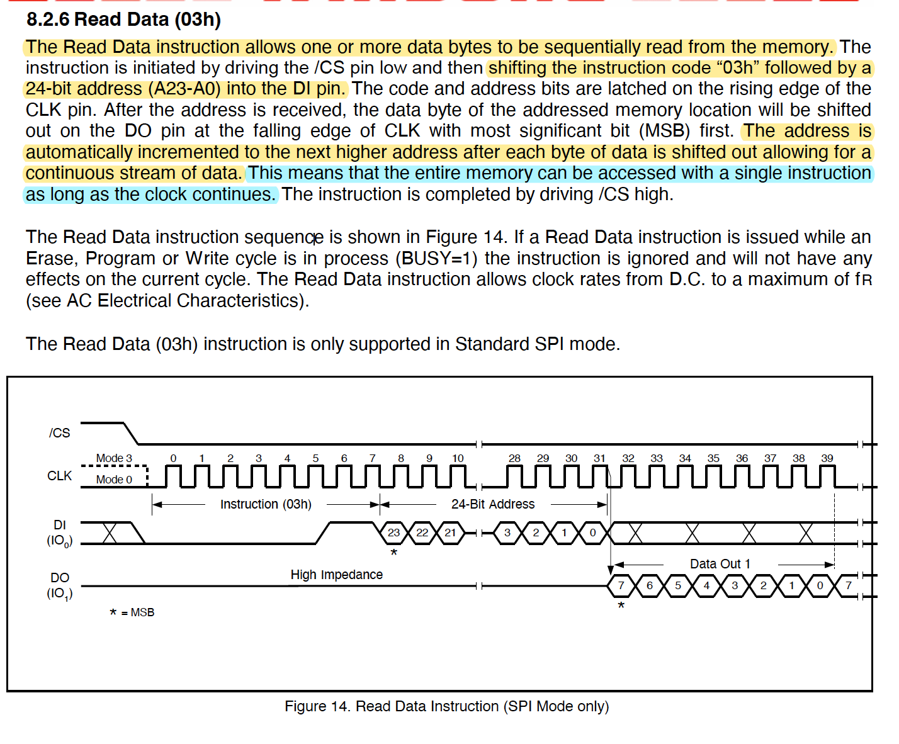

<font 
size='6'>Rids</font>

14$^{st}$ March 2024 / Document No. D24.102.24

Prepared By: `diogt`

Challenge Author(s): `diogt`

Difficulty: <font color=green>Easy</font>

Classification: Official

# Synopsis

- The objective of this challenge is to review the datasheet of the flash memory chip, whose name is provided in the challenge description,  to read its contents.

## Description

- Upon reaching the factory door, you physically open the RFID lock and find a flash memory chip inside. The chip's package has the word W25Q128 written on it. Your task is to uncover the secret encryption keys stored within so the team can generate valid credentials to gain access to the facility.


## Skills Required

- Basic documentation analysis 

## Skills Learned

- Analyzing Documentation of hardware components
- Using flash memory instructions to read its contents

# Enumeration

In this challenge, we are given one file:

- `client.py` : A client file that allows interaction with the flash memory chip using a socket connection.

## Analyzing the flash memory's Datasheet

The challenge's description mentions a flash memory chip whose package has the name of W25Q128. A quick google search will reveal that this is the name of the flash memory in question.


Navigating to the manufacturer (Winbond) [website](https://www.winbond.com/hq/product/code-storage-flash-memory/serial-nor-flash/?__locale=en&partNo=W25Q128FV) will lead us to the component's datasheet.


When approaching the datasheet for analysis it requires a focused strategy, starting with identifying key specifications like memory capacity, the memory structure, and available instructions.

#### **GENERAL DESCRIPTIONS** 

The first section of the datasheet, General Descriptions, contains a brief but very informative overview of the flash memory and its features. We can highlight areas of interest to keep a track of all the useful infromation.


>  When engaging with hardware components it is very important to be aware of their operating voltages and other electrical characteristics, to avoid damaging the component. In our case, this is of scope as the physical connection is already established.

To summarize the information we learned for the memory:

* Memory Structure
  * 64-KB Blocks, that contain:
    * 4-KB Sectors, that contain:
      * 256-Byte pages
* Supported operations: Read, Program, Erase

**BLOCK DIAGRAM**

Next, we can review the block diagram to Get a a better understanding of how the Blocks, Sectors, and pages are structured. 


#### Instructions

Now that we have painted a clear picture of the memory layout we can go back to the Table Of Contents and review the available Instructions. With a quick review of each instruction, we can identify some instructions related to Read operations, which is the challenge's objective, as we have to read the contents of the memory to uncover secret keys stored in it.


##### Read Data (03h)

The read data instruction is pretty straight forward. In order to use it we simply have to provide the flash memory with:

* The instruction code 0x03
* A 24-bit (or 3 byte) address
* As long as the clock is active the memory will sift out bytes starting with the address we provided and automatically incriment it.



Lets attempt now to use the `client.py` to read data from the memory. We can adjust the example command in order to read the first sector of the memory, and then display it on chunks of 16bytes (as the total size of each log entry).

```python
# Read Logs
# [0x03, 0x00, 0x00, 0x00]: Data to send to memory, including: 
# Instruction Code: 0x03
# 24-bit Address: 0x000000
# 4096 the number of bytes to read back
data = exchange([0x03, 0x00, 0x00, 0x00], 100) 
print(data)
```

Upon executing the client.py with the changes above we can observe some data written on the memory, which is then followed by empty space (0xff).

```
python3 client.py

[72, 84, 66, 123, 109, 51, 109, 48, 50, 49, 51, 53, 95, 53, 55, 48, 50, 51, 95, 53, 51, 99, 50, 51, 55, 53, 95, 102, 48, 50, 95, 51, 118, 51, 50, 121, 48, 110, 51, 95, 55, 48, 95, 53, 51, 51, 33, 64, 125, 255, 255, 255, 255, 255, 255, 255, 255, 255, 255, 255, 255, 255, 255, 255, 255, 255, 255, 255, 255, 255, 255, 255, 255, 255, 255, 255, 255, 255, 255, 255, 255, 255, 255, 255, 255, 255, 255, 255, 255, 255, 255, 255, 255, 255, 255, 255, 255, 255, 255, 255]
```

# Solution

We can observe that all the values on the above list are in the ASCII range of printable characters. If we change the format the data are displayed to text we can see that the above list contains the flag

```python
import socket
import json

def exchange(hex_list, value=0):

    # Configure according to your setup
    host = '94.237.50.202'  # The server's hostname or IP address
    port = 56880        # The port used by the server
    cs=0 # /CS on A*BUS3 (range: A*BUS3 to A*BUS7)
    
    usb_device_url = 'ftdi://ftdi:2232h/1'

    # Convert hex list to strings and prepare the command data
    command_data = {
        "tool": "pyftdi",
        "cs_pin":  cs,
        "url":  usb_device_url,
        "data_out": [hex(x) for x in hex_list],  # Convert hex numbers to hex strings
        "readlen": value
    }
    
    with socket.socket(socket.AF_INET, socket.SOCK_STREAM) as s:
        s.connect((host, port))
        
        # Serialize data to JSON and send
        s.sendall(json.dumps(command_data).encode('utf-8'))
        
        # Receive and process response
        data = b''
        while True:
            data += s.recv(1024)
            if data.endswith(b']'):
                break
                
        response = json.loads(data.decode('utf-8'))
        #print(f"Received: {response}")
    return response

# Read Logs
# [0x03, 0x00, 0x00, 0x00]: Data to send to memory, including: 
# Instruction Code: 0x03
# 24-bit Address: 0x000000
# 4096 the number of bytes to read back
data = exchange([0x03, 0x00, 0x00, 0x00], 100) 
print(data)

# Convert the list of characters back to their ASCII values
FLAG = [chr(char) for char in data if char < 255]

print(''.join(FLAG))
```
