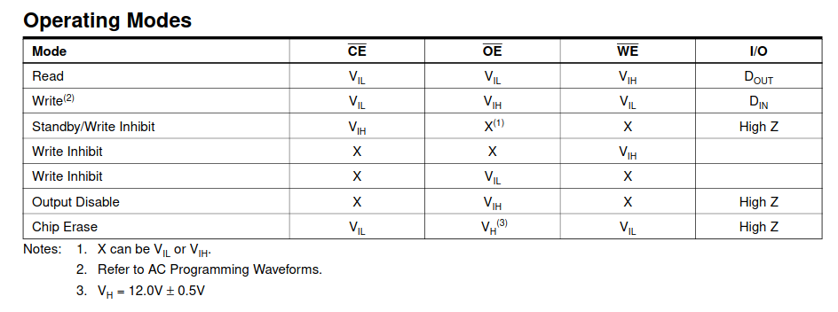
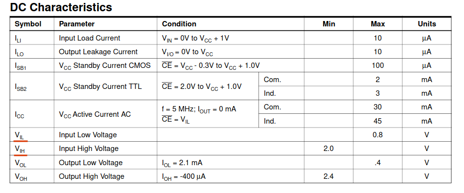
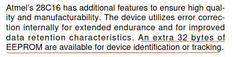
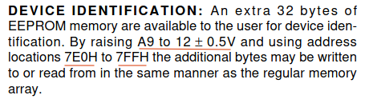

 <font size='10'>The PROM</font>

28<sup>th</sup> 2022 / Document No. D22.102.16

Prepared By: WizardAlfredo

Challenge Author(s): WizardAlfredo

Difficulty: <font color=orange>Medium</font>

Classification: Official

# Synopsis

- Read the extra memory of an EEPROM.

## Description

- After entering the door, you navigate through the building, evading guards, and quickly locate the server room in the basement. Despite easy bypassing of security measures and cameras, laser motion sensors pose a challenge. They're controlled by a small 8-bit computer equipped with AT28C16 a well-known EEPROM as its control unit. Can you uncover the EEPROM's secrets?

## Skills Required

- Basic research skills.

## Skills Learned

- Combining online resources to perform a vulnerability assessment on a chip.
- Better understanding of how to read chip datasheets.

# Enumeration

## Analyzing the netcat server

Since we are not provided with any release files, let's connect to the netcat instance and see what's going on.

```
      AT28C16 EEPROMs
       _____   _____
      |     \_/     |
A7   [| 1        24 |] VCC
A6   [| 2        23 |] A8
A5   [| 3        22 |] A9
A4   [| 4        21 |] !WE
A3   [| 5        20 |] !OE
A2   [| 6        19 |] A10
A1   [| 7        18 |] !CE
A0   [| 8        17 |] I/O7
I/O0 [| 9        16 |] I/O6
I/O1 [| 10       15 |] I/O5
I/O2 [| 11       14 |] I/O4
GND  [| 12       13 |] I/O3
      |_____________|

> help

Usage:
  method_name(argument)

EEPROM COMMANDS:
  set_address_pins(address)  Sets the address pins from A10 to A0 to the specified values.
  set_ce_pin(volts)          Sets the CE (Chip Enable) pin voltage to the specified value.
  set_oe_pin(volts)          Sets the OE (Output Enable) pin voltage to the specified value.
  set_we_pin(volts)          Sets the WE (Write Enable) pin voltage to the specified value.
  set_io_pins(data)          Sets the I/O (Input/Output) pins to the specified data values.
  read_byte()                Reads a byte from the memory at the current address.
  write_byte()               Writes the current data to the memory at the current address.
  help                       Displays this help menu.

Examples:
  set_ce_pin(3.5)
  set_io_pins([0, 5.1, 3, 0, 0, 3.1, 2, 4.2])

>
```

As mentioned in the description, we're dealing with an AT28C16 EEPROM. Let's attempt to call read_byte().

```
> read_byte()
Error: Pins are not set correctly
>
```

It appears that we'll need to consult the datasheet to proceed. We can jump directly to the Operating Modes section to understand how we can read from the chip.



Here, we can observe that to read a byte from memory, we need to set the Chip and Output Enable pins to $V_{IL}$ and the Write Enable pin to $V_{IH}$. This logic aligns with the fact that these pins internally have inverters, indicated by the bar on top of them. Consequently, the voltage applied externally will be inverted. Thus, to read a byte, it's necessary to enable the chip and enable the outputs while disabling writing. Now, let's find out the values of $V_{IL}$ and $V_{IH}$.



Based on the datasheet, we understand that $V_{IL}$ requires a voltage of less than 0.8 V, while $V_{IH}$ necessitates a voltage of more than 2.0 V. Let's proceed by applying these voltages to the respective pins and see if it works.

```
> set_ce_pin(0)
> set_oe_pin(0)
> set_we_pin(5)
> read_byte()
Read 0x0 at address 0x72c
```

We received `0x0` as the data for address `0x72c`. Now, let's proceed to configure the address. According to the help  menu, the address is specified by A10 to A0. Let's attempt to read from  address `0x01`.

```
> set_address_pins([0,0,0,0,0,0,0,0,0,0,5])
> read_byte()
Read 0x0 at address 0x1
```

We can write a script to read all the memory, but we will find out that it is empty.

# Solution

## Finding the extra memory

Upon revisiting the description, we notice the mention of the EEPROM's secrets. Upon another read-through of the datasheet, we discover that in addition to the main memory of the EEPROM, there are also an extra 32 bytes allocated for device identification.



## Exploitation

### Connecting to the server

A pretty basic script for connecting to the server with `pwntools`:

```python
if __name__ == "__main__":
    r = remote("0.0.0.0", 1337)
    pwn()
```

### Setting the address volts

As per the datasheet specifications, it's necessary to set the A9 pin to 12 volts with a tolerance of ± 0.5 volts. Additionally, to access the extra memory, we should use addresses ranging from `0x7e0` to `0x7ff`.



Let's try it manually first to confirm we're on the right path. Initially, we convert the address `0x7e0` into volts and adjust A9 to 12 volts.

```python
>>> [int(i) for i in bin(0x7e0)[2:].replace("1", "5")]
[5, 5, 5, 5, 5, 5, 0, 0, 0, 0, 0]
```

And then we send it to the server.

```
> set_address_pins([5, 12, 5, 5, 5, 5, 0, 0, 0, 0, 0])
> read_byte()
Read 0x48 at address 0x7e0
```

We observe that the output is `0x48`.

```python
>>> chr(0x48)
'H'
```

This corresponds to the character `H`. This suggests that the flag is indeed stored in the extra memory of the EEPROM. The process can be automated using the following function:

```py
def read_memory(address, secret=False):
    r.sendlineafter(b"> ", b"set_ce_pin(0)")
    r.sendlineafter(b"> ", b"set_oe_pin(0)")
    r.sendlineafter(b"> ", b"set_we_pin(5)")
    if secret:
        bits = byte_to_volts(address)
        bits[1] = 12
        address_pins = bytes(str(bits), "Latin")
    else:
        address_pins = bytes(str(byte_to_volts(address)), "Latin")
    r.sendlineafter(b"> ", b"set_address_pins(" + address_pins + b")")
    r.sendlineafter(b"> ", b"read_byte()")
    return to_ascii(r.recvline())
```

### Getting the flag

Since the memory size is 32 bytes, we can write a Python script to automatically read all the bytes.

```python
def get_flag():
    flag = ""
    for address in range(0x7e0, 0x7ff + 1):
        data = read_memory(address, secret=True)
        byte = data[5:-17]
        flag += chr(eval(byte))
    return flag
```

In summary:

1. Set the control pins and set A9 to 12 V.
2. Read every possible address in the extra memory to retrieve the flag.

```python
def pwn():
    r.recvuntil(b"> help")
    flag = get_flag()
    print(flag)
```
