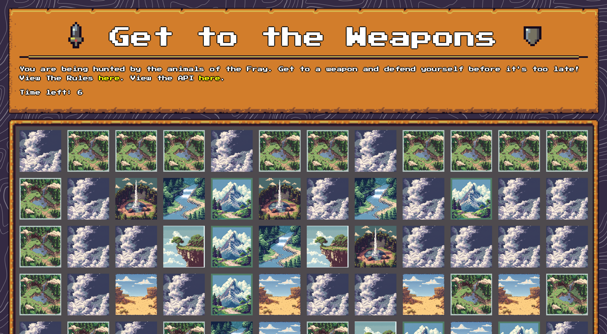

    	<font size="10">Path of Survival</font>

​	29<sup>th</sup> Jan 2024

​	Challenge Author(s): ir0nstone

# Synopsis
Path of Survival is a Hard miscellaneous challenge that involves parsing a map for a game and converting it to a directional weighted graph before running Dijkstra's Algorithm (or another pathfinding algorithm) on it in order to find the shortest route to the weapon.

## Description:
Far off in the distance, you hear a howl. Your blood runs cold as you realise the _Kara'ka-ran_ have been released - vicious animals tortured beyond all recognition, starved to provide a natural savagery. They will chase you until the ends of the earth; your only chance of survival lies in a fight. Strong but not stupid, they will back off if they see you take down some of their number - briefly, anyway...

## Skills Required
 - Basic Python skills
 - Basic understanding of algorithms
 - Basic understanding of communicating with web applications

## Skills Learned
 - Implementing Dijkstra's algorithm
 - Converting objects to abstract representations to solve problems

# Enumeration
Starting the instance, we get an IP and port to connect to. Connecting, we see what appears to be a game:



We can see that there is a square with what seems to be a player icon in the bottom right, and a couple others with a crossbow. Luckily the rules are provided, so we click the hyperlink and view them.

Reading the rules, it is in fact a minigame - we have to traverse between **tiles** to get to a weapon tile, and if we do so before the time runs out we are successful. Every movement has a **time cost** associated with it, so it's not as simple as just pressing the WASD keys and making our way there. Additionally:

* **Empty** tiles cannot be accessed
* **Cliffs** can only be entered from the **top** and the **left**
* **Geysers** can only be entered from the **bottom** and the **right**

Travelling from a tile of one terrain to another tile of the same terrain costs **1** time point. A valid movement to or from a **Cliff** or a **Geyser** costs **1** time point. Aside from that, the **time costs** are as follows:

- Plains to Mountain: 5
- Mountain to Plains: 2
- Plains to Sand: 2
- Sand to Plains: 2
- Plains to River: 5
- River to Plains: 5
- Mountain to Sand: 5
- Sand to Mountain: 7
- Mountain to River: 8
- River to Mountain: 10
- Sand to River: 8
- River to Sand: 6

Quite complicated! With all these rules, as well as the requirement to do **100** in a row, it makes logical sense that we have to script the process. Luckily, there is a mentioned `/api` page that describes how we communicate with the application.

# Solution

The entire challenge is effectively a **pathfinding** challenge, so it makes logical sense for us to try and use a pathfinding algorithm to find the optimal solution.

## Setting Up Constants

We're going to make a `Terrain` `enum` for all our terrains and directions, and also throw all the costs into one big constants.

```python
# Enum Class for Terrain Type
class Terrain:
    PLAINS = 'P'
    MOUNTAIN = 'M'
    RIVER = 'R'
    SAND = 'S'
    CLIFF = 'C'
    GEYSER = 'G'
    EMPTY = 'E'


# Enum Class for Direction
class Direction:
    LEFT = 'L'
    RIGHT = 'R'
    UP = 'U'
    DOWN = 'D'


# moving to/from a cliff or geyser is only 1 point regardless
# moving to and from same terrain type is 1 point
# rest are detailed here
COSTS = {
    (Terrain.PLAINS, Terrain.MOUNTAIN): 5,
    (Terrain.MOUNTAIN, Terrain.PLAINS): 2,

    (Terrain.PLAINS, Terrain.SAND): 2,
    (Terrain.SAND, Terrain.PLAINS): 2,

    (Terrain.PLAINS, Terrain.RIVER): 5,
    (Terrain.RIVER, Terrain.PLAINS): 5,

    (Terrain.MOUNTAIN, Terrain.SAND): 5,
    (Terrain.SAND, Terrain.MOUNTAIN): 7,

    (Terrain.MOUNTAIN, Terrain.RIVER): 8,
    (Terrain.RIVER, Terrain.MOUNTAIN): 10,

    (Terrain.SAND, Terrain.RIVER): 8,
    (Terrain.RIVER, Terrain.SAND): 6
}
```

## Parsing the Map

Now we have to parse the map. Let's create a simple POST request to see the format:

```python
from requests import Session

MAP = 'http://<IP>:1337/map'

s = Session()
map_data = s.post(MAP).json()
```

We get the following:

```python
{'height': 10, 'player': {'position': [10, 8], 'time': 21}, 'tiles': {'(0, 0)': {'has_weapon': False, 'terrain': 'P'}, '(0, 1)': {'has_weapon': False, 'terrain': 'P'} [...]}, 'width': 15}
```

So there's a `height` and `width` key for the grid size, a `player` key that holds a `position` and a `time`, and finally a `tiles` key which is a dictionary of `position: {has_weapon, terrain}` values. I'm going to create a `game.py` file and set up a useful `Player` and `Tile` class:

```python
class Player:
    def __init__(self, position, time):
        self.position = position
        self.time = time

class Tile:
    def __init__(self, terrain, has_weapon):
        self.terrain = terrain
        self.has_weapon = has_weapon

    def cost_to(self, tile):
        # return the cost of moving from this tile to another
        if self.terrain == Terrain.GEYSER or self.terrain == Terrain.CLIFF
            return 1
        if tile.terrain == Terrain.GEYSER or tile.terrain == Terrain.CLIFF
            return 1
        if tile.terrain == self.terrain:
            return 1
        else:
            return COSTS[self.terrain, tile.terrain]

    def __str__(self):
        return self.terrain
```

Next I'll create a `Map` class to use these two classes. Because I'm lazy and can't be bothered to type out `map.tiles[key]` every time, I create the `__setitem__` and `__getitem__` magic methods so I can just do `map[key]`.

```python
class Map:
    def __init__(self, width: int, height: int, tiles, player):
        self.width = width
        self.height = height
        self.tiles = dict()
        self.player = Player(tuple(player['position']), player['time'])

        for pos, t in tiles.items():
            pos = eval(pos)
            new_tile = Tile(t['terrain'], t['has_weapon'])
            self[pos] = new_tile
    
    def __setitem__(self, key, value):
        self.tiles[key] = value

    def __getitem__(self, item):
        try:
            return self.tiles[item]
        except KeyError:
            return None
```

That's all done!

## Pathfinding

Now I'm going to create a `pathfinder.py` file, where I'll set up [Dijkstra's algorithm](https://en.wikipedia.org/wiki/Dijkstra's_algorithm) (my algorithm of choice for this challenge). Implementations can be found in many places online, and this is the one I came up with myself:

```python
from math import inf


class Node:
    def __init__(self, name):
        self.name = name
        self.edges = dict()

    def add_edge(self, node, cost):
        self.edges[node] = cost

    def print_edges(self):
        print(self.edges)

    def __repr__(self):
        return str(self.name)


class Graph:
    def __init__(self, nodes):
        self.nodes = nodes

    def dijkstra(self, start_node):
        distances = {start_node: 0}
        nodes_from = {start_node: start_node}

        for n in self.nodes:
            if n != start_node:
                distances[n] = inf

        explored = set()
        nodes_to_explore = [start_node]

        while len(nodes_to_explore) > 0:
            # find shortest node and remove
            shortest_node, shortest_distance = nodes_to_explore[0], distances[nodes_to_explore[0]]

            for node, cost in distances.items():
                if node in explored:
                    continue

                if cost < shortest_distance:
                    shortest_node, shortest_distance = node, cost

            nodes_to_explore.remove(shortest_node)

            for node, cost in shortest_node.edges.items():
                if node not in explored:
                    nodes_to_explore.append(node)

                if distances[shortest_node] + cost < distances[node]:
                    distances[node] = distances[shortest_node] + cost
                    nodes_from[node] = shortest_node

            explored.add(shortest_node)

        return distances, nodes_from
```

This returns two dictionaries: `distances`, which contains the distance from the start point to the key, and `nodes_from`, which contains the `Node` that last updated the distance to that node (for backtracking purposes, so we can reconstruct the route). 

## Converting the Map to Nodes

The hardest part of the challenge may be abstracting the map away to a series of **nodes** and **edges** for Dijkstra's to work. This is because we have to make sure that:

* Edges are not formed with `EMPTY` tiles
* Edges are not formed on the incorrect sides of **Cliffs** or **Geysers**

If we bear all of that in mind, we can add the following method to the `Map` class. It generates a series of `Node` instances (which we defined in our `pathfinder.py` file) that are connected with edges.

```python
def to_nodes(self):
    # return the graph + node that is player starting position
    nodes = dict()

    # add a node, we'll use a dict for this of loc:Node pairs
    for y in range(self.height):
        for x in range(self.width):
            # ignore Empty terrain from the map
            if self[x, y].terrain == Terrain.EMPTY:
                continue

            nodes[x, y] = Node((x, y))

    # now we want to parse all the nodes
    for pos, node in nodes.items():
        x, y = pos
        tile = self[pos]

        # ignore empty ones
        if tile.terrain == Terrain.EMPTY:
            continue

        # will have to keep cliffs/geysers in mind
        adjacent = {
            (x - 1, y): Terrain.CLIFF,
            (x + 1, y): Terrain.GEYSER,
            (x, y - 1): Terrain.CLIFF,
            (x, y + 1): Terrain.GEYSER
        }

        # add node connection
        for adj in adjacent:
            # if it's None, it's off the map
            if not self[adj]:
                continue

            # if it's an Empty location, ignore
            # if it's impassable (due to cliff/geyser), also ignore
            if self[adj].terrain == Terrain.EMPTY or self[adj].terrain == adjacent[adj]:
                continue

            # add edge
            node.add_edge(nodes[adj], tile.cost_to(self[adj]))

    return nodes
```

Something that is **really important** here is that you **bear in mind which data types everything is** - some of them are a `Tile`, a `Node` or a `tuple`, so if you are using comparisons with `==` you may get a `False` when in reality you are comparing `(x, y)` to `Node(x, y)`, which is the same thing but you're missing that!

Back in `__init__()`, we will load the nodes into a `Graph` and run Dijkstra's on it from the player's starting position:

```python
# work out nodes from graph
self.nodes = self.to_nodes()
self.graph = Graph(self.nodes.values())
self.distances, self.nodes_from = self.graph.dijkstra(self.nodes[self.player.position])
```

## Finding the Nearest Weapon and the Path there

From here, it gets much simpler. We want to find the nearest weapon, for which we'll use a naive brute force:

```python
def calculate_closest_weapon(self):
    nearest_weapon = None
    shortest_cost = inf

    for pos, t in self.tiles.items():
        if t.has_weapon and self.distances[self.nodes[pos]] < shortest_cost:
            shortest_cost = self.distances[self.nodes[pos]]
            nearest_weapon = pos

    return nearest_weapon, shortest_cost
```

The length of time it takes is actually not important, but it's useful for debugging purposes. Once we get the position of the nearest weapon, we want to find the path of nodes there. This is what the `nodes_from` `dict` tells us - given a `Node`, we know which `Node` we used to get there, so we can start at the end point and backtrack until we get to the start. After that we'll reverse the order so we go from start to end, rather than vice versa.

```python
def calculate_path_to_tile(self, pos):
    # returns a list of tuples
    path = [pos]

    curr = self.nodes_from[self.nodes[pos]]
    path.append(curr.name)
    while curr.name != self.player.position:
        curr = self.nodes_from[self.nodes[curr.name]]
        path.append(curr.name)

    return path[::-1]
```

## Communicating the Path back

By looking at `/api`, we can see that the `/update` endpoint takes in a single direction and will return an update. We therefore need a series of `UDLR` (up-down-left-right) instructions to get to the weapon. All we need to do is take the result of `calculate_path_to_tile()` and take them in pairs, working out the relative direction between the nodes.

```python
def calculate_path_seq(self, pos):
    path = self.calculate_path_to_tile(pos)

    seq = ''

    for i in range(len(path) - 1):
        seq += Map.calculate_direction(path[i], path[i+1])

    return seq

@staticmethod
def calculate_direction(start, end):
    if start[0] == end[0]:
        if start[1] == end[1] - 1:
            return Direction.DOWN
        elif start[1] == end[1] + 1:
            return Direction.UP
    elif start[1] == end[1]:
        if start[0] == end[0] - 1:
            return Direction.RIGHT
        elif start[0] == end[0] + 1:
            return Direction.LEFT

    raise Exception('Invalid movement!')
```

This gets us a sequence like `UURDRU`, which is exactly what we need. We'll make the `__init__()` of `Map` load all this information in:

```python
# work out path to the closest weapon
self.closest_weapon, self.closest_weapon_distance = self.calculate_closest_weapon()

print(f'Nearest weapon is at tile {self.closest_weapon} with cost {self.closest_weapon_distance}')

# calculate the path to the tile
self.path_seq = self.calculate_path_seq(self.closest_weapon)
```

Then we can send the directions off one at a time:

```python
map_data = s.post(MAP).json()
m = Map(map_data['width'], map_data['height'], map_data['tiles'], map_data['player'])
seq = m.path_seq

for i, c in enumerate(seq):
    r = s.post(UPDATE, json={'direction': c})
    data = r.json()
    print(data)
```

Looking at the data, it seems like a success!

```python
Nearest weapon is at tile (5, 5) with cost 19
{'new_pos': [10, 7], 'time': 15}
{'new_pos': [9, 7], 'time': 14}
{'new_pos': [8, 7], 'time': 13}
{'new_pos': [7, 7], 'time': 11}
{'new_pos': [7, 6], 'time': 6}
{'new_pos': [6, 6], 'time': 5}
{'new_pos': [5, 6], 'time': 3}
{'maps_solved': 1, 'solved': True}
```

So, the last one should have the `solved` key set to `True`. We'll throw in an assertion there so we can pick up on any issues promptly:

```python
# if we are on the last move of the particular grid
if i == len(seq) - 1:
    assert 'solved' in data
    assert data['solved']
```

## Looping for all the Grids

We know we need to do `100`, so let's loop it! `/api` tells us that the POST to `/update` will send back the `flag` once we finish, so we make the loop check that and quit if we do:

```python
while True:
    map_data = s.post(MAP).json()
    m = Map(
      width=map_data['width'], height=map_data['height'], tiles=map_data['tiles'], player=map_data['player']
    )

    seq = m.path_seq

    for i, c in enumerate(seq):
        r = s.post(UPDATE, json={'direction': c})
        data = r.json()

        if i == len(seq) - 1:
            assert 'solved' in data
            assert data['solved']

            if 'flag' in data:
                print(data['flag'])
                exit(0)
```

This gets us the flag!
