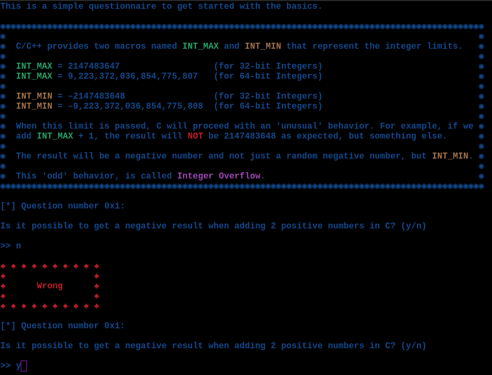

    	<font size="10">Tutorial</font>

​		28<sup>th</sup> January 2024 / Document No. DYY.102.XX

​		Prepared By: w3th4nds

​		Challenge Author(s): w3th4nds

​		Difficulty: <font color=green>Very Easy</font>

​		Classification: Official

 


# Synopsis

Tutorial is a very easy difficulty challenge that features answering some basic questions about `Integers` and `Integer Overflow`.

# Description

Before we start, practice time!

## Skills Required

- NONE

## Skills Learned

- `Integers`, `Integer Overflow`.

# Enumeration

Taking a look at the demo code:

```console
#include <stdio.h>
#include <limits.h>

int add(int x, int y) { return x + y; }

void main(){
	int n1, n2;
	printf("INT_MAX value: %d\n\nEnter 2 numbers: ", INT_MAX);
	scanf("%d %d", &n1, &n2);
	printf(n1 < 0 || n2 < 0 ? "\n[-] Negative values detected! Exiting..\n" : "\nThe sum of %d and %d is %d\n\n", n1, n2, add(n1, n2));
}
```

A very simple program that performs the `add` operation with 2 positive numbers. Now, taking a look at the questionnaire we have to answer:



I will answer the questions by showcasing the answers.

#### Q1

```console
[*] Question number 0x1:

Is it possible to get a negative result when adding 2 positive numbers in C? (y/n)

>> y

♠ ♠ ♠ ♠ ♠ ♠ ♠ ♠ ♠ ♠ ♠
♠                   ♠
♠      Correct      ♠
♠                   ♠
♠ ♠ ♠ ♠ ♠ ♠ ♠ ♠ ♠ ♠ ♠
```

```console
INT_MAX value: 2147483647

Enter 2 numbers: 2147483647 2147483647

The sum of 2147483647 and 2147483647 is -2
```

This example shows that when the `upper limit` of integers is passed, a `negative` numbers occurs.

#### Q2

```console
[*] Question number 0x2:

What's the MAX 32-bit Integer value in C?

>> 2147483647

♠ ♠ ♠ ♠ ♠ ♠ ♠ ♠ ♠ ♠ ♠
♠                   ♠
♠      Correct      ♠
♠                   ♠
♠ ♠ ♠ ♠ ♠ ♠ ♠ ♠ ♠ ♠ ♠
```

If we run the `test` binary or read the `guide`, we can find the answer.

#### Q3

```console
[*] Question number 0x3:

What number would you get if you add INT_MAX and 1?

>> -2147483648

♠ ♠ ♠ ♠ ♠ ♠ ♠ ♠ ♠ ♠ ♠
♠                   ♠
♠      Correct      ♠
♠                   ♠
♠ ♠ ♠ ♠ ♠ ♠ ♠ ♠ ♠ ♠ ♠
```

If we run the `test` binary or read the `guide`, we can find the answer.

#### Q4

```console
[*] Question number 0x4:

What number would you get if you add INT_MAX and INT_MAX?

>> -2

♠ ♠ ♠ ♠ ♠ ♠ ♠ ♠ ♠ ♠ ♠
♠                   ♠
♠      Correct      ♠
♠                   ♠
♠ ♠ ♠ ♠ ♠ ♠ ♠ ♠ ♠ ♠ ♠
```

Run the binary and see: 

```console
INT_MAX value: 2147483647

Enter 2 numbers: 2147483647 2147483647

The sum of 2147483647 and 2147483647 is -2
```

#### Q5

```console
[*] Question number 0x5:

What's the name of this bug? (e.g. buffer overflow)

>> integer overflow

♠ ♠ ♠ ♠ ♠ ♠ ♠ ♠ ♠ ♠ ♠
♠                   ♠
♠      Correct      ♠
♠                   ♠
♠ ♠ ♠ ♠ ♠ ♠ ♠ ♠ ♠ ♠ ♠
```

Read the guide to answer.

#### Q6

```console
[*] Question number 0x6:

What's the MIN 32-bit Integer value in C? 

>> -2147483648

♠ ♠ ♠ ♠ ♠ ♠ ♠ ♠ ♠ ♠ ♠
♠                   ♠
♠      Correct      ♠
♠                   ♠
♠ ♠ ♠ ♠ ♠ ♠ ♠ ♠ ♠ ♠ ♠
```

Read the `guide` or change the source code of `test.c` to check.

#### Q7

```console
[*] Question number 0x7:

What's the number you can add to INT_MAX to get the number -2147482312?

>> 1337

♠ ♠ ♠ ♠ ♠ ♠ ♠ ♠ ♠ ♠ ♠
♠                   ♠
♠      Correct      ♠
♠                   ♠
♠ ♠ ♠ ♠ ♠ ♠ ♠ ♠ ♠ ♠ ♠


HTB{gg_3z_th4nk5_f0r_th3_tut0r14l}
```

This question is the only one that needs calculation or `bruteforce` to be answered. With a simple python script we can find the answer.

# Solution

```python
#!/usr/bin/python3
from pwn import *
import warnings
import os
warnings.filterwarnings('ignore')
context.log_level = 'critical' 

LOCAL = False

os.system('clear')

IP   = str(sys.argv[1]) if len(sys.argv) >= 2 else '0.0.0.0'
PORT = int(sys.argv[2]) if len(sys.argv) >= 3 else 1337
r    = remote(IP, PORT)
print(f'Running solver remotely at {IP} {PORT}\n')

r.timeout = 0.5

ans = ['y', '2147483647', '–2147483648', '-2147483648', '-2', 'int overflow', '-2147483648', '1337']

[r.sendlineafter('>> ', i) for i in ans]
r.recvuntil('HTB')
print(f'Flag --> HTB{r.recvline().strip().decode()}')
```

```console
Running solver remotely at 0.0.0.0 1337

Flag --> HTB{gg_3z_th4nk5_f0r_th3_tut0r14l}
```

