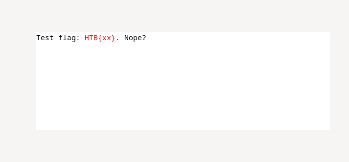
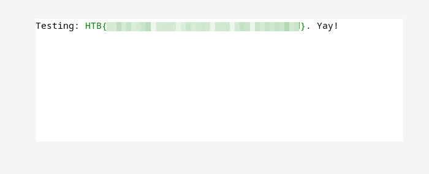

PackedAway

  6th 03 24 / Document No. D24.102.20

  Prepared By: clubby789

  Challenge Author: clubby789

  Difficulty: Very Easy

  Classification: Official

# Synopsis

PackedAway is a Very Easy reversing challenge. Players will use `UPX` to extract the original version of an executable.

## Skills Learned
    - Unpacking `UPX` executables

# Solution

If we run the binary, it opens a UI containing a text box with 'Placeholder'. If we write a fake flag such as `HTB{xx}`, it is highlighted in red.

.

If we run `strings` on the binary, there are no obvious secrets - but there are several 'UPX!' strings. If we use `upx -d` to extract the binary, we will unpack a slightly larger one. We can then run `strings` again, and find the flag in the output.

If we enter this in the textbox, it will be highlighted in green.

.
