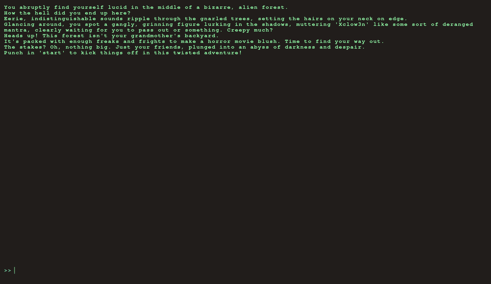
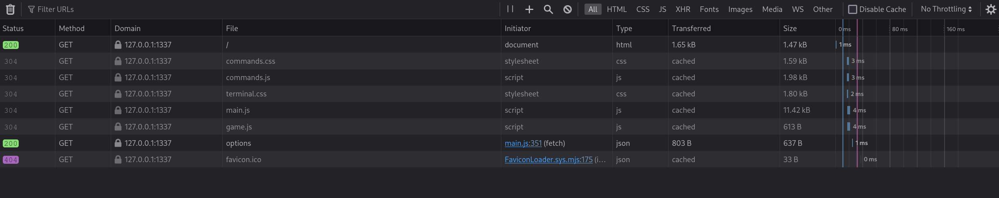
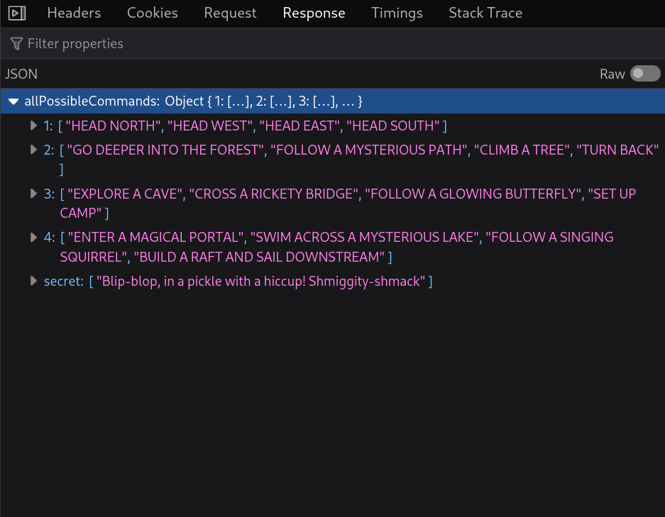
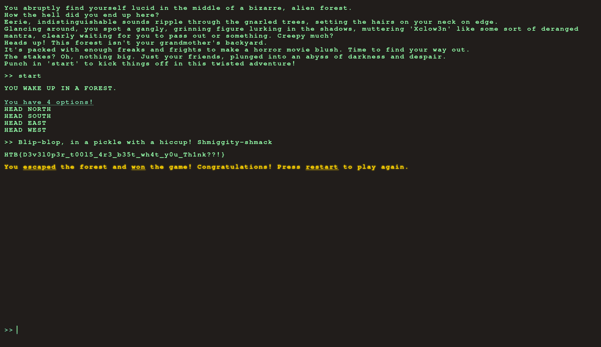

    	Flag Command

​	    Prepared By: Xclow3n

​	    Challenge Author(s): Xclow3n

​	    Difficulty: Very Easy

​	    Classification: Official

### Description:

Embark on the "Dimensional Escape Quest" where you wake up in a mysterious forest maze that's not quite of this world. Navigate singing squirrels, mischievous nymphs, and grumpy wizards in a whimsical labyrinth that may lead to otherworldly surprises. Will you conquer the enchanted maze or find yourself lost in a different dimension of magical challenges? The journey unfolds in this mystical escape!

### Objective

Find a secret command in json response and use it to get the flag

## Application Overview

Visiting the home page we are provided with the following page:

We can play the game but none of the option leads us to the flag

## Solution

If we simply look at the developer's tool network tab and reload the page, we can see it makes a web request to the `options` endpoint 

Looking at the response of this endpoint. There is a secret command whose value is "Blip-blop, in a pickle with a hiccup! Shmiggity-shmack".

If we start the game and enter the secret value we get the flag.

